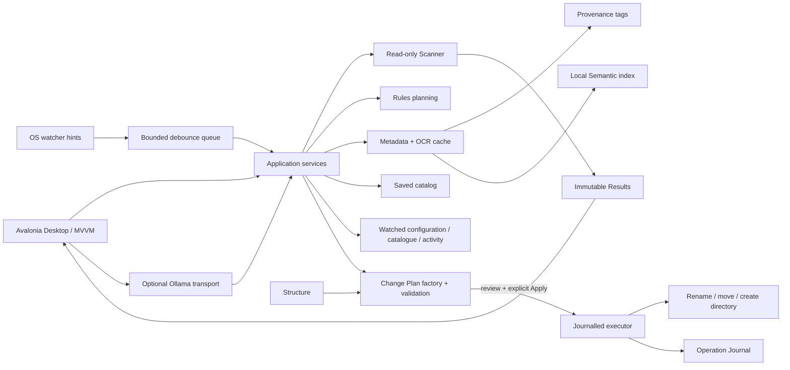

# OpenSorSe 1.7 System Overview

OpenSorSe is a local-first Avalonia desktop application for understanding selected folders and reviewing organization decisions. It uses .NET 8, C#, MVVM, dependency injection, bounded asynchronous work, versioned local JSON stores, and an embedded provider-isolated SQLite Search index.

## Product boundary

Scanning, exact-duplicate review, metadata extraction, OCR Beta, tag generation, Search/background indexing, catalog/history comparison, diagrams, and optional AI suggestions are non-mutating. AI is disabled by default, capability-specific, untrusted, and suggestion-only. Rename/folder requests are metadata-only; bounded extracted text requires a separate opt-in and explicit one-document action.

OpenSorSe 1.2 added watched roots, v1.3 typed workflows/recipes, v1.4 the
local plugin host/SDK, and v1.5 explicit platform services. v1.6 hardens atomic
application-data persistence, cancellation, lifecycle, bounded memory,
performance, diagnostics, accessibility, and Windows/Linux/macOS validation.
v1.7 adds provider-neutral durable staged indexing, progressive Search
coverage, bounded storage policy, and interruption recovery without requiring
a database server or adding a mutation path.
Watcher events, workflow settings, plugin output, and platform capability
reports remain analysis inputs, not authorization or filesystem truth.

> Workflow profiles automate configuration and analysis, not approval or file modification.

## Implemented components

| Project | Responsibility |
| --- | --- |
| `OpenSorSe.Extensions.Abstractions` | Stable immutable plugin SDK contracts; no reference to Application, Desktop, DI, persistence, credentials, or execution. |
| `OpenSorSe.Core` | Validated settings, logging, lifecycle, events, state, tasks, platform contracts/implementations, application locations, capability reporting, and dependency-injection support. |
| `OpenSorSe.Scanner` | Read-only traversal, filesystem metadata, hashing, deterministic classification, and exact duplicate detection. |
| `OpenSorSe.Rules` | Deterministic rule evaluation/planning and conflict resolution; no Desktop execution workflow. |
| `OpenSorSe.Executor` | v1.1 Change Plan factory/validator/stores, durable journal, filesystem gateway, deterministic execution, rollback, Undo, restart recovery, and report export; historical generic components remain unregistered. |
| `OpenSorSe.Application` | Processing orchestration, Results projection, workflow profile/recipe domain/store/validation/templates/resolution/import/export/plan generation, plugin discovery/loading/lifecycle/packages/registry/invocation/diagnostics, persistent watched-folder management/coordinator/catalogues, debounced event hints, stability and incremental/reconciliation processing, AI gates/contracts, suggestion-to-plan adapters, catalog/search/comparison, content extraction, OCR service, provenance tags, semantic index/search, and restructuring/history/comparison. |
| `OpenSorSe.AI` | Optional Ollama-compatible HTTP transport and bounded AI review-decision persistence. |
| `OpenSorSe.Indexing.Sqlite` | Embedded schema-versioned implementation of provider-neutral durable indexing, recovery, coverage, and quota contracts. |
| `OpenSorSe.Desktop` | Avalonia shell, Windows/Linux desktop adapters, platform diagnostics, global feature controls, Workflows/profile/recipe management and preview, manual profile selection, Watched Folders management/status/actions/activity, MVVM pages, Review Changes, Operation History/details/report/Undo, Help, diagnostics, and explicit confirmation. |

## Local stores

Settings, logs, AI decisions, saved catalog/searches, extracted content,
semantic index, structure history, workflow library, plugin state/packages,
watched configurations/catalogues/grouped activity, Change Plans, and the
Operation Journal live in separate bounded OpenSorSe application-owned files.
v1.6 serializes process-local transactions per normalized path and replaces an
owned document only after a complete bounded sibling is durably flushed.

## Deferred

An online plugin marketplace/download/update service, out-of-process plugin sandbox, publisher signature authority, broad localization, installers/updaters/distribution packages, full macOS support, cloud indexing/synchronization, background-service monitoring while OpenSorSe is closed, automatic moved-root discovery, autonomous AI actions, permanent deletion, arbitrary recipe scripting, learned/external embedding models, and generic rule execution remain future work.

## Related documents

- [Component Map](03_Component_Map.md)
- [Data Flow](04_Data_Flow.md)
- [User Flow](06_User_Flow.md)
- [Safety and Privacy](../../SAFETY_AND_PRIVACY.md)
- [v1.1 safety architecture](../07-Rules/07_v1.1_Change_Plans_and_Operation_Journal.md)
- [v1.1 specification](../../Implementation_Spec/v1.1/053_Safe_File_Operations_and_Robustness.md)
- [v1.2 watched-folder architecture](../02_Scanner/09_v1.2_Watched_Folders_and_Incremental_Scanning.md)
- [v1.2 specification](../../Implementation_Spec/v1.2/054_Watched_Folders_and_Incremental_Scanning.md)
- [v1.3 workflow architecture](../07-Rules/08_v1.3_Workflow_Profiles_and_Recipes.md)
- [v1.3 specification](../../Implementation_Spec/v1.3/055_Workflow_Profiles_and_Recipe_Library.md)
- [v1.4 plugin architecture](../10_Plugins/06_v1.4_Plugin_Foundation.md)
- [v1.4 specification](../../Implementation_Spec/v1.4/056_Plugin_Foundation_and_Extension_SDK.md)
- [v1.5 platform architecture](08_v1.5_Platform_Architecture.md)
- [v1.5 specification](../../Implementation_Spec/v1.5/057_Cross_Platform_Foundation_and_Linux_Preview.md)
- [v1.6 reliability architecture](09_v1.6_Reliability_Architecture.md)
- [v1.6 specification](../../Implementation_Spec/v1.6/058_Reliability_Performance_and_Production_Hardening.md)
- [v1.7 deep indexing architecture](10_v1.7_Deep_Indexing_Architecture.md)
- [v1.7 specification](../../Implementation_Spec/v1.7/059_Deep_Indexing_Foundation.md)
