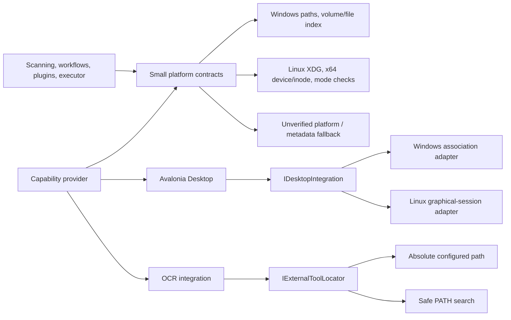

# OpenSorSe 1.5 Platform Architecture

The platform layer is owned by `OpenSorSe.Core.Platform`. It contains small
contracts and explicit Windows, Linux, conservative, and best-effort
implementations. Application/executor/scanner services depend on semantics and
capabilities, while Desktop owns graphical integration.

Path normalization is lexical and never treats canonicalization as permission
to follow a link. Link inspection, root confinement, native identity,
same-filesystem checks, permission diagnostics, collision checks, immediate
preflight, and result verification form separate layers. Failure to establish a
safe identity, mount, link, permission, desktop, native plugin, or executable
state produces an unavailable/limited result rather than a hidden fallback.

Application locations preserve Windows compatibility and separate Linux
configuration/data/state/cache. Packaging remains outside runtime composition;
the Windows manifest/icon are build-conditioned and Linux framework-dependent
publish is documented but not packaged.

The full [system map](../OpenSorSe_System_Map.md) keeps the analysis-to-approval-
to-mutation boundary visible. See the
[platform matrix](../../PLATFORM_COMPATIBILITY_MATRIX.md).
