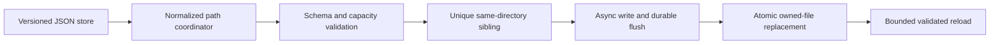
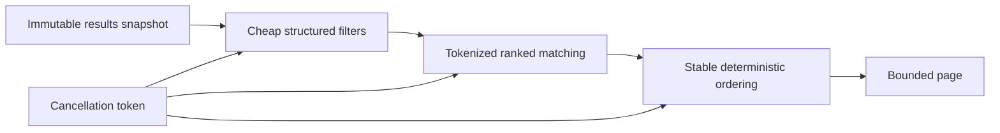

# v1.6 Reliability Architecture

OpenSorSe v1.6 hardens the existing layered system without changing feature
ownership or the file-operation authorization boundary.

## Durable application-owned state

The gate is process-local and covers the complete load-modify-write
transaction. The temporary sibling and destination are always in the same
directory. Failure before replacement leaves the previous valid document
untouched. This mechanism applies only to OpenSorSe application data and never
to selected user files.

## Responsive in-memory work

Duplicate preparation uses a compact value array and one hash-count map.
Duplicate member lists exist only for hashes with more than one member.
Processing-session history is bounded independently of persistent history.

## Failure containment

Lifecycle owners snapshot their observer lists and call handlers independently.
Exceptions are redacted and logged; caller-owned cancellation is the only
cancellation allowed to cross the event or task boundary. The watched-folder
coordinator serializes initialization, refresh, and disposal and awaits its
owned long-running loops during shutdown.

## Compatibility

No v1.6 persistence schema changes are required. Existing MVVM pages, services,
workflow profiles, watched folders, plugins, AI contracts, Change Plans,
Operation Journals, and Undo records retain their existing ownership and
meaning. The complete v1.5 platform architecture remains the foundation:
[v1.5 Platform Architecture](08_v1.5_Platform_Architecture.md).
