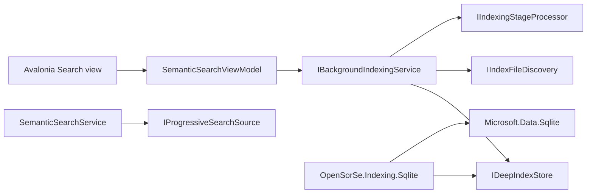

# v1.7 Deep Indexing Architecture

## Scope

OpenSorSe 1.7 adds a durable, local background-indexing foundation. It does
not add a database server, autonomous file management, a conversational search
agent, a final learned ranking engine, or a new source-file mutation path.
Existing scans, saved scans, watched folders, duplicate detection, Change
Plans, the Operation Journal, Undo, workflows, plugins, OCR, and optional AI
remain compatible.

The user-facing feature formerly called **Meaning Search** is now **Search**.
Internal `Semantic*` names and the existing `semantic-index.json` schema remain
unchanged where renaming them would create compatibility risk.

## Dependency boundaries

Views and ViewModels do not use SQLite APIs. Application contracts and
orchestration live in `OpenSorSe.Application.Indexing`. The
`OpenSorSe.Indexing.Sqlite` project is the initial embedded provider and depends
inward on Application/Core contracts. Desktop is the only composition root.
A future server client can implement `IDeepIndexStore` and
`IProgressiveSearchSource` without redesigning Search or the UI. PostgreSQL is
therefore neither installed nor referenced by the desktop application.

## Storage lifecycle

The provider owns `deep-index.db` below the platform application-data index
directory. Schema version 1 uses normalized relational tables for sources,
runs, files, shared content, selected chunks, jobs, per-stage states, failures,
and maintenance history. It does not store copies of source files or large
binary payloads.

Initialization:

1. opens the local database with foreign keys and a bounded busy timeout;
2. enables WAL and full synchronization for the local application-data model;
3. rejects a newer unsupported schema;
4. creates a consistent pre-migration backup before upgrading an older schema;
5. applies schema changes in a transaction;
6. runs an integrity check; malformed storage raises an actionable corruption
   exception at the provider boundary while the coordinator degrades to a
   failed background-index state, leaving the compatible existing Search path
   usable;
7. requeues jobs and stage rows left `running` by an interrupted process.

Manual, pre-migration, and explicit recovery copies are placed in a managed
backup directory, bounded to three copies including SQLite sidecars, and never
include source files. A normal rebuild clears derived index data but preserves
configured sources. When storage is unreadable or from a newer schema, an
explicit rebuild first moves the database and sidecars to a recovery copy,
then creates a fresh schema; it never silently overwrites or downgrades the
original. Watched-folder configurations register their owned sources again,
while a manually added source from an unreadable database must be added again.
The existing JSON stores are not migrated into SQLite and remain readable by
their established owners.

## Identity and incremental rules

Discovery records source-relative and normalized absolute paths, metadata, and
the strongest available platform identity. Links/reparse points are not
followed. Windows identity/case-insensitive semantics and Unix
device/inode/case-sensitive semantics come through Core platform contracts.

| Observation | Durable action |
| --- | --- |
| Unchanged identity, metadata, processor, and level | Mark the run item complete and reuse prior data |
| Rename or move within a source with stable identity | Update path data without rerunning completed analysis |
| Metadata change | Revalidate metadata, fingerprint content, then reuse shared content if unchanged |
| Content change | Use the new hash and rerun only dependent stages |
| Copy/duplicate content | Share bounded derived content by hash after fingerprinting |
| Missing file after a successful reconciliation | Mark deleted and retain according to policy |
| Link entry | Skip without traversal |
| Inaccessible source traversal | Fail that run without declaring unseen files deleted |

Processor fingerprints include schema/processor version, indexing policy,
extractor/OCR bounds, content configuration, representation dimensions, and
optional enrichment-provider version. A relevant change therefore invalidates
only incompatible derived work.

## Durable pipeline

Applicable work advances through:

1. file discovered;
2. metadata indexed;
3. content fingerprinted;
4. document text extracted;
5. OCR processed;
6. summaries/keywords generated;
7. related-concept representation generated;
8. Search index updated;
9. relationship analysis completed;
10. file fully indexed.

Basic skips content enrichment. Standard adds bounded text, keywords, and one
document representation. Deep adds applicable OCR, an extractive or optional
provider result, and bounded selected chunks. Archives and known
binary/executable formats remain metadata-only by default. Non-applicable OCR
may be skipped while later stages continue.

Every job and stage has persistent pending, queued, running, complete, skipped,
failed, dependency-waiting, cancelled, or retry-scheduled state. Claims and
stage output are separate short transactions. Cancellation is cooperative:
the run first becomes cancelling, active discovery/stages receive
cancellation, and durable rows become cancelled only after workers acknowledge
it. Process shutdown deliberately leaves an interrupted claim for startup
recovery. Pause stops new claims while allowing the current atomic stage to
finish.

Startup resumes the newest eligible run rather than replacing it. Discovery
also resumes within the same durable run, and its upserts preserve already
completed jobs, so interruption cannot turn rediscovery into duplicate
analysis. Explicitly paused and cancelled runs keep their state across restart:
paused work requires Resume and cancelled work requires Retry. Dependency and
resource waits return to Running automatically when their persisted retry time
and policy gates permit. Superseding refresh, source removal, and rebuild first
cancel and await owned discovery/stage work before changing durable state.

### v2.5 progressive scheduling

The persisted `InitialScanDepth` setting changes claim order, not capability
policy. `BaseFirst` orders eligible work breadth-first by durable stage so
discovery and inexpensive evidence for known files are published before OCR,
transcription, frame analysis, or other enabled deeper stages dominate the
queue. `DeepInitialAnalysis` orders work per file so users who explicitly
prefer deeper initial processing can advance each file earlier. The UI labels
these choices **Fast — searchable first** and **Deep initial analysis**.
Existing Basic/Standard/Deep levels and individual media/content switches still
decide which stages are enabled.

Both modes use the same durable jobs and SQLite store. Restart, pause, retry,
cancellation, provider waits, quotas, and processor fingerprints therefore keep
their established behavior. The scheduling preference is intentionally absent
from processing fingerprints because changing order does not invalidate
completed evidence.

Watched-folder sources carry an ownership flag in the provider-neutral source
contract. Configuration reconciliation adds, updates, or removes only sources
owned by watched folders; a manually queued or prioritized source is not
silently removed by the watcher lifecycle.

## Resource and quota policy

Eco, Balanced, and Fast modes map to bounded worker concurrency. Optional time
windows are portable. Idle, power, and battery settings are persisted and
presented, but currently degrade to no restriction on platforms where no safe
adapter is available. OCR and local-AI enrichment are independently gated.
Missing OCR or enrichment dependencies produce a waiting state and retry time,
not lost work. The coordinator wakes at the durable retry time and automatically
continues once the dependency or resource policy is available; Retry remains an
explicit immediate control.

Storage policy bounds database size, extracted/OCR characters, selected chunks,
deleted records, failed history, retries, concurrency, exclusions, generated
folders, archives, and binary processing. Near quota, maintenance:

1. removes expired deleted records and operational history;
2. removes orphaned shared content and chunks;
3. checkpoints and compacts eligible storage;
4. prunes selected chunks as the explicit lowest-value retained category;
5. reports a blocking quota state if storage is still over the limit.

Metadata, source configuration, and user files are not silently deleted.

## Progressive Search and diagnostics

Search combines the compatible existing JSON index with provider-neutral
progressive documents. Exact filename, folder, metadata, text, OCR, tags,
summaries, and related-concept inputs are distinct fields so later hybrid
ranking can evolve without a schema leak into Views.

Coverage reports known files, filename/metadata, document text, OCR,
related-concept, and fully indexed counts. Search remains usable during
indexing and warns that results may be incomplete. The existing search path
still works if durable indexing is disabled or unavailable.

Progress distinguishes discovery, base Search coverage, and deeper analysis.
Once discovery has committed and every known visible file has filename and
metadata coverage, the UI reports that files are searchable even if fully
indexed coverage is incomplete. Its percentage then describes deeper coverage;
it does not present base availability and all optional intelligence as one
misleading completion number. Deeper evidence updates the existing durable file
record and cannot introduce a duplicate Search identity.

Diagnostics publish run ID, recovered-stage count, cancellation reason, stage
and duration, queue remaining, retry count, per-stage throughput, failure
category, worker, storage size, dependency state, quota state, and maintenance
actions. The Search page exposes a bounded, inspectable failure list and a
direct route to the current run's advanced diagnostics. The current file is
reduced to a display name and classified as path data. Full extracted text,
OCR text, source contents, representations, prompts, secrets, and tokens are
not emitted. Export remains an explicit, reviewable user action.
