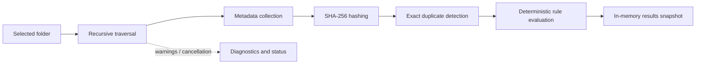

# Scanner Overview

> This document describes the read-only Scanner subsystem and its v1.2 watched-folder orchestration consumer.

---

## Purpose

The Scanner analyzes a user-selected folder without changing its contents. It traverses directories recursively, gathers filesystem metadata, calculates SHA-256 hashes, detects exact duplicates, and reports recoverable issues, progress, and cancellation through the application pipeline.

---

## Current Responsibilities

* Validate the selected scan root.
* Traverse accessible directories recursively while respecting the configured link/reparse-point policy.
* Discover files and collect filesystem metadata.
* Calculate SHA-256 hashes for analysis and exact-duplicate detection.
* Isolate inaccessible paths and other recoverable failures as structured scan issues.
* Report progress and honour cancellation.
* Produce data consumed by deterministic rules and the in-memory results snapshot.

---

## Safety Boundary

The Scanner reads filesystem information only. It does not rename, move, delete, modify, or organize user files; it does not read document content, perform OCR, or execute AI.

The v1.2 watched-folder coordinator is an Application-layer consumer of Scanner services. It treats operating-system events as hints, verifies root-confined real state, preserves unchanged catalogue analysis, and sends only changed items into the relevant metadata/content/hash/classification/rules/optional-AI stages. Its suggestions become v1.1 Change Plans and never enter execution automatically.

---

## Processing Flow

---

## Advanced diagnostics

When both the master and Scanning diagnostics switches are enabled, the scanner creates a process-local session containing the selected root, traversal options, start/end, accepted files and directories, skipped entries and reasons, access/missing/reparse decisions, progress, counts, cancellation, and elapsed time. The scanner continues to accept every ordinary non-reparse file; a format that is unsupported by downstream extraction is reported without changing scan behavior.

Detailed entry records are limited to 500 per scan. Larger scans aggregate omitted entries and explicitly report sampling. Metadata reading has a related scanning session for missing/changed files, access failures, reparse decisions, and recoverable metadata errors. Paths are redacted before retention unless the separate unredacted setting is enabled. Collection failures never alter the read-only scan.

See [Unified Advanced Diagnostics](../01_Core/10_Advanced_Diagnostics.md).

---

## Related Documents

* [System Data Flow](../00_System/04_Data_Flow.md)
* [Folder Scanner](01_Folder_Scanner.md)
* [Cancellation](07_Cancellation.md)
* [Scanner Error Handling](08_Error_Handling.md)
* [v1.2 Watched Folders and Incremental Scanning](09_v1.2_Watched_Folders_and_Incremental_Scanning.md)
* [Release Status](../../RELEASE_STATUS.md)
