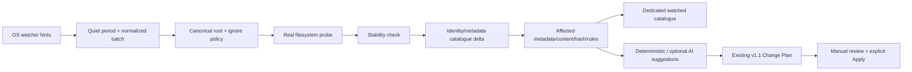

# v1.2 Watched Folders and Incremental Scanning

## Safety boundary

`FileSystemWatcher` events never update a catalogue directly and never reach the executor. The pipeline is:

> Watched folders automate detection and analysis, not file modification.

## Stores and models

`watched-folders.json` schema 2 persists up to 64 configurations. `watched-catalogues.json` schema 1 persists up to 250,000 files per catalogue and 256 MiB total. `watched-activity.json` schema 1 retains 1,000 meaningful grouped activities and 16 MiB total. Writes use an atomic sibling temporary file and replace.

The catalogue stores stable identity, path, size, creation/write times, attributes, SHA-256 when analysed, classification, duplicate state, analysis time, reprocess reason, and optional-AI pending/completed/failed state. Windows uses volume serial plus file index where the filesystem provides it. Other hosts use a best-effort creation-time/length identity; collisions are path-qualified.

## Event normalization and reconciliation

The event source reports create, change, rename/move, delete/unknown, directory, and error/overflow hints. The coordinator groups a per-folder burst after the configured quiet period and deduplicates equal kind/old/new path hints. Directory and overflow batches require full metadata reconciliation.

Targeted file batches probe only mentioned old/new paths. Startup, resume, reconnect, overflow, daily, and manual full scans enumerate canonical non-linked entries. Reconciliation compares actual identities and metadata to the catalogue. Only new/content-changing files enter content extraction, OCR cache checks, hashing, and classification. Rename/move and metadata-only differences preserve content-derived values when safe.

## Stability and retries

New/content-changing files must have equal size and write time across two observations and permit a read handle. Three immediate observations are attempted. A changing/locked file is stored with invalidated derived data, `DeferredUntilStable`, and an unresolved summary. Later hints or reconciliation retry it.

## Duplicate and rule impact

Exact-duplicate membership is recalculated from retained and new hashes without hashing unchanged files. Rules resolve from the selected recipe and run only for affected entries. Proposed operations are projected into the saved snapshot, then converted by the existing `ISuggestionChangePlanFactory`.

The v1.2 recipe ID `current` resolves to rules saved in the current session's Rule Editor; no named recipe library is persisted. Watched AI observes both per-folder and global readiness gates, chunks folder requests to 12 files, attempts at most 120 items per cycle, records completed/failed IDs, leaves excess work pending, and retries pending/failed entries only.

## Backpressure and lifecycle

A single-reader bounded channel serializes at most 256 queued batches and prevents concurrent processing of the same path. Queue saturation sets **Busy**, records deferral, and marks full reconciliation required. Pausing/editing/removing disposes registrations. Shutdown cancels quiet timers, the consumer, and availability loop and disposes every watcher.

## Self-generated event correlation

Operation Journal action paths, action result/Undo state, and pre/post identity evidence identify expected OpenSorSe changes. Matching event paths are consumed once, grouped, and reconciled with `OpenSorSeExecution` reason. Suggestion and AI creation are suppressed for that batch. Watching is not disabled for an arbitrary duration.

## Limitations

Watchers can duplicate, reorder, omit, or overflow events. Network/removable storage can disappear. The root itself may be renamed. These cases remain visible and are resolved by explicit metadata reconciliation rather than claims of perfect event delivery.
