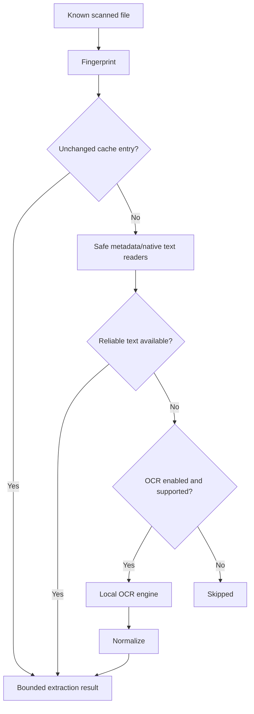

# v1.0 OCR and Metadata Extraction

## Implemented boundary

OpenSorSe 1.0 introduces a bounded local extraction pipeline. Filesystem metadata is always available from the scan. Safe format readers add PDF, Open XML document/workbook, and PNG/JPEG facts without executing macros, formulas, embedded objects, scripts, or remote references. Every value carries provenance and optional confidence.

OCR is a Beta capability. `IOcrService` decides whether OCR is needed, applies settings and bounds, uses a capability-detected `IOcrEngine`, and stores optional local cache records keyed by source fingerprint. Raw native text, raw OCR output, normalized text, and the bounded text supplied downstream remain distinct values. The Tesseract CLI adapter supports configured local image OCR when available; OpenSorSe does not install it. PDFtoImage/PDFium provides bounded in-process page rendering for pages whose native text does not pass the deterministic quality policy.

## Bounds and privacy

- No reader fetches remote content or executes document behavior.
- DTD processing and XML resolution are disabled.
- Input bytes, text, page counts, duration, and parallelism are bounded.
- Raw text is absent from ordinary logs. It is retained only in a separately enabled Advanced Diagnostics session, redacted by default, bounded, and process-local unless manually exported.
- Cache writes are atomic, versioned, local, and explicitly clearable.
- Source files are never written.

## Advanced diagnostics

When both the master and OCR/text-extraction switches are enabled, one extraction session records the file type, selected strategies, native-text result and quality decision, OCR fallback reason, engine/version/language, per-page status, render DPI/dimensions, preprocessing, raw OCR output, normalized output, downstream text, character counts, warnings, truncation, cancellation, partial success, and duration. Scan and later AI sessions are related by session ID.

Rendered page previews are deliberately not retained in v1.0: page images are temporary resources deleted immediately after recognition, and the diagnostic image-preview limit is zero. Confidence is shown only if an engine reports it; Tesseract CLI does not currently expose per-page confidence through this adapter.

## Capability states

Unavailable, Disabled, Pending, Processing, Completed, SkippedNativeText, SkippedBound, Partial, Failed, Cancelled, and NotIndexed are presented explicitly. Engine name/version is shown only when detected.
