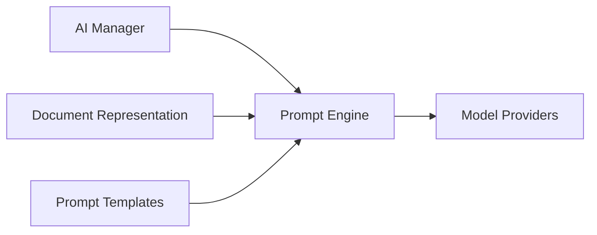

# Prompt Engine

> This document defines the Prompt Engine component, which is responsible for constructing, managing, and preparing prompts for AI interactions within OpenSorSe.

---

## Purpose

The Prompt Engine transforms application requests into structured prompts suitable for AI models.

It provides a centralized mechanism for constructing prompts, injecting document context, applying templates, and preparing requests for execution by the configured AI provider.

The Prompt Engine focuses solely on prompt construction. It does not execute AI requests or interpret AI responses.

## v1.0 implementation status

`IAiPromptBuilder` and `AiPromptBuilder` own short, deterministic, single-task templates for `file-rename-v2`, `folder-structure-v2`, and separately enabled `document-text-interpretation-v1`. Rename input is one opaque ID, one current stem, the application-owned extension, one deterministic document type, and at most 8 nearby/rejected stems. Folder input is capped at 12 deterministically ordered file records and 16 prevalidated folder-name choices. Files use request-local `item-NNN` identities; absolute paths and file contents are excluded from rename and folder requests.

Each prompt contains labelled input, numbered rules, the exact response schema, explicit `no_suggestion` behavior, and a JSON-only output instruction. Ollama receives the same schema through `format`; generation uses temperature `0.0`. The model returns an extension-free rename stem or opaque folder assignments. Application validators append the known extension and independently reject unknown IDs, missing or duplicate assignments, invented names/evidence, unsafe components, traversal, absolute paths, cycles, excessive depth, and complete-response inconsistencies.

One optional repair request is allowed only for JSON or schema-shape failures. It includes the original task ID, exact schema, bounded prior response, and concise validation error. Unsafe identities, unknown source IDs, path attempts, model misuse, hard bounds, provider failures, timeouts, and cancellations are never repaired. The original and repair requests are separate related Advanced Diagnostics sessions.

Templates and schema strings are application-owned reviewable source. Snapshot tests fail on unapproved changes. See [Small-model Prompt Contracts](11_Small_Model_Prompt_Contracts.md) for versions, exact bounds, validators, and the unverified manual model matrix.

---

# Responsibilities

The Prompt Engine is responsible for:

* Constructing AI prompts.
* Managing prompt templates.
* Injecting document context.
* Applying prompt variables.
* Preparing provider-ready requests.
* Supporting prompt versioning.
* Maintaining prompt consistency.

---

# Scope

### In Scope

* Prompt construction
* Prompt templates
* Context injection
* Variable substitution
* Prompt formatting
* Prompt validation

### Out of Scope

The Prompt Engine is **not** responsible for:

* AI inference
* Model selection
* Response interpretation
* Document classification
* Summarization
* Response caching

These responsibilities belong to other AI components.

---

# Architectural Overview

The Prompt Engine prepares structured prompts for execution by the configured AI provider.

---

# Prompt Workflow

A typical prompt generation process consists of the following stages:

1. Receive an AI request.
2. Select the appropriate prompt template.
3. Inject document context.
4. Apply variables and configuration.
5. Validate the generated prompt.
6. Produce a provider-ready request.
7. Forward the prompt to the Model Providers component.

---

# Prompt Templates

Prompt templates define reusable instructions for specific AI capabilities.

Examples include:

* Document classification
* Document summarization
* Filename suggestions
* Folder suggestions
* Tag generation
* Keyword extraction

Templates should remain reusable and independent of specific AI providers.

---

# Context Management

The Prompt Engine may incorporate contextual information such as:

* Extracted document text
* Embedded metadata
* Filesystem metadata
* User preferences
* Application configuration
* Previous AI results where appropriate

Only relevant context should be included to improve prompt quality and reduce unnecessary token usage.

---

# Design Principles

The Prompt Engine should remain:

* Provider-independent.
* Template-driven.
* Reusable.
* Configurable.
* Extensible.
* Easy to test.

Prompt construction should be deterministic and independent of AI model implementation details.

---

# Prompt Validation

Before execution, prompts should be validated to ensure:

* Required variables are present.
* Mandatory context has been provided.
* Prompt templates are complete.
* Invalid prompt structures are detected before inference.

Validation helps improve reliability and reduces avoidable AI failures.

---

# Error Handling

The Prompt Engine should handle prompt-related failures gracefully.

Examples include:

* Missing templates.
* Missing variables.
* Invalid prompt configuration.
* Context generation failures.
* Template validation errors.

Prompt generation failures should prevent invalid requests from reaching AI providers.

---

# Future Considerations

The architecture should support future enhancements, including:

* User-customizable prompt templates.
* Versioned prompt libraries.
* Multi-language prompt support.
* Prompt optimization.
* Prompt testing and benchmarking.
* Plugin-defined prompt templates.

These enhancements should preserve the separation between prompt generation and AI execution.

---

# Related Documents

* [AI Overview](00_Overview.md)
* [AI Manager](01_AI_Manager.md)
* [Model Providers](02_Model_Providers.md)
* [Document Classification](04_Document_Classification.md)
* [Summarization](05_Summarization.md)
* [Small-model Prompt Contracts](11_Small_Model_Prompt_Contracts.md)

