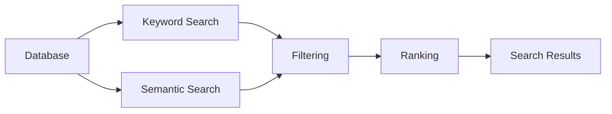

# Search Overview

> This document provides an overview of the Search subsystem, which is responsible for retrieving relevant documents using keyword, semantic, and metadata-based search techniques.

---

## Implementation Status

OpenSorSe retains deterministic current-Results and catalog metadata search from v0.3-v0.9 and the compatible v1.0 `semantic-index.json`. In v1.7 the user-facing feature became **Search** and combined that bounded index with provider-neutral progressive documents from the durable background index. v2.1 provides deterministic exact/literal-first hybrid ranking, bounded fuzzy handling, explanations, visible filters, and optional same-tier AI assistance over already known results. v2.2 adds typed media metadata, OCR, transcript-contract, and optional-description-contract evidence to the same pipeline. Search is one obvious primary-navigation destination and stays usable while coverage or optional media capabilities are incomplete.

---

## Purpose

The Search subsystem enables users to efficiently discover and retrieve documents managed by OpenSorSe.

It combines multiple search strategies—including keyword search, semantic search, metadata filtering, and intelligent ranking—to provide accurate and relevant search results regardless of how a document was originally processed.

The Search subsystem provides retrieval capabilities only. It does not create or modify document information.

---

# Responsibilities

The Search subsystem is responsible for:

* Searching document and available media-derived content.
* Searching metadata.
* Performing semantic search.
* Filtering search results.
* Ranking results by relevance.
* Managing search indexes.
* Returning unified search results.

---

# Scope

### In Scope

* Keyword search
* Semantic search
* Metadata search
* Filtering
* Ranking
* Search indexes
* Result retrieval

### Out of Scope

The Search subsystem is **not** responsible for:

* AI inference or media extraction
* Embedding generation
* Metadata extraction
* Database persistence
* Rule execution
* User interface rendering

These responsibilities belong to other architectural subsystems.

---

# Architectural Overview

The Search subsystem retrieves information from the Database using multiple search strategies and presents unified search results.

The Search subsystem combines multiple retrieval techniques into a single, consistent search experience.

---

# Search Components

The Search subsystem consists of several specialized components.

| Component       | Responsibility                                 |
| --------------- | ---------------------------------------------- |
| Keyword Search  | Searches textual content and metadata.         |
| Semantic Search | Retrieves documents based on meaning.          |
| Filtering       | Narrows result sets using structured criteria. |
| Ranking         | Orders results by relevance.                   |
| Tagging         | Supports tag-based organization and retrieval. |
| Indexing        | Maintains searchable data structures.          |

Each component is documented separately within this section.

---

# Search Workflow

A typical search operation consists of the following stages:

1. Receive a user query.
2. Determine the applicable search strategies.
3. Execute keyword and semantic searches where appropriate.
4. Apply filters.
5. Rank candidate results.
6. Return the final result set.

Individual search strategies may be combined depending on the query.

---

# Search Sources

The Search subsystem may retrieve information from:

* Document and media metadata.
* Extracted document text.
* Image and representative-frame OCR.
* Bounded local-provider transcripts when a concrete provider is available.
* Optional low-weight visual descriptions when a reviewed provider is available.
* AI-generated summaries.
* AI classifications.
* Tags.
* Embeddings.
* File properties.

The origin of information should remain transparent to the user whenever practical.

---

# Design Principles

The Search subsystem should remain:

* Unified.
* Fast.
* Extensible.
* Provider-independent.
* Scalable.
* Independent of AI implementation.

Search should focus on retrieving information rather than generating it.

---

# Future Considerations

The architecture should support future enhancements, including:

* Additional validated hybrid signals.
* Broader deterministic natural-language interpretation.
* Saved queries containing full filter combinations beyond v0.7's query-text-only presets.
* Personalized ranking.
* Federated search.
* Plugin-defined search providers.

These enhancements should preserve the Search subsystem's primary responsibility of retrieving relevant information.

---

# Related Documents

* [Keyword Search](01_Keyword_Search.md)
* [Semantic Search](02_Semantic_Search.md)
* [Filtering](03_Filtering.md)
* [Ranking](04_Ranking.md)
* [Tagging](05_Tagging.md)
* [Indexing](06_Indexing.md)
* [Database Overview](../05_Database/00_Overview.md)
