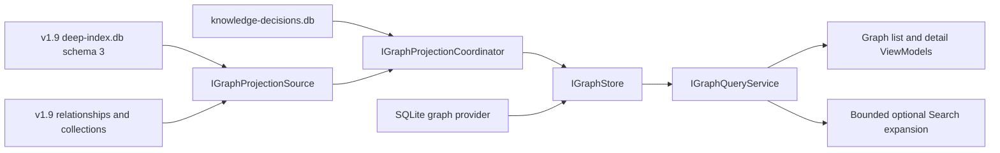

# v2.0 Knowledge Graph stability design

**Status:** Proposed design only on `v2.0-knowledge-graph-design`.

**Implementation status:** No v2.0 runtime, schema, UI, or public API is
implemented by this document. OpenSorSe remains version 1.9 on this branch.

## Objective

v2.0 may project the indexed files, evidence-backed relationships, Smart
Collections, and explicit user decisions into a small queryable Knowledge
Graph. The graph must remain a derived, inspectable aid. It must not become a
second authority for source files, indexing, Search, or file operations.

Stability is the release's primary feature. A graph outage must degrade to the
implemented v1.9 Search and Relationships experience. It must not prevent
indexing, Change Plans, recovery, or Undo from operating.

## Repository-grounded boundaries

The design reuses these v1.9 guarantees rather than reimplementing them:

- `IDeepIndexStore` and `deep-index.db` schema 3 own indexed files, bounded
  extracted data, durable indexing stages, source ownership, and privacy;
- `IRelationshipStore` owns evidence-backed file relationships, Smart
  Collections, and overrides, while `IRelationshipSearchSource` supplies the
  existing bounded direct contextual Search expansion;
- `SemanticSearchService` and `HybridSearchRanker` preserve exact/literal-first
  Search and provider failure fallback;
- the background index already owns file discovery, OCR/AI dependency waits,
  pause, cancellation, retries, restart recovery, quota maintenance, and
  progress;
- Change Plans, the Operation Journal, recovery, and Undo remain the only
  supported source-file mutation path.

The design also records current signal limits rather than treating placeholders
as graph facts: SQLite relationship `MetadataText` is a metadata fingerprint,
production relationship candidates do not currently receive accepted tags,
Workflow evidence is declared but not emitted, extracted/OCR relationships use
whole-field fingerprint equality, and relationship timelines currently use
file-modification time. A graph implementation must add a real provider-neutral
observation contract or leave the corresponding node/evidence type unavailable.

Knowledge Graph work must therefore run after compatible indexed observations
exist, but outside the indexing critical path. A graph failure never changes a
file's `FileFullyIndexed` result.

## Storage isolation decision

The first implementation should create a separate `knowledge-graph.db` rather
than increase `deep-index.db` beyond schema 3. This is a deliberate stability
boundary:

1. v1.9 data is never rewritten merely to enable the graph;
2. v1.9 can be run again and will ignore the sidecar graph store;
3. graph corruption, locking, quota, compaction, and rebuild remain isolated;
4. Search and indexing retain their current database lifecycle;
5. graph bootstrap is cancellable background projection, not a long startup
   migration.

The graph database stores derived nodes, typed edges, retained evidence
references, immutable reconciliation manifests, observation/applied
watermarks, work state, integrity facts, and operational history. It does not
copy full source files, extracted documents, OCR text, summaries, prompts, or
vectors.

Explicit graph corrections are not disposable derived data. A separate,
versioned `knowledge-decisions.db` owns manual entities, aliases, merge/split
decisions, manual edges, rejected suggestions, and exclusions. Its provider
uses short transactions, verified bounded backups, and staged restore. The
graph store applies the ordered decision sequence idempotently. Rebuild can
replace every derived graph row without erasing a user decision.

Existing v1.9 file-relationship and Smart Collection decisions remain
authoritative in schema 3 and continue to be changed only through their
existing services. A graph-side import of those decisions is a versioned,
non-authoritative observation used for projection and replay; it is never a
second writable copy. The decision ledger is authoritative only for graph-native
manual entities, aliases, compatible-kind merge/split choices, graph-only
manual edges, graph suggestion decisions, and graph exclusions. Reconciliation
must observe legacy updates and removals, including changes made after running
v1.9 during a rollback.

The provider may remain in `OpenSorSe.Indexing.Sqlite`, but Application
contracts must contain no SQL, connection, FTS, or provider types. A future
server provider must preserve the same bounds, cancellation, privacy,
degradation, and repair semantics.

## Stable v2.0 scope

Stable enough for the first v2.0 implementation:

- File, Source, Folder, Smart Collection, and exact-content Document Set nodes
  using existing or mechanically derived stable IDs;
- user-created entities whose merge/split identity is always explicit;
- typed edges projected from retained v1.9 evidence and explicit decisions;
- list/detail navigation, one-hop Related Items, evidence inspection, and
  bounded timeline links;
- manual create, link, unlink, merge, split, rename, reject, and forget actions;
- selective verify/repair/rebuild by file, entity, collection, source, or graph
  projection;
- one-hop, opt-out graph Search expansion below exact and literal results;
- partial coverage, stale, dependency, maintenance, and repair-required states;
- privacy inspection and index-only forgetting that never changes originals.

Experimental and disabled by default:

- bounded two-hop exploration;
- Project, Purchase, Trip, or Organization mention suggestions derived from
  exact retained evidence;
- Topic or Event suggestions derived from generated summaries or semantic
  signals;
- optional local-model entity suggestions that require user confirmation and
  can never merge identities automatically.

Deferred beyond v2.0:

- automatic Person, Place, Event, or Topic identity; face recognition,
  biometric, or GPS identity resolution;
- model-only facts, aggressive fuzzy alias merging, or learned confidence;
- unrestricted recursive traversal, a graph query language, or a large canvas
  visualization;
- conversational assistance, autonomous actions, adaptive profiling, remote
  graph services, collaboration, or cross-device identity;
- accepted Tag nodes until a provider-neutral accepted-tag observation,
  stable-identity, ownership, persistence, and rename/move reconciliation
  contract is implemented;
- automatic processing of new archive contents beyond the existing index.

Existing v1.9 `SameProject`, `SamePurchase`, `SameTrip`, and `SameTopic`
file-relationship edges and Smart Collection context types may be projected in
the stable scope. That does not create a real-world Project, Purchase, Trip, or
Topic entity. Inferring such an entity from mentions remains experimental and
requires confirmation. A Smart Collection carries existing context metadata;
there is no separate stable `Context` node kind.

## Initial graph model

Stable node kinds are `File`, `Source`, `Folder`, `Collection`, `DocumentSet`,
and `ManualEntity`. Stable edge kinds are `RelatedFile`, `OwnedBySource`,
`LocatedInFolder`, `MemberOf`, `SameDocumentSet`, and `Manual`.
The contracts use extensible codes while providers reject unknown persisted
values they cannot safely interpret.

Every automatic edge contains:

- source and target stable keys;
- edge type and direction;
- one or more evidence references that still resolve in the v1.9 source
  snapshot;
- understandable confidence level, never a fabricated percentage;
- algorithm name/version and input fingerprint;
- creation, validation, and source-observation timestamps;
- projection revision and stale state;
- user decision state.

Missing evidence invalidates an automatic edge. Manual edges are labelled as
manual and do not pretend to have automatic evidence.

## Conservative identity resolution

Automatic identity resolution is local and deterministic. Normalization is
limited to Unicode normalization, trimming/collapsing whitespace, documented
case comparison, and bounded punctuation handling. It does not guess that two
different aliases identify the same real-world subject.

Any future opt-in automatic real-world entity merge requires:

1. the same exact normalized candidate key in the same declared scope;
2. compatible entity type and extractor version;
3. corroboration from a second retained signal, such as an explicit tag,
   relationship evidence, or collection membership;
4. no persisted split, never-merge, exclusion, or ambiguity decision;
5. a candidate bucket below the configured safety ceiling.

The stable v2.0 path resolves only mechanical identities: existing stable IDs,
exact source-relative folder keys, and exact content hashes.
Project, Organization, Purchase, and Trip candidates remain suggestions until
the user confirms them. Otherwise candidates stay separate. Oversized or
contradictory buckets are `RepairRequired` or ambiguous, never auto-merged.

Derived IDs use a documented deterministic hash of entity type, scope,
normalization version, and canonical key. The full inputs are retained for
collision verification. The hash is an identifier mechanism, not encryption,
authentication, or a claim about identity truth.

Manual merge/split decisions reference stable candidate keys rather than a
temporary row ID. They apply only to compatible manual or experimental entity
candidates; File, Source, Folder, Collection, and Document Set identities are
linked/unlinked but never merged across incompatible kinds. Decisions are
applied after automatic resolution and survive algorithm changes, incremental
invalidation, selective repair, and rebuild.

## Incremental projection

The future `IGraphProjectionSource` exposes a provider-held consistent snapshot
of provider-neutral file, relationship, collection, privacy, decision, and
deletion observations in stable-primary-key pages with canonical row hashes.
A completed manifest generation is authoritative. Wall-clock timestamp cursors
and fast in-process notifications are latency optimizations only; they cannot
retire data or prove completeness.

For each affected bounded component, the coordinator:

1. captures source fingerprints and the applicable decision-ledger revision;
2. extracts and normalizes bounded candidates without opening source files;
3. resolves identity conservatively;
4. builds nodes/edges in staging records;
5. validates evidence, referential integrity, bounds, and decisions;
6. atomically replaces only that affected component and records its applied
   observation revision;
7. schedules old/stale rows for bounded cleanup.

Until step 6 commits, readers see the previous valid component. Missed
notifications, source deletion, clock changes, or a crash are corrected by a
completed stable-ID manifest comparison. An interrupted manifest never retires
unseen rows. No cross-database transaction is claimed.

## Durable states

The product projects several orthogonal durable axes. Run control models
`Pending`, `Running`, `PauseRequested`, `Paused`, `CancelRequested`,
`Cancelled`, and `Complete`. Job execution models `Pending`, `Running`,
`Complete`, `Cancelled`, `RetryableFailure`, `PermanentFailure`,
`WaitingForDependency`, and `WaitingForResources`. Component freshness models
current or `Stale`; integrity models valid or `RepairRequired`. UI product state
combines those axes without persisting impossible enum combinations.

`Running` always includes a coordinator fencing epoch, per-job claim token,
owner instance, input revision, attempt, heartbeat, and lease expiry. Startup
converts an expired claim to retryable execution while retaining freshness.
A valid pause request prevents new claims and becomes `Paused` after active
claims acknowledge a durable resumable boundary. Cancellation becomes
`Cancelled`, never `Complete`, only after every active claim is durably
acknowledged or fenced. Permanent failure requires an explicit input or policy
change before retry. No row remains indefinitely `Running` after a process
interruption, and a late publisher from an older fencing epoch is rejected.

## Concurrency and query model

- One coordinator owns scheduling; a bounded worker pool performs pure
  extraction/normalization.
- One short-transaction writer gate owns `knowledge-graph.db` changes.
- No external dependency call or expensive analysis occurs inside a write
  transaction.
- WAL readers capture a SQLite snapshot and return complete immutable result
  objects.
- Maintenance and projection use persisted leases and documented lock order;
  maintenance may pause writers but does not invalidate existing read
  snapshots.
- Search may use at most 16 seed results and 50 graph-only expansions within a
  combined 100-result contextual ceiling, one hop by default. Candidates are
  deduplicated by File ID before ranking. A file receives at most one contextual
  score component: existing direct v1.9 relationship evidence wins, otherwise
  graph evidence applies. Ordinary graph lists page at 100, traversal depth
  never exceeds two, and the visited-node ceiling is 500.
- Candidate buckets, aliases, evidence, edges per node, queue capacity,
  parallelism, text inspected, and retained operational history all have hard
  ceilings tested at and above their boundaries.

Exact/literal Search remains higher priority than any graph-only result. The
existing relationship-context control retains its v1.9 meaning; a separate
advanced graph-context control can be disabled without disabling direct
relationship context. If the graph is disabled, stale, busy, corrupt, under
maintenance, or unsupported, Search falls back to eligible v1.9 behavior and
explains that graph context is temporarily unavailable. If current privacy or
decision authority cannot be validated, graph reads/expansion fail closed.

Indexing coverage and graph-projection coverage are independent UI/diagnostic
facts. Complete graph projection does not imply complete filename/text/OCR
indexing, and incomplete graph projection does not make already-indexed literal
Search incomplete. No-result and acknowledgement wording keeps those layers
separate.

## UI and accessibility contract

The stable UI is limited to paged/virtualized overview, list, detail, evidence,
privacy, and repair surfaces. All actions are available through keyboard and
click/touch without depending on hover. Names, roles, states, errors, progress,
freshness, confidence, and limit reasons are exposed to assistive technology;
color or position is never the only carrier of meaning. High-contrast themes
and text scaling must preserve content and controls.

Async refresh keeps a still-valid selection and discards superseded responses.
After paging, merge, split, forget, repair, or removal, focus moves
deterministically to the updated item, a logical neighbor, or the initiating
control. Destructive index-only actions use an accessible confirmation that
states which OpenSorSe data changes and that original files remain untouched.
Live announcements are coalesced to meaningful transitions rather than every
progress sample.

## Privacy and authority

Graph operations have no source-file write capability. Forget, rebuild,
repair, merge, and split affect only OpenSorSe-owned derived state or the graph
decision ledger. Existing watched/manual source ownership and v1.9 privacy
rules are mandatory projection filters.

Sidecars, decision backups, labels, aliases, and quarantine copies are sensitive
local metadata. The design does not claim encryption. Disable retains data but
stops graph work/query; Clear Derived Graph removes derived stores/backups while
retaining decisions; Clear Graph and Decisions separately confirms irreversible
removal of graph-owned decisions/backups and leaves graph disabled to prevent
immediate recreation. A privacy forget is acknowledged only after a verified
post-decision recovery point exists; restore cannot activate a backup older
than the current privacy sequence.

Default diagnostics include safe IDs, stages, states, counts, durations,
versions, queue depth, bounds reached, retry categories, database size, and
repair actions. They omit source contents, extracted/OCR text, summaries,
aliases, complete queries, prompts, vectors, secrets, and unnecessary absolute
paths. Export remains reviewable before sharing.

## Release policy

v2.0 requires a release-candidate stabilization phase after feature freeze.
No merge, tag, package, or publication should occur until migration/recovery,
manual-decision preservation, deterministic rebuild, graph bounds, Search
fallback, UI responsiveness, redaction, and source-file immutability gates all
pass on the exact candidate commit.

The detailed failure analysis, migration plan, recovery plan, concurrency
model, integrity model, compatibility matrix, automated test matrix, release
checklist, and unchecked manual checklist are linked from the v2.0
implementation-specification package.
