# v1.1 Change Plans and Operation Journal

## Separation of intent and fact

A **Change Plan** is a non-mutating proposal. It owns review decisions, edits, validation, scan freshness, warnings, and conflicts. An **Operation Journal** record is a durable account of an actual attempted Apply, rollback, recovery, or Undo. Journal data never replaces or rewrites the source plan.

```mermaid
flowchart LR
    Suggestion["AI / rule / metadata suggestion"] --> Adapter["SuggestionChangePlanFactory"]
    Adapter --> Plan["Persisted Change Plan"]
    Plan --> Review["Review Changes: edit + approve/reject"]
    Review --> Validate["Validate Plan"]
    Validate --> Confirm{"Explicit Apply Plan?"}
    Confirm -- No --> Plan
    Confirm -- Yes --> Preflight["Immediate immutable preflight"]
    Preflight --> Journal["Durable pending/running journal"]
    Journal --> Engine["ChangePlanExecutionService"]
    Engine --> Gateway["IFileSystemGateway"]
    Engine --> Verify["Verify + persist each action"]
    Verify --> History["Operation History"]
    History --> Undo["Conflict-aware reverse operations"]
```

## Domain and services

- `ChangePlan`, `ProposedChangeAction`, `FileIdentitySnapshot`, and structured enums are versioned portable records.
- `ChangePlanFactory` normalizes proposals, captures identity, infers required directory actions, validates at creation, and persists.
- `ChangePlanValidator` is read-only and runs at creation, review, and pre-execution.
- `ChangePlanExecutionService` freezes approved actions, persists before mutation, executes deterministically, verifies, rolls back, undoes, and recovers.
- `IFileSystemGateway` is the production low-level user-file mutation boundary. It refuses overwrites.
- `JsonChangePlanStore` and `JsonOperationJournalStore` use bounded atomic sibling replacement and graceful reads.
- `OperationReportExporter` emits paths and recovery facts but no file content or prompt text.

## Ordering and failure behavior

Factory-created plans order required directories before file actions, then use stable execution order/action ID. The engine revalidates all approved actions before journalling Running. It observes cancellation only between atomic filesystem actions. A blocking failure stops later work and rolls back completed reversible actions in reverse order.

Case-only renames on case-insensitive filesystems use a unique verified temporary sibling and attempt immediate restoration if the final hop fails. Verification failures are journalled; when a mutation may have occurred, immediate restoration is attempted and itself verified.

## Undo and dependencies

Rename/move inverse operations restore the recorded original path. Created-directory inverses remove only OpenSorSe-owned empty directories. Post-identity, modification, destination/original occupancy, and later successful journal dependencies are checked first. Unsafe inverses are blocked, not forced. Partial Undo is an explicit terminal status.

## v2.5 post-operation reconciliation

Terminal Apply/Undo journals returned through Review Changes or Operation
History, plus startup interruption-recovery records, are projected from actual
action outcomes rather than from the source plan's intent. Successful
rename/move actions retain the existing Results logical ID by path matching;
filesystem identity is not treated as that UI identity. Obsolete paths leave
the Files projection, duplicate groups and planned-operation indicators are rebuilt, and
selection is restored by logical file ID when the row remains visible.

Failure, rollback, and rollback-partial-failure outcomes are checked against
current filesystem existence. A mixed or ambiguous result is never labelled as
complete: verified paths are shown immediately and only configured indexing
sources intersecting the affected old/new paths are refreshed. Incremental
identity matching reuses completed derived evidence for unchanged moved files;
missing old paths are removed during source reconciliation. Undo enters the
same contract instead of using a separate presentation-only patch.

The internal journal-only path does not require the shorter-retained source plan.
Duplicate-recovery Undo requests targeted refresh because Apply removed that
row and journal schema 1 cannot recreate its Results logical identity.

## Interruption

After core host initialization, startup preflights the authoritative stores
before plugin, workflow, watcher, and index initialization. Pending/Running
operations are inspected only after background-index and shell initialization,
then their exact returned records are immediately reconciled and
their operation roots are deduplicated and submitted as one refresh batch
bounded by the journal's 500-operation retention limit. A
missing original plus matching intended result can establish a completed file
action; an unchanged original can establish a skipped action. Ambiguity remains
a structured conflict. Directory ownership is never inferred solely from
existence. Recovery and projection reconciliation are adjacent but not one
atomic durable transaction.

## Limits

The mechanism is transaction-like but cannot provide an operating-system-wide transaction. Permanent deletion is unsupported. Plan storage retains at most 100 plans/1,000 actions each. The journal retains at most 500 operations and 128 MiB.
