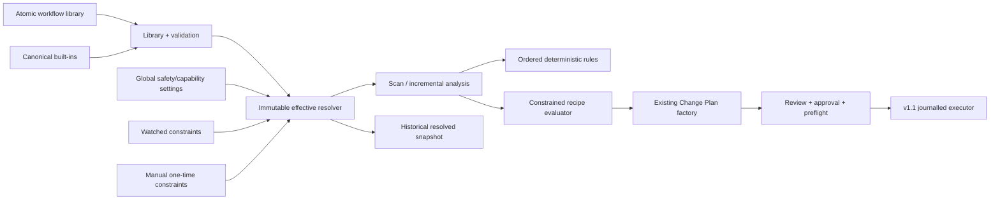

# v1.3 Workflow Profiles and Recipes

## Data and control flow

> Workflow profiles automate configuration and analysis, not approval or file modification.

## Separation

Domain contracts are in `OpenSorSe.Application.Workflows`. Persistence, validation/template evaluation, resolution, recipe-to-plan conversion, and import/export are separate services behind interfaces. Desktop ViewModels own only editor/filter/command state. The executor has no dependency on Application; additive provenance uses executor-owned primitive records.

## Precedence

Global application settings are absolute capability ceilings. A selected profile defines the reusable baseline. Watched-folder or one-time manual overrides can only lower size/capability/plan settings. Recipes then contribute ordered declarative templates and deterministic file rules. Multiple matching recipes resolve by descending explicit integer priority and stable ordinal recipe ID; the choice is reported.

Recipe-owned `FileRule` entries run through the existing rule engine before template-plan generation. Rule priority remains explicit and inspectable; the current rule model selects actions rather than executing expressions or injecting arbitrary metadata. Template generation consumes the bounded deterministic result fields available in the completed scan. Incremental scan behavior controls changed-only versus full reanalysis, preservation of unchanged analysis, and missing-item reconciliation.

## Template security

The parser accepts literals and `{field}` or `{dateField:format}` tokens from a fixed whitelist. Values are formatted once and appended as data; braces in values are never parsed. Portable invalid characters and separators are removed/replaced, Unicode/whitespace/case policies are deterministic, and each resulting segment is checked. Full paths are normalized and confined below the root. Collision policy blocks occupied output.

## Historical truth

`WorkflowConfigurationSnapshot` stores profile identity/revision/time, recipe identities/revisions/priorities, effective typed settings, resolution source, and resolution time. Results catalogues and watched catalogues retain this value. Later library edits cannot mutate the immutable snapshot.

## Existing safety system reuse

Recipe proposals carry profile/recipe revisions, values, evidence, AI-assisted flag, warnings, and unresolved fields. Inferred directory proposals inherit provenance. All actions begin Pending and pass the existing validator/store. The workflow subsystem cannot approve or execute.

## v1.4 plugin contribution integration

Profiles may require stable plugin/version/contribution references and recipes
may declare plugin recipe-field providers. Resolution accepts only the exact
active registration and stores it in the immutable configuration snapshot.
Missing, disabled, incompatible, integrity-changed, dependency-blocked,
quarantined, or wrong-version contributions stop resolution with **Plugin
capability unavailable — review workflow profile**. There is no silent
fallback.

Plugin field values are typed data, not executable template syntax. The normal
field whitelist, sanitization, root confinement, reserved-name, length,
collision, preview, and unresolved-field rules still apply. All generated
actions, including inferred directory actions, retain plugin ID, exact version,
contribution ID, value, derivation, reason, evidence, and confidence
provenance. Actions begin Pending and use the existing Change Plan boundary.
