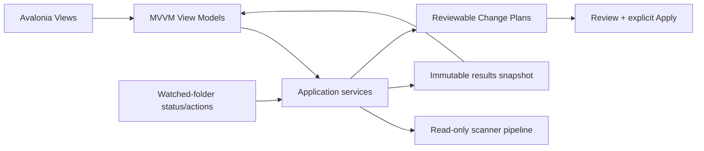

# GUI Overview

> The current v1.3 GUI is an Avalonia MVVM desktop application focused on reusable workflow configuration, safe analysis, watched-folder monitoring, review, and separately confirmed Change Plan execution.

---

## Current scope

The implemented Desktop application hosts these user-facing areas:

| Component | Current role |
| --- | --- |
| Main Window | Hosts the official OpenSorSe identity, primary and advanced destinations, footer Help/About, global feature controls, notifications, and the persistent operation status bar. |
| Home | Shows one current-session latest-scan card and routes to primary workflows. |
| Scan | Accepts selected local folders, selects/summarizes an active workflow profile, supports session-only narrowing/save-as-new, and presents processing progress and cancellation. |
| Files | Hosts primary search, progressive filters, a resizable explorer table, selected-file details, warnings, bounded tags, and selection-only File Assistant controls. |
| Duplicates | Reuses the exact-duplicate review ViewModel as a primary friendly workflow without adding deletion. |
| Saved scans | Consolidates the scan library, saved metadata search, and advanced comparison behind local tabs. |
| Meaning Search Beta | Opens from Files, builds/searches a separately enabled bounded local index, and explains filename/tag/metadata/native/OCR/similarity matches. |
| Folder plans | Advanced preview/apply/history page with exact confirmation, repeat protection, filters, source/proposed/applied/current structures, and accessible diagrams. |
| Rules | Edits and validates current-session deterministic rules. Saving exposes the recipe as `current` to watched-folder analysis; rules never execute directly. |
| Watched Folders | Adds, edits, pauses, resumes, scans, reconciles, opens, reviews, and safely removes persistent watched-root configurations with status and grouped activity. |
| Workflows | Searches, filters, creates, duplicates, validates, versions, assigns, archives/restores, safely deletes, imports/exports, and diagnoses profiles/recipes; previews deterministic templates without filesystem mutation. |
| Review Changes | Reviews/edits/approves/rejects, validates, explicitly applies, and reports persisted Change Plans. |
| Settings | Edits implemented application settings. |
| Diagnostics | Presents aggregate logging health. |
| Operation History | Presents durable journal summaries/details, report copy, interruption state, and conflict-aware whole/selected-action Undo. |
| Notifications | Shows non-blocking user-safe status messages. |

The current GUI exposes capped known-file/folder opening, local metadata/OCR controls, Semantic Search Beta, persistent watched folders, reviewable Change Plans, journalled safe execution, and conflict-aware Undo. It does not expose duplicate deletion, direct generic rule execution, autonomous AI mutation, permanent deletion, or background-service monitoring while OpenSorSe is closed. AI remains review-only, and catalog/index/history maintenance changes only OpenSorSe application data.

## Presentation boundary

Views contain layout/bindings only. ViewModels coordinate application interfaces asynchronously; watcher lifecycle, filesystem extraction, opening, semantic indexing, catalogue processing, Change Plan validation, and execution remain behind injected application/service boundaries.

## Current usability guarantees

- Scan progress and cancellation are visible.
- Results are bounded through paging and are filtered and sorted in memory.
- Result and duplicate details reflect the completed scan; they do not inspect the live filesystem.
- The Results surface includes persistent read-only safety wording.
- Catalog, Catalog Search, and Compare Snapshots present historical metadata only; they do not refresh or access a selected file.
- Snapshot comparison holds at most 4,000 application changes and renders at most 500 rows for the active filters.
- User tags are application metadata only. Saved searches store names/query text only and always recalculate hits from the current catalog.
- Primary navigation includes Home, Scan, Files, Duplicates, Saved scans, Settings, Operation History, Watched Folders, and Workflows. Specialist pages remain grouped separately; Help and About are in the footer.
- Semantic theme resources define layered surfaces, text, borders, primary/organization/search/duplicate/AI accents, and success/warning/error colors for future light/dark refinement.
- Empty, limitation, and error states use user-safe messages.
- Fixed Results filters remain outside the independently scrolling result list; Duplicate details use a right drawer.
- The Files list owns remaining width until selection. Its details divider uses star sizing, 450/320 minimum pane widths, native pointer/keyboard resizing, and a validated 20–50% locally persisted ratio.
- File columns use shared size groups and keyboard-operable dividers so headers and realized rows remain aligned without adding a second table framework.
- Official branding is packaged as transparent Avalonia resources and is used by both the native window icon and sidebar at device-independent sizes.
- Settings owns the persistent AI and Advanced controls; the shell centrally hides stale gated destinations and safely returns to Home.
- Structure diagrams are capped at 500 visible nodes and provide text labels for every change state.
- Watched-folder cards distinguish paused/watching/unavailable/busy/error state, queue and pending-plan counts, last change/scan/reconciliation, summary, and grouped activity without claiming automatic organization.
- Workflow cards distinguish canonical/user origin, revision state, capabilities, dependencies, and usage. Structured sections and advanced disclosure keep safety and processing cost visible.

> Workflow profiles automate configuration and analysis, not approval or file modification.

## Future design material

The remaining GUI documents may describe future pages or extension points such as reports, dialogs, themes, and plugin-provided UI. Those descriptions are design intent unless a current release document or implementation specification identifies a feature as implemented.

## Related documents

- [System Overview](../00_System/00_Overview.md)
- [Results Page](04_Results_Page.md)
- [Catalog and Catalog Search](11_Catalog_Page.md)
- [Catalog Comparison](12_Catalog_Comparison_Page.md)
- [Release Status](../../RELEASE_STATUS.md)
