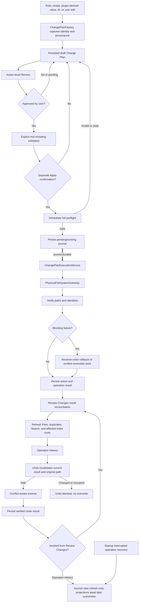
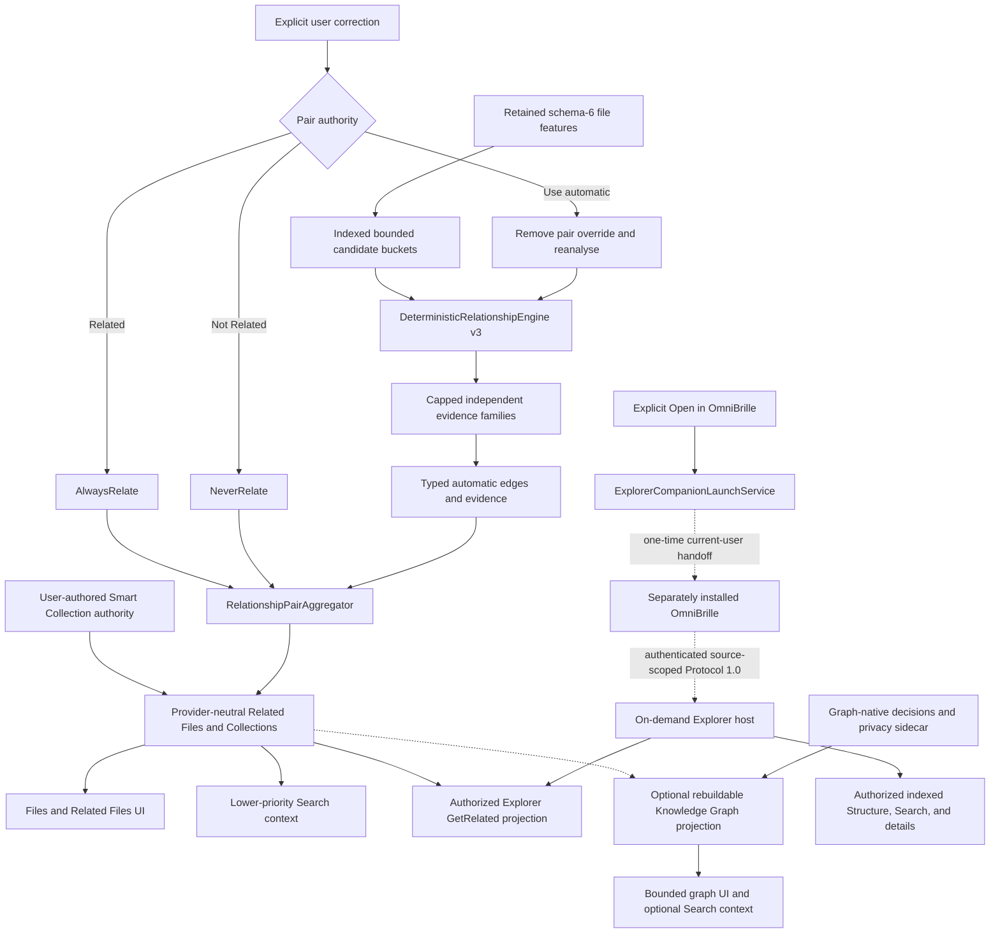

# OmniSorSe system map

These five Mermaid diagrams model the current OmniSorSe v2.12 implementation
candidate. They emphasize authority, persistence, communication, bounded work,
and the only supported source-file mutation route. Minor helpers and individual
Views are intentionally omitted.

Use the diagrams for navigation, then verify exact behavior in the linked
source and tests. [Current State](../CURRENT-STATE.md) owns volatile
version/runtime/schema/protocol facts; the
[Architecture Overview](../ARCHITECTURE_OVERVIEW.md) owns the deeper textual
boundary description.

## Platform, profile, and capability adapters

```mermaid
flowchart TB
    Capability["Platform capability provider"] --> Diagnostics["Settings diagnostics and report"]
    Capability --> Gating["Explicit limited or unavailable states"]
    PathContract["IPathSemantics"] --> WindowsPath["Windows case-insensitive and device-name policy"]
    PathContract --> LinuxPath["Linux case-sensitive policy"]
    IdentityContract["IFileIdentityProvider"] --> WindowsIdentity["Volume serial and file index"]
    IdentityContract --> LinuxIdentity["Device and inode"]
    IdentityContract --> Fallback["Metadata fallback"]
    FsContract["IFileSystemCapabilities"] --> Link["Link and reparse inspection"]
    FsContract --> Permission["Writable-access and free-space inspection"]
    FsContract --> Mount["Same-filesystem verification"]
    Paths["IApplicationPathProvider"] --> WindowsData["Existing LocalAppData layout"]
    Paths --> LinuxData["XDG config, data, state, cache"]
    Paths --> MacData["Application Support, Caches, and Logs"]
    Paths --> LegacyIdentity["Retained OpenSorSe/opensorse compatibility identity"]
    Tool["IExternalToolLocator"] --> TesseractPath["Configured path or safe PATH discovery"]
    Tool --> MediaTools["Explicit ffprobe or ffmpeg path, or safe process lookup"]
    DesktopContract["IDesktopIntegration"] --> WindowsDesktop["Windows desktop adapter"]
    DesktopContract --> LinuxDesktop["Linux graphical desktop adapter"]
    PackageBoundary["Build and packaging boundary"] --> WindowsManifest["Windows-conditioned manifest and icon"]
    PackageBoundary --> MacPackage["Intel and Apple Silicon disk images"]
    PackageBoundary --> LinuxPublish["Documented framework-dependent Linux publish"]
    Paths --> Profile["ProfileOwnershipLease and run marker"]
    Profile --> OneWriter["One current-user writer per profile"]
    Gating --> Approval["Review and explicit approval boundary"]
    Approval ==>|validated and journalled only| Mutation["Rename, same-filesystem move, create directory"]
```

Platform detection is contained in the platform implementation. Capability
reporting does not itself authorize an operation: the normal plan validation,
approval, immediate preflight, journal, execution, and verification route still
controls every mutation.

Navigate to `src/OpenSorSe.Core/Platform/`,
`src/OpenSorSe.Core/Lifecycle/ApplicationRunState.cs`, and
`src/OpenSorSe.Desktop/App.axaml.cs`. Principal regression coverage is in
`tests/OpenSorSe.Core.Tests/PlatformFoundationTests.cs`,
`PlatformCapabilityProviderTests.cs`, and
`ProfileOwnershipAndLifecycleTests.cs`.

## High-level ownership and communication map

```mermaid
flowchart TB
    subgraph External["External actors and systems"]
        User["User"]
        FS["Local filesystem"]
        Watcher["Operating-system file watcher"]
        Ollama["Ollama or configured AI provider"]
        Tesseract["Tesseract OCR engine"]
        MediaTools["Optional local ffprobe and ffmpeg"]
        Package["External local plugin ZIP"]
        Companion["Optional separate OmniBrille companion"]
    end

    subgraph Desktop["Desktop layer"]
        Shell["Application shell and navigation"]
        ScanUI["Scan UI"]
        FilesUI["Files and Results UI"]
        SearchUI["Search filters, explanations, privacy, and coverage UI"]
        CollectionsUI["Collections, Related Files, evidence, privacy, and repair UI"]
        GraphUI["Knowledge Graph bounded browser, evidence, privacy, and repair UI"]
        ReviewUI["Change Plan Review"]
        WatchUI["Watched Folders UI"]
        WorkflowUI["Workflows UI"]
        PluginUI["Plugin Settings UI"]
        HistoryUI["Operation History"]
        SettingsUI["Settings and Diagnostics"]
    end

    subgraph Application["Application orchestration"]
        ScanOrchestrator["Processing orchestrator"]
        WorkflowResolver["Workflow resolver"]
        WatchCoordinator["Watched Folder coordinator"]
        Reconcile["Incremental reconciliation"]
        PostOperationReconcile["Change Plan result reconciliation"]
        PluginManager["Plugin manager"]
        Registry["Contribution registry"]
        PlanAdapters["Change Plan proposal services"]
        HistoryService["Operation-history projection"]
        Stores["Persistence services"]
        IndexCoordinator["Durable indexing coordinator"]
        QueryInterpreter["Bounded query interpreter"]
        HybridRanker["Deterministic hybrid ranker"]
        IndexPrivacy["Index privacy and repair service"]
        RelationshipService["Relationship service"]
        RelationshipEngine["Deterministic evidence engine"]
        SmartTags["Smart Tag service and classifier"]
        Discovery["Complete-index facets and Saved View rules"]
        GraphCoordinator["Durable Knowledge Graph projection coordinator"]
        GraphServices["Provider-neutral graph query, decision, privacy, repair, and Search services"]
        MediaCoordinator["Provider-neutral bounded media coordinator"]
        ExplorerHost["On-demand Explorer Protocol host"]
        CompanionLaunch["Lazy scoped companion launch/bootstrap"]
        ExplorerContract["Dependency-free Protocol v1 contract"]
        StateTransfer["Logical state backup and restore"]
        Health["Profile, store, index, and lifecycle health"]
    end

    subgraph Processing["Read-only processing and suggestion layer"]
        Enumerate["File enumeration"]
        Metadata["Metadata extraction"]
        Text["Document text extraction"]
        OCR["OCR coordination"]
        MediaEvidence["Structured media metadata, transcripts, sampled-frame OCR, optional descriptions"]
        Classify["Classification"]
        Rules["Rules and deterministic planning"]
        Duplicates["Duplicate analysis"]
        Semantic["Semantic and tag analysis"]
        AI["AI adapters and validation"]
        Recipes["Sorting Recipe evaluation"]
        Extensions["Plugin contributions"]
    end

    subgraph Safety["Approval, safety, and execution layer"]
        Plan["Change Plan model"]
        PlanValidation["Plan validation"]
        Approval["Explicit user approval boundary"]
        Conflicts["Conflict and stale-state checks"]
        Preflight["Immediate preflight"]
        Journal["Execution Journal"]
        Executor["Safe executor"]
        Verify["Result verification"]
        Recovery["Recovery"]
        Undo["Undo and rollback"]
    end

    subgraph Storage["User-local storage"]
        UserFiles["User files"]
        Saved["Saved scans and catalogues"]
        WatchedState["Watched configuration, catalogue, activity"]
        Profiles["Workflow Profiles and Sorting Recipes"]
        PluginState["Plugin state and installed versions"]
        Plans["Change Plans"]
        Journals["Operation Journal and History"]
        LocalIndexes["Content and semantic indexes"]
        DeepIndex["Schema 6 Search, Smart Tag, relationship, media, and content authority"]
        SavedViews["Dynamic Saved View rules"]
        GraphIndex["Schema 1 rebuildable Knowledge Graph projection"]
        GraphDecisions["Schema 1 graph-native decision and privacy authority"]
        RuntimeState["Profile lock, run marker, and recovery state"]
    end

    User -->|commands and review| Shell
    Shell -->|explicit Open in OmniBrille| CompanionLaunch
    CompanionLaunch -->|lazy session creation| ExplorerHost
    CompanionLaunch -.->|one-time current-user handoff pipe| Companion
    Companion -.->|authenticated, source-scoped, bounded, read-only local session| ExplorerHost
    ExplorerHost --> ExplorerContract
    ExplorerHost --> IndexCoordinator
    ExplorerHost --> RelationshipService
    Shell --> ScanUI
    Shell --> FilesUI
    Shell --> SearchUI
    Shell --> CollectionsUI
    Shell --> GraphUI
    Shell --> ReviewUI
    Shell --> WatchUI
    Shell --> WorkflowUI
    Shell --> PluginUI
    Shell --> HistoryUI
    Shell --> SettingsUI

    ScanUI -->|scan request| WorkflowResolver
    WorkflowResolver --> ScanOrchestrator
    WatchUI --> WatchCoordinator
    Watcher -->|untrusted hints| WatchCoordinator
    WatchCoordinator --> Reconcile
    Reconcile --> WorkflowResolver
    PluginUI -->|local package operations| PluginManager
    Package -->|inspect only| PluginManager
    PluginManager --> Registry
    Registry -.->|bounded extension calls| Extensions

    ScanOrchestrator --> Enumerate
    Enumerate -->|read only| FS
    Enumerate --> Metadata
    Metadata --> Text
    Text --> OCR
    OCR -.->|local process| Tesseract
    Metadata --> MediaCoordinator
    MediaCoordinator -.->|argument-list process, bounded and cancellable| MediaTools
    MediaCoordinator --> MediaEvidence
    MediaEvidence --> OCR
    Metadata --> Classify
    Classify --> Rules
    Classify --> Duplicates
    Text --> Semantic
    Rules --> Recipes
    Extensions -.-> Metadata
    Extensions -.-> Classify
    Extensions -.-> Duplicates
    Extensions -.-> Recipes
    AI -.->|optional request| Ollama
    AI -->|validated suggestions| PlanAdapters
    Rules -->|proposals| PlanAdapters
    Recipes -->|proposals and provenance| PlanAdapters
    PlanAdapters --> Plan

    Plan --> Plans
    Plan --> ReviewUI
    ReviewUI --> PlanValidation
    PlanValidation --> Approval
    Approval ==>|separate Apply confirmation| Conflicts
    Conflicts --> Preflight
    Preflight --> Journal
    Journal --> Journals
    Journal ==>|durable before mutation| Executor
    Executor ==>|rename, move, create directory only| UserFiles
    UserFiles --- FS
    Executor --> Verify
    Verify --> Journals
    Verify -->|actual journal and filesystem outcomes| PostOperationReconcile
    Verify --> HistoryService
    HistoryService --> HistoryUI
    Journals --> Recovery
    Journals --> Undo
    Recovery ==>|verified repair only| Executor
    Undo ==>|conflict-aware inverse only| Executor

    Stores --> Saved
    Stores --> WatchedState
    Stores --> Profiles
    Stores --> PluginState
    Stores --> LocalIndexes
    SearchUI --> IndexCoordinator
    SearchUI --> QueryInterpreter
    SearchUI --> Discovery
    Discovery --> DeepIndex
    SavedViews --> Discovery
    QueryInterpreter --> HybridRanker
    HybridRanker --> SearchUI
    SearchUI --> IndexPrivacy
    SearchUI --> RelationshipService
    SearchUI -.->|optional bounded context| GraphServices
    CollectionsUI --> RelationshipService
    RelationshipService --> RelationshipEngine
    RelationshipService --> IndexCoordinator
    RelationshipService --> DeepIndex
    SmartTags --> DeepIndex
    IndexCoordinator --> SmartTags
    GraphUI --> GraphServices
    GraphUI --> GraphCoordinator
    GraphCoordinator -->|completed manifest adapter only| DeepIndex
    GraphCoordinator --> GraphIndex
    GraphCoordinator --> GraphDecisions
    GraphServices --> GraphIndex
    GraphServices --> GraphDecisions
    IndexPrivacy --> IndexCoordinator
    IndexPrivacy --> DeepIndex
    IndexCoordinator --> Enumerate
    IndexCoordinator --> Metadata
    IndexCoordinator --> Text
    IndexCoordinator --> MediaCoordinator
    MediaEvidence --> DeepIndex
    IndexCoordinator --> LocalIndexes
    IndexCoordinator --> DeepIndex
    Reconcile --> WatchedState
    WorkflowResolver --> Profiles
    PluginManager --> PluginState
    ScanOrchestrator --> Saved
    Text --> LocalIndexes
    StateTransfer --> SavedViews
    StateTransfer -->|selected authored authority only| DeepIndex
    StateTransfer --> Profiles
    Health --> RuntimeState
    Health --> DeepIndex
    PostOperationReconcile -->|targeted refresh input| IndexCoordinator
```

Solid ordinary arrows represent application calls or persistence. Dotted arrows
represent optional external/plugin integrations. Thick arrows represent the
approval-to-mutation route. Reading, analysis, suggestion creation, and storage
do not imply authorization. The executor cannot be reached merely because a
watcher, AI provider, rule, recipe, or plugin produced a proposal.

The central authorities are intentionally asymmetric: source files remain
user/filesystem-owned; `deep-index.db` owns schema-6 indexed, Smart Tag,
relationship, Smart Collection, and privacy state; Saved Views own query rules,
not membership; graph projection is derived; graph-native decisions stay in a
separate non-rebuildable sidecar; Change Plans own intent and the Operation
Journal owns execution/recovery facts.

Navigate to `src/OpenSorSe.Desktop/App.axaml.cs` for composition,
`src/OpenSorSe.Application/` for provider-neutral orchestration,
`src/OpenSorSe.Indexing.Sqlite/` for schema/provider mechanics,
`src/OpenSorSe.Executor/` for mutation safety, and
`src/OmniSorSe.ExplorerProtocol/` for the public read-only contract. The
project-reference policy is executable in
`tests/OpenSorSe.Core.Tests/RepositoryDocumentationTests.cs`.

## Read-only discovery, progressive indexing, and Search

```mermaid
flowchart LR
    subgraph Manual["Manual scan"]
        Select["Select roots and Workflow Profile"]
        Resolve["Resolve effective configuration"]
        Scan["Enumerate files"]
    end

    subgraph Watched["Watched Folder"]
        Event["Filesystem event hint"]
        Debounce["Root check and debounce"]
        Stability["Stability check"]
        Compare["Catalogue reconciliation"]
        Incremental["Incremental file set"]
    end

    subgraph Analysis["Shared read-only analysis"]
        Meta["Metadata"]
        Extract["Native text extraction"]
        OcrGate{"OCR enabled and needed?"}
        OCR["Local OCR"]
        Hash["Hash"]
        Classify["Classification"]
        Dup["Exact/plugin duplicate evidence"]
        Rules["Rules"]
        Plugin["Capability-authorized plugin call"]
        AI["Optional bounded AI"]
        Catalog["Catalogue/index update"]
        Suggest["Suggestion or Sorting Recipe"]
    end

    subgraph Progressive["Base-first durable indexing"]
        Schedule["BackgroundIndexingService"]
        Base["Discovery, metadata, fingerprint"]
        Retained["Bounded text, OCR, media, content evidence"]
        Tags["Deterministic Smart Tag classification"]
        Relations["Bounded relationship feature/enrichment work"]
        Sqlite["deep-index.db schema 6"]
    end

    subgraph Discovery["Current-index discovery"]
        Candidate["Complete authorized candidate selection"]
        Facets["Canonical facets and contextual counts"]
        SavedView["Dynamic Saved View query rules"]
        Rank["Deterministic hybrid ranking and explanations"]
    end

    Select --> Resolve --> Scan --> Meta
    Event --> Debounce --> Stability --> Compare --> Incremental --> Resolve
    Incremental --> Meta
    Meta --> Extract --> OcrGate
    OcrGate -- Yes --> OCR
    OcrGate -- No --> Hash
    OCR --> Hash
    Hash --> Classify --> Dup --> Rules
    Plugin -.-> Meta
    Plugin -.-> Classify
    Plugin -.-> Dup
    Rules --> Catalog
    Catalog --> AI
    Catalog --> Suggest
    AI --> Suggest
    Suggest --> Review["Create Change Plan for manual review"]
    Catalog --> Schedule --> Base --> Sqlite
    Base --> Retained --> Sqlite
    Retained --> Tags --> Sqlite
    Retained --> Relations --> Sqlite
    Sqlite --> Candidate --> Facets --> Rank
    SavedView --> Candidate
```

The watched path updates its dedicated catalogue even if optional AI is
unavailable. It may create a reviewable Change Plan, but it never invokes Apply.
Watcher notifications are hints; reconciliation against actual state is the
authority.

Base Search evidence is scheduled ahead of expensive deferred work. Optional
OCR/media/transcription providers can be unavailable without disabling names,
metadata, filters, or deterministic ranking. Saved Views persist bounded query
rules and execute against the current authorized index; they do not copy file
membership. Relationship and Smart Tag enrichment is cancellable, versioned,
and bounded independently of extraction.

Navigate to `src/OpenSorSe.Application/Indexing/`, `Content/`, `Media/`,
`ContentIntelligence/`, `SmartTags/`, `Semantic/`, and `Relationships/`, with
provider mechanics in `src/OpenSorSe.Indexing.Sqlite/`. Principal regression
coverage is in `tests/OpenSorSe.Indexing.Sqlite.Tests/BackgroundIndexingServiceTests.cs`,
`SqliteDeepIndexStoreTests.cs`, and `SqliteRelationshipStoreTests.cs`, plus
`tests/OpenSorSe.Application.Tests/SavedDiscoveryViewStoreTests.cs` and the
Search/relationship quality suites.

## Safe file-operation path

No service upstream of `ChangePlanExecutionService` owns production user-file
mutation. Journal persistence precedes mutation. A failed journal write blocks
Apply. Undo and recovery use recorded facts plus current verification; they do
not guess. `ChangePlanReconciliationService` follows verified journal outcomes
and current filesystem truth rather than plan intent when `MainViewModel`
receives the Review Changes completion event, including mixed failure, rollback,
duplicate-recovery moves, and Review Changes Undo.

The diagram also exposes a current integration gap: Operation History Undo and
startup interruption recovery do not publish their returned records to
reconciliation. They refresh/persist journal truth, but Results and targeted
index projections can remain stale until a later scan/index pass.

Navigate to `src/OpenSorSe.Executor/` for plan/journal/execution/Undo authority,
`src/OpenSorSe.Application/ChangePlans/ChangePlanReconciliationService.cs` for
post-operation state convergence, and `MainViewModel` for presentation
orchestration. `UndoHistoryViewModel` and `App.axaml.cs` are the two known
unreconciled entry paths. Principal coverage is in
`tests/OpenSorSe.Executor.Tests/ChangePlanSafetyTests.cs`,
`tests/OpenSorSe.Application.Tests/ChangePlanReconciliationServiceTests.cs`,
and focused `MainViewModelTests`.

## Relationship authority, derived graph, and companion consumers

Explicit pair authority wins over automatic evidence and can be removed without
erasing retained automatic facts. Smart Collections are the grouping authority.
The optional Knowledge Graph consumes bounded projections and maintains its own
graph-native decisions, but does not become relationship, grouping, Search, or
source-file authority. Semantic or AI-derived evidence cannot qualify an
automatic relationship by itself.

Explorer Protocol remains 1.0. It exposes bounded opaque nodes only for roots
authorized in the current session. It has no mutation operation, arbitrary-path
operation, network listener, or direct SQLite contract. Ordinary OmniSorSe use
starts no listener; failure to find/start OmniBrille leaves core behavior
unchanged.

Navigate to `src/OpenSorSe.Application/Relationships/`,
`src/OpenSorSe.Indexing.Sqlite/SqliteRelationshipStore.cs`,
`src/OpenSorSe.Application/KnowledgeGraph/`, and
`src/OpenSorSe.Application/Explorer/`. Principal coverage is in
`tests/OpenSorSe.Application.Tests/RelationshipEngineTests.cs`,
`RelationshipQualityCorpusTests.cs`, `ExplorerProtocolTests.cs`, and
`ExplorerCompanionLaunchTests.cs`, plus
`tests/OpenSorSe.Indexing.Sqlite.Tests/SqliteRelationshipStoreTests.cs` and the
Knowledge Graph suites.
