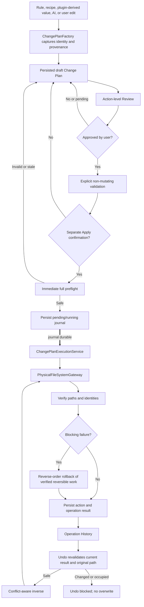
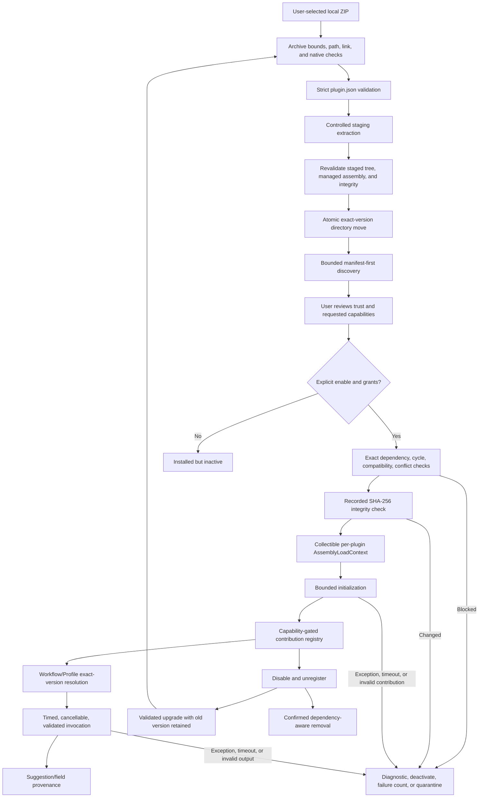

# OpenSorSe system map

These Mermaid diagrams model the v1.7 implementation. They emphasize
communication, ownership, persistence, and safety boundaries; minor helper
classes and presentation details are intentionally omitted.

## Platform capability and adapter map

```mermaid
flowchart TB
    Capability["Platform capability provider"] --> Diagnostics["Settings diagnostics and report"]
    Capability --> Gating["Explicit limited or unavailable states"]
    PathContract["IPathSemantics"] --> WindowsPath["Windows case-insensitive and device-name policy"]
    PathContract --> LinuxPath["Linux case-sensitive policy"]
    IdentityContract["IFileIdentityProvider"] --> WindowsIdentity["Volume serial and file index"]
    IdentityContract --> LinuxIdentity["Device and inode"]
    IdentityContract --> Fallback["Metadata fallback"]
    FsContract["IFileSystemCapabilities"] --> Link["Link and reparse inspection"]
    FsContract --> Permission["Writable-access and free-space inspection"]
    FsContract --> Mount["Same-filesystem verification"]
    Paths["IApplicationPathProvider"] --> WindowsData["Existing LocalAppData layout"]
    Paths --> LinuxData["XDG config, data, state, cache"]
    Tool["IExternalToolLocator"] --> TesseractPath["Configured path or safe PATH discovery"]
    DesktopContract["IDesktopIntegration"] --> WindowsDesktop["Windows desktop adapter"]
    DesktopContract --> LinuxDesktop["Linux graphical desktop adapter"]
    PackageBoundary["Build and packaging boundary"] --> WindowsManifest["Windows-conditioned manifest and icon"]
    PackageBoundary --> LinuxPublish["Documented framework-dependent Linux publish"]
    Gating --> Approval["Review and explicit approval boundary"]
    Approval ==>|validated and journalled only| Mutation["Rename, same-filesystem move, create directory"]
```

Platform detection is contained in the platform implementation. Capability
reporting does not itself authorize an operation: the normal plan validation,
approval, immediate preflight, journal, execution, and verification route still
controls every mutation.

## High-level communication map

```mermaid
flowchart TB
    subgraph External["External actors and systems"]
        User["User"]
        FS["Local filesystem"]
        Watcher["Operating-system file watcher"]
        Ollama["Ollama or configured AI provider"]
        Tesseract["Tesseract OCR engine"]
        Package["External local plugin ZIP"]
    end

    subgraph Desktop["Desktop layer"]
        Shell["Application shell and navigation"]
        ScanUI["Scan UI"]
        FilesUI["Files and Results UI"]
        SearchUI["Search progress and coverage UI"]
        ReviewUI["Change Plan Review"]
        WatchUI["Watched Folders UI"]
        WorkflowUI["Workflows UI"]
        PluginUI["Plugin Settings UI"]
        HistoryUI["Operation History"]
        SettingsUI["Settings and Diagnostics"]
    end

    subgraph Application["Application orchestration"]
        ScanOrchestrator["Processing orchestrator"]
        WorkflowResolver["Workflow resolver"]
        WatchCoordinator["Watched Folder coordinator"]
        Reconcile["Incremental reconciliation"]
        PluginManager["Plugin manager"]
        Registry["Contribution registry"]
        PlanAdapters["Change Plan proposal services"]
        HistoryService["Operation-history projection"]
        Stores["Persistence services"]
        IndexCoordinator["Durable indexing coordinator"]
    end

    subgraph Processing["Read-only processing and suggestion layer"]
        Enumerate["File enumeration"]
        Metadata["Metadata extraction"]
        Text["Document text extraction"]
        OCR["OCR coordination"]
        Classify["Classification"]
        Rules["Rules and deterministic planning"]
        Duplicates["Duplicate analysis"]
        Semantic["Semantic and tag analysis"]
        AI["AI adapters and validation"]
        Recipes["Sorting Recipe evaluation"]
        Extensions["Plugin contributions"]
    end

    subgraph Safety["Approval, safety, and execution layer"]
        Plan["Change Plan model"]
        PlanValidation["Plan validation"]
        Approval["Explicit user approval boundary"]
        Conflicts["Conflict and stale-state checks"]
        Preflight["Immediate preflight"]
        Journal["Execution Journal"]
        Executor["Safe executor"]
        Verify["Result verification"]
        Recovery["Recovery"]
        Undo["Undo and rollback"]
    end

    subgraph Storage["User-local storage"]
        UserFiles["User files"]
        Saved["Saved scans and catalogues"]
        WatchedState["Watched configuration, catalogue, activity"]
        Profiles["Workflow Profiles and Sorting Recipes"]
        PluginState["Plugin state and installed versions"]
        Plans["Change Plans"]
        Journals["Operation Journal and History"]
        LocalIndexes["Content and semantic indexes"]
        DeepIndex["Embedded durable Search index"]
    end

    User -->|commands and review| Shell
    Shell --> ScanUI
    Shell --> FilesUI
    Shell --> SearchUI
    Shell --> ReviewUI
    Shell --> WatchUI
    Shell --> WorkflowUI
    Shell --> PluginUI
    Shell --> HistoryUI
    Shell --> SettingsUI

    ScanUI -->|scan request| WorkflowResolver
    WorkflowResolver --> ScanOrchestrator
    WatchUI --> WatchCoordinator
    Watcher -->|untrusted hints| WatchCoordinator
    WatchCoordinator --> Reconcile
    Reconcile --> WorkflowResolver
    PluginUI -->|local package operations| PluginManager
    Package -->|inspect only| PluginManager
    PluginManager --> Registry
    Registry -.->|bounded extension calls| Extensions

    ScanOrchestrator --> Enumerate
    Enumerate -->|read only| FS
    Enumerate --> Metadata
    Metadata --> Text
    Text --> OCR
    OCR -.->|local process| Tesseract
    Metadata --> Classify
    Classify --> Rules
    Classify --> Duplicates
    Text --> Semantic
    Rules --> Recipes
    Extensions -.-> Metadata
    Extensions -.-> Classify
    Extensions -.-> Duplicates
    Extensions -.-> Recipes
    AI -.->|optional request| Ollama
    AI -->|validated suggestions| PlanAdapters
    Rules -->|proposals| PlanAdapters
    Recipes -->|proposals and provenance| PlanAdapters
    PlanAdapters --> Plan

    Plan --> Plans
    Plan --> ReviewUI
    ReviewUI --> PlanValidation
    PlanValidation --> Approval
    Approval ==>|separate Apply confirmation| Conflicts
    Conflicts --> Preflight
    Preflight --> Journal
    Journal --> Journals
    Journal ==>|durable before mutation| Executor
    Executor ==>|rename, move, create directory only| UserFiles
    UserFiles --- FS
    Executor --> Verify
    Verify --> Journals
    Verify --> HistoryService
    HistoryService --> HistoryUI
    Journals --> Recovery
    Journals --> Undo
    Recovery ==>|verified repair only| Executor
    Undo ==>|conflict-aware inverse only| Executor

    Stores --> Saved
    Stores --> WatchedState
    Stores --> Profiles
    Stores --> PluginState
    Stores --> LocalIndexes
    SearchUI --> IndexCoordinator
    IndexCoordinator --> Enumerate
    IndexCoordinator --> Metadata
    IndexCoordinator --> Text
    IndexCoordinator --> LocalIndexes
    IndexCoordinator --> DeepIndex
    Reconcile --> WatchedState
    WorkflowResolver --> Profiles
    PluginManager --> PluginState
    ScanOrchestrator --> Saved
    Text --> LocalIndexes
```

Solid ordinary arrows represent application calls or persistence. Dotted arrows
represent optional external/plugin integrations. Thick arrows represent the
approval-to-mutation route. Reading, analysis, suggestion creation, and storage
do not imply authorization. The executor cannot be reached merely because a
watcher, AI provider, rule, recipe, or plugin produced a proposal.

## Detailed processing and watched-folder paths

```mermaid
flowchart LR
    subgraph Manual["Manual scan"]
        Select["Select roots and Workflow Profile"]
        Resolve["Resolve effective configuration"]
        Scan["Enumerate files"]
    end

    subgraph Watched["Watched Folder"]
        Event["Filesystem event hint"]
        Debounce["Root check and debounce"]
        Stability["Stability check"]
        Compare["Catalogue reconciliation"]
        Incremental["Incremental file set"]
    end

    subgraph Analysis["Shared read-only analysis"]
        Meta["Metadata"]
        Extract["Native text extraction"]
        OcrGate{"OCR enabled and needed?"}
        OCR["Local OCR"]
        Hash["Hash"]
        Classify["Classification"]
        Dup["Exact/plugin duplicate evidence"]
        Rules["Rules"]
        Plugin["Capability-authorized plugin call"]
        AI["Optional bounded AI"]
        Catalog["Catalogue/index update"]
        Suggest["Suggestion or Sorting Recipe"]
    end

    Select --> Resolve --> Scan --> Meta
    Event --> Debounce --> Stability --> Compare --> Incremental --> Resolve
    Incremental --> Meta
    Meta --> Extract --> OcrGate
    OcrGate -- Yes --> OCR
    OcrGate -- No --> Hash
    OCR --> Hash
    Hash --> Classify --> Dup --> Rules
    Plugin -.-> Meta
    Plugin -.-> Classify
    Plugin -.-> Dup
    Rules --> Catalog
    Catalog --> AI
    Catalog --> Suggest
    AI --> Suggest
    Suggest --> Review["Create Change Plan for manual review"]
```

The watched path updates its dedicated catalogue even if optional AI is
unavailable. It may create a reviewable Change Plan, but it never invokes Apply.
Watcher notifications are hints; reconciliation against actual state is the
authority.

## Safe file-operation path

No service upstream of `ChangePlanExecutionService` owns production user-file
mutation. Journal persistence precedes mutation. A failed journal write blocks
Apply. Undo and recovery use recorded facts plus current verification; they do
not guess.

## Plugin lifecycle and contribution path

The SDK exposes analysis, proposal, import, and export data contracts. It does
not expose the executor, user approval, host service provider, credentials, or
arbitrary storage. Nevertheless, plugin code is in-process and has the current
user's operating-system permissions; trust review remains necessary.
