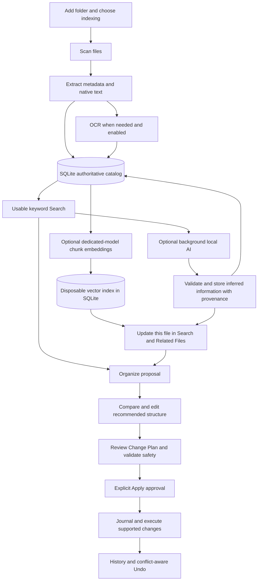

# How OmniSorSe Works

OmniSorSe helps you find and organize files in folders you choose. It first makes
them searchable using ordinary file information and extracted text. Optional local
AI can then add useful interpretations in the background.

**AI enriches OmniSorSe's record of a file, never the original file.** A tag such
as “electricity bill” lives in OmniSorSe's own library. It does not alter a PDF,
Word document, photograph, or its embedded metadata. An AI inference is labelled
as an inference even after it passes structural checks; those checks cannot prove
that a model's interpretation is factually correct.

## Library workflow

## From a folder to useful results

Learned embeddings are a separate optional background step. The catalog owns
retained facts, inferences and decisions; vectors can be cleared and regenerated.
See [how hybrid Search works](HYBRID_SEARCH.md) for the query diagram, model
controls, ranking, partial coverage and keyword fallback.

| Stage | What does it do? | What code/tool implements it? | Why this approach? |
| --- | --- | --- | --- |
| Add Folder | Records the roots you choose and whether to use background AI. Standard indexing uses local extraction. AI-enriched indexing adds interpretation after useful basic coverage exists. | `FolderSelectionViewModel`, `ScanRequest`, `BackgroundIndexingService` | You choose the scope and processing cost. Search need not wait for an AI model. |
| Scan | Finds eligible files, reads basic size/date/type information and calculates bounded fingerprints/hashes. Links and inaccessible files receive explicit handling. | OmniSorSe `FileScanner`, `PhysicalIndexFileDiscovery`, `IFileHasher` | Current disk state is authoritative; hashes can identify exact duplicate content. |
| Extract | Reads native document text and embedded information without editing the document. | `ContentIndexingService`, `OpenXmlMetadataExtractor`, `PdfMetadataExtractor`, format-specific extractors | File-format tools reliably expose text already in the file before interpretation is attempted. |
| OCR | Recognizes visible characters when native text is absent and OCR is enabled. A scanned PDF page is rendered first. | `IOcrEngine`, `OcrService`, `TesseractCliOcrEngine`, `PdfPageRasterizer` | Recognizing text and understanding it are separate jobs. The interface allows another OCR engine later. |
| Basic index | Saves bounded extracted evidence and makes progressively completed files searchable. Work survives pause or restart. | `BackgroundIndexingService`, `SqliteDeepIndexStore`, `deep-index.db` | A large library becomes useful progressively, with durable work tracking. |
| AI enrichment | Sends bounded retained text to your selected local Ollama model for a document type, category, tags, topics, entities and a short summary. | `OllamaIndexingEnrichmentProvider`, `IndexingEnrichmentValidator`, `DefaultIndexingStageProcessor` | AI can supply concepts that are useful even when those words do not occur literally in the file. |
| Validate and update | Rejects malformed/oversized fields, unsafe path-like values and duplicate entries; stores valid output as AI-derived data and updates the affected file. | `IndexingEnrichmentValidator`, existing SQLite stage completion and Search projection | Automatic enrichment should not require approving every tag, and one finished file should not rebuild the whole library. |
| Search | Combines keyword results with independent optional learned similarity, retaining exact filename priority and model/chunk explanations. | `SemanticSearchService`, `HybridSearchRanker`, `ReciprocalRankFusion`, SQLite FTS and derived vector tables | Literal matches remain useful without a model; semantic paraphrases can find files without the query's exact words. |
| Embeddings | Progressively chunks retained catalog fields with offsets and embeds them through a dedicated local model. | `VectorIndexCoordinator`, `IModelEmbeddingProvider`, `IVectorSearchStore` | Vectors are disposable application data; model changes, privacy and catalog freshness govern reuse. |
| Related Files | Uses retained evidence to show useful connections and collections; user confirmations/rejections remain authoritative. | `RelationshipService`, SQLite relationship authority, optional Knowledge Graph projection | Most people need connected documents rather than a raw graph. Graph diagnostics remains advanced. |
| Organize | Uses selected indexed files, recipes, evidence, strategies and remembered edits to propose destinations and explain why. | `ReviewedOrganizationService`, `ReviewedOrganizationViewModel`, `OrganizeView` | There is no universally correct folder tree. Compare, edit or reject the proposal first. |
| Review and Apply | Persists a Change Plan, checks current sources/destinations and conflicts, and waits for explicit approval. | `IChangePlanFactory`, `ChangePlanValidator`, `ChangePlanExecutionService`, `IFileSystemGateway` | Neither document text nor model output receives filesystem authority. |
| History and Undo | Journals execution facts before mutation, reconciles completed work and reverses eligible actions while detecting later outside changes. | `JsonOperationJournalStore`, executor recovery/Undo, `ChangePlanReconciliationService` | Recovery depends on recorded facts and current disk state. Undo refuses unsafe overwrites. |

Source identifiers use `OpenSorSe` for compatibility even though the product is
called OmniSorSe. Source files live in `src/`; corresponding regression tests live
under `tests/`.

## What information is trusted?

Filesystem facts, embedded fields, OCR output, deterministic classifications,
AI inferences and explicit user decisions have different origins. An AI summary
is not converted into a user-confirmed fact merely because its JSON is valid.
Reanalysis must preserve your accepted/rejected tags and relationship decisions.
Any resulting file move still needs its own reviewed and approved Change Plan.

Search's background panel shows progress, failures, pause/resume/cancel controls
and the selected folder's AI policy. You can enable enrichment for an already
indexed folder using its retained text. A metadata-only library needs text
extraction first; enabling AI cannot invent missing content. Newly discovered
files inherit the folder policy. Pausing work preserves completed Search coverage.

## Your preferred organization

Open **Organize** after selecting files in Files or Search. Compare the current
and recommended trees, inspect each reason, and choose Preserve my structure,
Improve my structure, or Reorganize from scratch. Edit destinations or rename a
folder within the proposal; reject moves you do not want. These edits do not
change disk. Explicitly remembered folder edits become bounded, source-scoped preferences
for later proposals; this is not model training. Review Changes performs a fresh
safety check before you separately approve Apply.

## Where OmniSorSe keeps its information

Settings provides the active storage paths, a usage breakdown, cache limits and
safe reclamation. A saved location change applies on restart: application-owned
data is copied and verified before an atomic location receipt selects it. Earlier
copies remain available for recovery. Configuration, profile ownership and
operation history retain their original location. Keep the selected drive
available; an unavailable active library must not be silently replaced by an
empty one.

Temporary files and reproducible caches are reclaimed while durable decisions are preserved.
The primary index contains important decisions as well as extracted content, so
deleting that entire database is not a cache-cleaning operation. The projected
knowledge graph is rebuildable; its separate decision database is not. See the
candidate's migration notes before changing versions or restoring old state.

## Third-party tools and OmniSorSe code

| Third-party technology | Its role |
| --- | --- |
| Avalonia | Desktop windows, controls and accessible layout |
| CommunityToolkit.Mvvm | Observable presentation state and commands |
| Office Open XML support | Reading structured Office document text and fields |
| PdfPig | Native PDF text extraction |
| PDFium / PDFtoImage | Rendering PDF pages for OCR where supported |
| Tesseract | Optional local OCR through the shared OCR interface |
| SQLite | Durable library, queue, Search and relationship storage |
| Ollama | Optional local model runtime/API; exact selected models must be installed |
| xUnit | Automated regression and integration tests |

OmniSorSe itself owns scanning policy, extraction orchestration, indexing,
classification rules, planning, conflict resolution, provenance, relationships,
AI validation, the reviewed executor, journaling and Undo. OmniLAB helps develop
the software; it is not an installed application's runtime dependency.

Windows OCR, PaddleOCR and vision-model OCR are possible future adapters, not
providers this candidate claims to ship. Existing image metadata/OCR and bounded
media adapters use the shared evidence path. Richer image/audio/video
understanding remains future-facing and depends on separately implemented tools.

## Five everyday examples

1. **Normal Word document:** DOCX → Open XML extraction → text and embedded
   metadata → local index. Search can find the text without any AI model.
2. **Scanned electricity bill:** PDF → rendered page → Tesseract OCR → recognized
   text → optional local AI → inferred bill/finance/electricity concepts. A search
   for “bill” can then find the document even if OCR text used another term.
   Missing rendering/OCR/model dependencies are reported, never fabricated.
3. **Image with text:** JPEG → image metadata + optional OCR → searchable text.
   Optional text interpretation enriches that evidence; it does not prove general
   visual scene understanding.
4. **AI-enriched document:** extracted text → validated tags/entities/category
   and summary → application-owned record → incremental Search and relationship
   update. Your original bytes and embedded metadata remain unchanged.
5. **Organizing a file:** selected indexed evidence → explained recommended folder
   → your edits → persisted review → safety checks → explicit Apply → journaled
   move → History/Undo. A conflicting destination or changed source blocks unsafe
   execution instead of overwriting another file.
