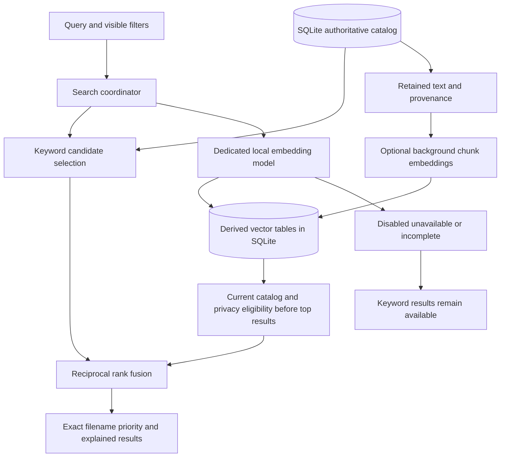

# Hybrid semantic Search in v3

Keyword Search becomes useful as soon as deterministic indexing has recorded a
file. Optional learned embeddings add matches based on meaning, including text
that does not share the query's exact words. Enable **local semantic embeddings**
in Settings, select an installed dedicated embedding model, and save. This also
indexes already retained library content; removing and re-adding folders is not
necessary. Metadata-only files need text extraction before useful text embeddings.

The embedding model is separate from the chat/enrichment model. The initial
provider uses Ollama's [embedding API](https://docs.ollama.com/api/embed) at the
configured loopback endpoint. No model is downloaded automatically. Search and
source files remain available when Ollama or its selected model is unavailable.

## How search works

The keyword and semantic rankings contribute reciprocal ranks using `k = 60`;
raw keyword scores and cosine values are not added together. Exact filenames and
exact filename stems retain priority. Each file contributes once even if several
chunks match. Results expose the ranking contribution, model, cosine similarity,
retained evidence field and character span. Similarity is an inference about
meaning, not a verified factual connection.

Filters apply to current eligible catalog records before vector top-result
selection. Semantic candidates are then hydrated through the normal catalog
lookup. A removed, excluded or stale record must not reappear through embeddings.
After hydration, the store checks the exact scored source generations, current
filters and privacy rules again. Related Files also checks the seed generation
and current pair decisions. Search repeats this check after optional context or
AI review, restoring independent keyword matches if learned evidence changed.
Interactive semantic work shares a five-second budget across model lookup,
query embedding, hydration and final validation; time spent in separately
requested context or AI review does not extend that semantic-work budget.
Exhausting the budget returns ordinary results with an explicit explanation.
Caller cancellation remains a cancelled query rather than a successful fallback.
Keyword facet counts continue to describe literal query/filter matches; they are
not a count of every possible semantic neighbour.

The older **semantic available** query filter keeps its existing meaning: a
retained deterministic representation is present. Use the separate semantic model
panel to inspect learned-vector coverage. Exact-ID result hydration is performed
in batches of at most 100, preserving semantic retrieval in larger libraries.

## Ownership and recovery

`deep-index.db` remains the authoritative catalog for extracted information,
validated AI inference, user tags and relationship decisions. Schema 8 adds
logically separate, disposable learned-vector tables. SQLite stores portable
numeric vector data; the application performs bounded cosine ranking without a
native vector extension. This reuses the existing cross-platform SQLite payload,
locking, migration, relocation and recovery paths. It is an exact scan suitable
for a bounded desktop index, not an unbounded approximate-neighbour service.

The background coordinator does not delay the deterministic indexing queue.
Each file publishes its vectors atomically against a current catalog fingerprint.
Chunks retain file identity, evidence field, offsets and length. Native text, OCR,
transcript and AI-derived fields keep their provenance. Processing is bounded to
16 chunks per file, up to 1,600 characters each; very long documents therefore
have partial semantic coverage. The original file is never opened by this worker.

Catalog changes invalidate dependent vectors transactionally. Deletion, moves,
privacy changes, content updates and enrichment updates cannot leave old vectors
eligible. The model identity includes its installed digest and dimensionality;
changing model weights or selecting another model requires fresh embeddings.
Interrupted files retry from retained catalog data; completed compatible files
survive restart. Derived vectors are excluded from logical state backup and
rebuild after restore.

## Controls and storage

Under Search, expand **Semantic model and indexing** to inspect progress, check
availability, pause/resume, or rebuild vectors. Settings controls the dedicated
model and vector budget. The embedding switch independently authorizes sending
retained text to the local model; it does not enable chat-based organization.

Storage usage labels learned vectors separately inside the library total. They
move with the catalog under the existing verified storage relocation procedure.
Cleanup pauses embedding work and clears only disposable vectors before ordinary
maintenance; use Resume to generate them again. User decisions, enrichment
records, journals and source files remain intact. SQLite may reuse freed pages
before its physical file size decreases.

Related Files shows semantic suggestions separately from evidence-backed
relationships. Similarity does not create a durable relationship or authorize
organization. Explicit relationship exclusions and index privacy remain binding.
Organize continues through editable previews, reviewed Change Plans, approval,
Apply, journal/verification and conflict-aware Undo.

## Verification boundary

The opt-in [real-model benchmark](../eng/benchmarks/VectorSearch/README.md) uses a
small synthetic corpus and declares Recall@5, reciprocal-rank, exact-filename,
paraphrase-gain and source-integrity gates before execution. It reports model
digest and latency separately. Passing it is evidence for that model/corpus;
it does not establish general factual accuracy or performance for large libraries.

The [validation record](VALIDATION_v3.0.0.md) distinguishes automated tests,
actual local-model checks, native artifact smoke and human acceptance. Use the
[v3 checklist](MANUAL_TESTING_v3.0.md) only with the matching merged and published
v3 candidate. Richer image/audio/video understanding remains future work.
