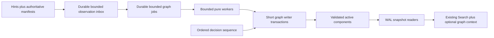

# v2.0 concurrency, cancellation, shutdown, and resource model

## Concurrency ownership

Knowledge Graph work is independent of the v1.9 background-indexing critical
path. The future composition root creates one graph coordinator, but durable
leases—not that process-local assumption—enforce ownership.

### Coordinator lease

One non-expired coordinator lease may schedule/write for each graph store. The
lease contains instance ID, monotonically increasing fencing epoch, opaque
token, acquired/heartbeat/expiry times, heartbeat sequence, and process-start
identity. Acquisition, renewal, and release are compare-and-set operations.
Every claim and publication carries the epoch. Another process may read the
last active projection but cannot steal an unexpired lease.

An expired lease is reclaimed atomically. Work recovery increments a separate
infrastructure-recovery counter, not the processor-attempt counter. Repeated
lease loss above the configured ceiling becomes `RepairRequired` instead of an
infinite restart loop.

All lease time comes from an injected `TimeProvider`. Persisted UTC supports
restart, while an unchanged heartbeat sequence observed for the TTL plus grace
under elapsed monotonic time permits conservative reclaim when the wall clock
moves backwards. A forward clock jump may cause an early reclaim, but the
incremented fencing epoch prevents the prior owner from committing. A process
that cannot renew before its renewal deadline immediately self-fences: it stops
claims, cancels workers, and cannot publish until it acquires a new epoch.

Each `Running` job also has its own owner, claim token, claim heartbeat, and
expiry. Coordinator heartbeat does not keep a hung job alive. Proposed initial
values are a five-second coordinator and job heartbeat, a thirty-second TTL,
and a five-second reclaim grace. They are configurable internal bounds and must
be measured on every supported host before becoming release defaults.

### Job claims

The unique logical-work key includes component stable key, source revision,
decision sequence, graph configuration fingerprint, algorithm version, stage,
and explicit rebuild generation. Retries do not create a second logical job;
they append an immutable attempt record with a new attempt ordinal and claim
token. A changed input, decision, configuration, algorithm, or explicit rebuild
therefore creates a new logical key.

Claim updates compare expected execution state, coordinator fencing epoch, and
claim token. Before publication the writer also revalidates the current source
revision, privacy/deletion/exclusion authority, decision sequence, and captured
configuration. Component publication, the component's applied watermark, and
stage completion then commit together in one graph-store transaction. A late
publisher with an expired token or older coordinator epoch is rejected even if
its computation completed successfully.

No worker may hold a database transaction while parsing input, resolving
identity, calling an optional provider, traversing a graph, waiting, or logging.

## Change ingestion without cross-store atomicity

v1.9 `deep-index.db` remains schema 3, so the design does not claim an atomic
source outbox that the existing transaction never wrote. Instead:

- in-process v1.9 change notifications are low-latency hints;
- notifications and updated-time scans insert idempotent observations into a
  graph-side durable inbox; they are optimizations, never deletion or
  completeness authority;
- a full keyset-paged `IGraphProjectionSource` reconciliation from stable-ID
  page zero is authoritative;
- each source has at most one in-progress reconciliation generation, with a
  durable on-disk seen manifest and stable-ID page cursor;
- inserting a page's observations into the inbox and advancing that
  generation's **ingestion watermark** commit atomically in the graph store;
- publishing a component and advancing its **applied watermark** commit
  atomically and independently, so a poison or slow job cannot hide later
  observations;
- startup and periodic reconciliation compare only completed bounded manifests;
- an interrupted scan never treats unobserved source rows as deleted;
- a completed manifest identifies possible absence, but every deletion/source
  removal is point-revalidated against current source ownership before
  retirement;
- duplicate observation delivery is idempotent;
- every query expansion always rechecks current authoritative
  deletion/privacy/exclusion state, even after cleanup has converged. If that
  authority is unavailable, graph-derived results fail restrictive and
  ordinary v1.9 Search continues where its own stores are healthy.

The composite `(updated time, stable ID)` cursor may accelerate notification
repair, but it is never a correctness watermark: timestamp collision,
granularity, or clock rollback cannot suppress the next stable-ID generation.
Concurrent mutations to rows already passed are accepted as eventual input;
they are detected by notification or the next full generation. Before any
component becomes active, its source revision is point-revalidated. Candidate
generation rows remain invisible, and missing rows are not retired, until the
manifest completes and the absence checks succeed. Interrupted generations are
resumed or discarded within the staging-retention bound.

This is explicit eventual consistency. The UI shows current, stale, partial,
waiting, and repair-required coverage rather than implying an atomic global
snapshot across databases.

## Four orthogonal durable state axes

One combined enum is prohibited because run control, job execution, component
freshness, and component integrity change independently.

| Axis | Values | Meaning |
| --- | --- | --- |
| Run control | `Pending`, `Running`, `PauseRequested`, `Paused`, `CancelRequested`, `Cancelled`, `Complete` | User intent and coordinator admission for one run. |
| Job execution | `Pending`, `Running`, `Complete`, `Cancelled`, `RetryableFailure`, `PermanentFailure`, `WaitingForDependency`, `WaitingForResources` | Durable state of one logical work item; attempts are append-only history. |
| Component freshness | `Current`, `Stale` | Whether active output matches its recorded source, decision, configuration, and algorithm revisions. |
| Component integrity | `Valid`, `RepairRequired` | Whether invariants permit normal use; quarantined rows are a repair disposition, not another freshness value. |

Allowed run transitions are `Pending → Running`, `Pending → CancelRequested`,
`Running → PauseRequested`, `PauseRequested → Paused`,
`PauseRequested → Running` when Resume wins before acknowledgement,
`Paused → Running`, any
non-terminal state to `CancelRequested`, `CancelRequested → Cancelled`, and
`Running → Complete`. `Cancelled` and `Complete` are terminal for that run;
Retry/Rebuild creates a new run.

Allowed job transitions are `Pending → Running` or a structured waiting state;
`Running → Complete`, `Cancelled`, a failure state, or a structured waiting
state; waiting/retryable work returns to `Pending` when its gate opens; and an
explicit permitted retry appends a new attempt before returning the logical job
to `Pending`. `Complete` is immutable for its exact logical-work key.
`PermanentFailure` requires an input/policy change or reviewed explicit retry.
Freshness moves `Current ↔ Stale` only through revision comparison and validated
replacement. Integrity moves `Valid → RepairRequired` on a failed invariant and
back only after successful verification or repair. Unknown values and every
unlisted transition are corruption, not implicit `Pending`.

Race precedence is deterministic:

1. current privacy, deletion, and exclusion authority always wins and
   suppresses output;
2. coordinator epoch and claim token validity are required before any state or
   publication commit;
3. durable `CancelRequested` wins over Pause, Resume, retry eligibility, and an
   uncommitted completion;
4. Pause/Resume uses an incrementing run-control sequence, so the latest
   committed request wins until cancellation;
5. a source, decision, configuration, or algorithm revision change rejects an
   old publication, marks prior output `Stale`, and queues the new logical key;
6. lease expiry under `CancelRequested` finalizes cancellation; otherwise it
   creates retryable infrastructure recovery without consuming a processor
   attempt; and
7. dependency/resource restoration never makes a job claimable while its run
   is paused or cancelling.

## Database concurrency

- A provider-neutral outer lifecycle lock, acquired by atomic exclusive access
  to an application-data lock file, serializes first-enable, migration,
  backup/restore promotion, and destructive sidecar replacement before either
  database is opened for lifecycle mutation. It does not depend on an existing
  schema and is released before normal coordinator work.
- `knowledge-decisions.db` and `knowledge-graph.db` use separate writer gates,
  connections, WAL, busy policies, quotas, and maintenance leases.
- No operation holds both store gates or both database transactions. A decision
  commits and releases its transaction before a separate graph transaction
  records the ordered decision in its inbox. Reconciliation replays any gap.
  Graph Search withholds affected expansion while its relevant applied decision
  sequence trails authoritative decisions.
- Graph writes use one bounded channel and short transactions.
- Search/detail readers use separate read-only connections and one SQLite
  snapshot per request.
- Component publication replaces either the complete affected component or
  none of it. Readers never receive a node without its required fields or an
  automatic edge without evidence.
- Maintenance is incremental. A full `VACUUM` is not an emergency low-disk
  strategy and cannot run while projection publication owns the maintenance
  lease.
- Lifecycle lock order is outer lifecycle lock → exactly one store gate → that
  store's transaction. Runtime graph order is valid coordinator epoch →
  component key → graph writer gate → graph transaction. Decision transactions
  are never nested in runtime graph locks, and no source/provider callback runs
  while any database transaction is held.

Busy/locked has a finite provider deadline and capped backoff. It is not
reported as corruption. Search gives up the graph supplement first and returns
ordinary v1.9 results.

## Pause and resume

Pause first commits `PauseRequested` with the next run-control sequence. It
stops observation ingestion and new claims but does not rewrite thousands of
jobs. A running bounded stage either:

- commits its atomic output and then observes pause; or
- cooperatively closes its attempt without publication and returns the logical
  job to `Pending`, preserving wait reasons and without consuming a processor
  retry.

The run becomes `Paused` only after every live claim has committed or returned,
or has been fenced and expired. Restart while `PauseRequested` continues the
drain; restart while `Paused` does not ingest or claim. Resume commits a newer
run-control sequence and returns the run to `Running`; it does not rewrite job
states.

Repeated Pause/Resume is idempotent. Resume does not mislabel dependency or
resource-waiting jobs as actively processing; run status derives from eligible
work and structured wait reasons.

## Cancellation

Cancellation sequence:

1. persist `CancelRequested`, a bounded enumerated reason category, request
   time, and next run-control sequence;
2. stop new ingestion/claims;
3. signal linked worker tokens;
4. check cancellation between input pages, candidate buckets, identity
   components, edge/evidence batches, reconciliation pages, and before
   publication;
5. commit claim-token-guarded `Cancelled` state;
6. retain history and prior active graph output;
7. transition the run to `Cancelled` only when every live claim is acknowledged
   or fenced, and require explicit Retry/Rebuild to create a new run/attempt.

The Cancel command returns success after intent is durable and reports
`CancelRequested` until acknowledgement completes. If intent cannot be made
durable because the store is busy, full, or unavailable, the command reports
that cancellation was not accepted; it never presents a false `Cancelled`
state. Cancellation is not success. It does not advance an applied watermark
for unpublished work, while an observation already durably placed in the inbox
remains safely ingested. A crash after step 1 resumes cancellation at startup.
Wait/backoff loops observe the same token and do not wait past their bounded
slice. SQLite work is divided by the transaction row/byte/time ceilings below.

## Safe shutdown

Shutdown persists a reason and performs:

1. stop new observation and claim loops;
2. request cancellation of active workers;
3. allow short publication transactions to finish/rollback;
4. wait up to a proposed five-second drain target and ten-second hard ceiling;
5. before returning, stop renewal and atomically revoke the local epoch/claims
   when possible; otherwise self-fence locally so every late publication fails
   its epoch/token compare-and-set and leave expiry facts for startup recovery;
6. detach only pure computation that owns no connection, store, or disposable
   application service; dispose stores only after database users finish or are
   fenced; and
7. return control to the desktop exit path.

Migration, backup publication, restore promotion, and full SQLite maintenance
do not begin during desktop shutdown. Once their small final atomic rename or
commit starts it is non-interruptible and must fit the hard ceiling; their bulk
copy/check work is chunked and cancellable. If a provider cannot meet that
contract, the lifecycle operation is deferred rather than entered.

The final implementation must measure and validate these proposed values on all
supported hosts. If a provider cannot honor the hard ceiling, that provider or
stage is deferred; the UI is not allowed to hang indefinitely.

## Resource-bounding strategy

These are proposed release ceilings, not performance claims. Benchmarks and
stress tests may lower them. Raising a hard ceiling requires a documented
measurement and policy review.

| Resource | Proposed stable default / hard ceiling | Bound behavior |
| --- | --- | --- |
| Source/decision read page | 256 / 1,024 records | Continue by keyset cursor; no offset/full load. |
| In-memory pending work | 256 / 512 items | Durable queue applies backpressure. |
| Durable observation inbox | 10,000 / 50,000 pending rows per source; 128 / 512 MiB total | Stop page ingestion before the limit; do not advance ingestion watermark; resume after drain/cleanup. |
| Durable logical jobs | 50,000 / 250,000 pending rows or 256 / 1,024 MiB total | Coalesce by logical-work key; wait for resources instead of dropping work. |
| Worker concurrency | Eco 1, Balanced 2, Fast 4 / 4 | Change only between claims. |
| Coordinator/job lease | heartbeat 5 s, TTL 30 s, reclaim grace 5 s | Self-fence on missed renewal; fake-time and multi-process validation required. |
| Entity candidates per file | 8 / 16 | Excess is classified/bounded; no silent fact creation. |
| Identity candidate bucket | 32 / 64 | Larger bucket is ambiguous/repair required. |
| One component rebuild/merge/split | 256 / 1,024 affected nodes and 1,024 / 4,096 edges | Page as a durable reviewed operation or reject; never hold the complete cascade in memory. |
| Automatic edges per node | 64 / 128 | High-degree node requires filter/review. |
| Evidence per edge | 8 / 8, 256 characters each | Reuse v1.9 ceiling; reject malformed excess. |
| Aliases per entity | 16 / 32 | Additional aliases remain suggestions or require cleanup. |
| Candidate indexed text inspected | 64 / 256 KiB per file | Consume bounded indexed fields only; record partial evidence rather than opening the source. |
| Candidate-analysis CPU slice | yield at 50 ms / stop or checkpoint at 250 ms | Persist/page continuation or classify the bound; never monopolize a worker indefinitely. |
| Stable traversal | depth 1, 100 nodes / depth 1, 500 visited | Page and expose limit reason. |
| Experimental traversal | disabled / depth 2, 500 visited, 1,000 edges | Cancel/stop at first ceiling; never recurse further. |
| Search graph seeds/expansion | 16 seeds, 50 results / same | Existing exact/literal ranking remains first. |
| UI page | 50 / 100 rows | Virtualize/page; never materialize a whole graph. |
| Projection/maintenance transaction | 256 / 1,024 rows, 4 / 16 MiB, 250 ms / 2 s | Commit/yield at the first bound; publication remains component-atomic through staging. |
| Reconciliation generations | 1 in progress plus 1 prior complete per source / 2 incomplete recovery generations total | Manifests remain on disk and paged; quota pauses scanning without false deletion. |
| Applied inbox/history retention | 7 / 30 days and 100,000 / 500,000 rows | Prune only applied/expired operational rows after watermark and manifest proof. |
| Decision label/alias text | 120 / 256 characters | Validate before persistence. |
| Default diagnostics history | 30 days / 100,000 records | Age and count pruning; decisions are excluded. |
| Backup/restore reserve | staged bytes plus current WAL/SHM plus max(64 MiB, 10%) | Refuse lifecycle operation before copy if unavailable; never overwrite the verified current copy. |
| Graph/decision database size | Configured quota plus 128 MiB filesystem safety reserve | Clean derived history/staging first. If the decision ledger cannot grow safely, reject the new decision visibly before commit; never prune or claim it was saved. |

Candidate selection uses indexed keys and bounded inverted buckets. It never
compares all node pairs. Semantic/vector input may shortlist experimental
suggestions but is bounded independently and cannot establish identity.

## Memory and responsive UI

- Provider APIs return pages/async streams, not complete graphs.
- Workers retain only one bounded component plus fixed-size lookup structures.
- Traversal holds a bounded visited set and output page.
- ViewModels expose paging/virtualization and immutable result snapshots.
- No synchronous `.Result`/`.Wait()` or database call runs on the UI thread.
- Progress updates are throttled/coalesced and accessibility announcements are
  reserved for meaningful state transitions.
- Cancellation tokens flow View → ViewModel → service → provider; cancellation
  latency has automated regression thresholds.

## Dependency and resource degradation

Stable graph projection uses already-indexed deterministic fields and requires
neither Ollama nor OCR. Missing OCR/AI coverage is recorded as partial input.
Experimental provider suggestions may enter `WaitingForDependency`; they do
not block stable stages.

Low disk, configured quota, unavailable time/power policy, and prolonged
database lock use `WaitingForResources` with a structured reason. Cleanup first
removes expired derived history, failed staging, orphans, and superseded graph
generations. It never silently deletes decisions, privacy tombstones, current
evidence, or source/index data.

The graph coordinator consumes the existing resource-policy abstraction. Eco,
Balanced, and Fast use the worker bounds above. Idle, external-power, battery,
and time-window restrictions are evaluated before each page/claim. An enabled
restriction whose platform adapter is unavailable produces
`WaitingForResources(PolicyUnavailable)` with an actionable setting; it does
not crash, spin, or silently ignore the requested restriction. Busy commands
have a proposed two-second hard command deadline. Three consecutive eligible
busy attempts or thirty cumulative seconds move the job to
`WaitingForResources(DatabaseBusy)` until a health probe succeeds.

## Mandatory concurrency gates

- two coordinators cannot hold valid writer leases;
- renewal failure self-fences and an older epoch or claim token can never
  publish, including after the shutdown deadline;
- lease expiry and cancellation-crash recovery leave no stale running jobs;
- notification loss, timestamp collision/rollback, and update-behind-cursor are
  repaired by a completed stable-ID manifest without false deletion;
- ingestion and applied watermarks survive every transaction crash boundary,
  and poison work cannot block later observation ingestion;
- graph expansion always passes the current authoritative privacy barrier;
- Search snapshots are valid during publication, repair, cleanup, and
  compaction;
- repeated rapid queries and updates remain bounded/cancellable;
- database lock and full-disk fault injection reach the documented state;
- pause/resume and cancel/retry are idempotent under repetition;
- durable queue, generation, transaction, cascade, storage-reserve, and
  decision-retention limits hold at boundary values;
- shutdown meets the hard ceiling with a non-cooperative fake worker;
- memory ceilings hold on large synthetic high-degree/cyclic graphs;
- original files are never opened for write.
