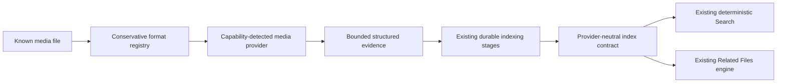

# OpenSorSe v2.2 Media Intelligence

**Status:** released as OpenSorSe v2.2.0 from `v2.2-media-intelligence` through
the repository's history-preserving release process.

**v2.4 name note:** The historical release name remains accurate. OmniSorSe
retains the same schema-5/profile evidence and may project bounded safe media
facts through Explorer Protocol v1; the protocol never returns binary media,
complete OCR/transcripts, or precise GPS by default.

This document is the authoritative design and implementation guide for the
v2.2 release. Source and automated tests remain authoritative if this guide
and code ever disagree.

## Purpose and boundaries

Media Intelligence extends the existing durable indexing pipeline. It does not
create a media library or a second Search system.

Media processing is read-only. It never changes source files, writes EXIF,
extracts archives, launches embedded content, or authorizes a Change Plan.
There is no telemetry, mandatory cloud service, facial recognition, person
identification, reverse geocoding, map service, or silent media upload.

## Provider model

Application contracts isolate capabilities from implementations:

- `IMediaMetadataProvider` supplies bounded embedded/container metadata;
- `IMediaTranscriptionProvider` supplies optional bounded text and timestamped
  segments;
- `IVideoFrameSampler` supplies caller-owned representative frames;
- `IMediaVisualDescriptionProvider` supplies optional unverified descriptions;
- `IMediaIntelligenceService` coordinates capability checks, limits, caching,
  OCR reuse, diagnostics, and per-file failure isolation;
- `IMediaThumbnailProvider` creates application-owned bounded previews.

Views and ViewModels do not run external tools, construct SQL, calculate Search
weights, or read media contents. SQLite stores the provider-neutral
`IndexedMediaEvidence` contract as bounded JSON linked to the existing shared
content fingerprint.

Unsupported or absent capabilities report `Unavailable`, `Unsupported`,
`Skipped`, or `LimitExceeded`. Ordinary filename/document Search continues.

## Implemented formats and evidence

### Images

The built-in header reader recognizes JPEG/JPG, PNG, WebP, BMP, and TIFF. It
reads at most the first 1 MiB and extracts, where valid:

- dimensions;
- EXIF orientation;
- camera/device make and model;
- a capture timestamp, retaining the original bounded timestamp when no
  reliable offset is available;
- GPS latitude and longitude.

Missing or corrupt EXIF does not abort indexing. Precise GPS remains structured
local metadata; it is deliberately omitted from ordinary free-text Search and
is never transmitted or reverse-geocoded by Media Intelligence.

When image OCR is enabled, the coordinator reuses the existing local OCR
service. The configured engine decides which image encodings it can recognize.
OCR failure remains isolated and requested missing capability remains retryable.

Still-image previews use the already-restored SkiaSharp runtime. Preview
generation is lazy, bounded by source bytes and decoded pixel count, scaled to
a configured maximum edge, transformed according to valid EXIF orientation,
encoded as PNG, and cached below OpenSorSe's cache directory. Clearing media
evidence, forgetting indexed data, or clearing the generated Search index also
clears applicable managed previews. No thumbnail is written beside the source
file.

### Audio

The conservative registry recognizes MP3, WAV, FLAC, and M4A. Metadata is
available only when an explicitly configured or PATH-resolved local `ffprobe`
can read the file. Bounded JSON may provide duration, codec, bitrate, sample
rate, channels, title, artist, album, track, creation timestamp, and other
bounded text tags.

The transcription contract and timestamped-segment persistence are implemented.
The desktop candidate deliberately registers an unavailable provider: it does
not bundle Whisper or claim that speech transcription works without a future,
reviewed local provider. Enabling transcription therefore produces an honest
not-configured/waiting state and never blocks ordinary Search.

### Concrete transcription-provider evaluation

The final v2.2 pass evaluated three maintained local options on 2026-08-11:

| Candidate | License and platforms | Integration and model impact | v2.2 decision |
| --- | --- | --- | --- |
| `whisper.cpp` CLI (v1.8.1) | MIT; upstream supports CPU-first Windows, Linux, macOS Intel, and macOS ARM builds | User-managed executable and separately supplied model; robust input conversion also depends on local ffmpeg. CLI/version/output compatibility and timestamp parsing need a separately versioned adapter. | Deferred. This is the preferred future process-isolated adapter, but no runtime/model was present to validate and OpenSorSe must not silently download a large model. |
| Whisper.net (v1.9.1) | MIT; managed API with per-platform native runtime packages | Adds native runtime assets to every supported package plus a separately managed model. This materially changes package size, RID validation, and native failure/concurrency exposure. | Deferred pending a dedicated packaging, native-runtime, cancellation, and redistribution pass. |
| OpenAI Whisper Python reference | MIT; Python/PyTorch environment plus ffmpeg | Maintained reference implementation, but requires a large Python/ML environment or management of an external Python installation. | Rejected for the desktop product path; Python will not become a mandatory OpenSorSe runtime. |

No production dependency or executable adapter was added. The provider-neutral
contract, capability state, timestamped-segment model, cache provenance,
settings switches, and Search projection remain ready for a future reviewed
local adapter. The current user-visible state is **Transcription — Not
configured**; there is no remote-transcription fallback.

### Video

The registry recognizes MP4, MOV, MKV, and AVI containers. With local
`ffprobe`, the index may retain duration, dimensions, frame rate, audio/video
codecs, bitrate, creation timestamp, device tags, title, and other bounded tags.
Actual codec support is whatever the installed local tool reports; an extension
is not a guarantee that every codec can be decoded.

Optional representative-frame extraction uses a separately detected local
`ffmpeg`. It never analyzes every frame. The exact algorithm is:

1. reject a missing/non-positive duration or a duration above the configured
   maximum;
2. choose one sample per started five minutes;
3. cap that count at `MaximumVideoFrames` (default 8);
4. place samples at deterministic interior positions
   `duration * sampleNumber / (sampleCount + 1)`;
5. run one shell-free, bounded, cancellable process per position;
6. scale each frame to at most 1280 pixels on its longest edge;
7. retain at most 16 MiB per encoded temporary frame;
8. OCR at most `MaximumVideoOcrFrames` (default 4);
9. delete the verified application-owned workspace in success, failure, or
   cancellation paths.

The same transcription contract accepts video inputs, so a future reviewed
provider can process the audio track without a second architecture. No real
transcription provider is included in this candidate. Video thumbnails are not
implemented; Search displays retained duration/resolution and evidence text.

## Optional visual descriptions

Descriptions and tags have a provider-neutral contract and a strict retained
text bound. The desktop registers an unavailable provider and makes no model
request. No image or frame is sent to Ollama by the current implementation.
A future provider would have to be explicitly configured, locally capable,
privacy-reviewed, cancellable, and validated before it could produce visibly
labelled derived evidence.

Descriptions are unverified suggestions. The ranker gives them less weight than
deterministic metadata, OCR, transcripts, and exact filename evidence.

## Durable indexing and schema

The embedded provider schema advances from 3 to 4. Migration is transactional,
creates a recovery backup under the existing policy, and adds:

- `index_media_content`, keyed by the existing content hash, containing the
  media family, bounded evidence JSON, processing fingerprint, and update time;
- optional relationship-feature columns for transcript fingerprints, media OCR
  fingerprints, device keys, and capture-date buckets;
- targeted indexes for those bounded relationship candidate queries.

The media row cascades with shared content. It never contains a source-file
copy or binary media payload. Existing v2.1/v2.0 schema-3 databases migrate in
place; unsupported newer versions and corrupt databases retain the established
fail-closed recovery behavior.

Basic indexing stores deterministic media metadata with the content
fingerprint. Standard indexing retains metadata without running expensive
media analysis. Deep indexing may run the single bounded OCR/transcription/frame
pass allowed by settings. Processing fingerprints include relevant settings,
configured executable paths, and OpenSorSe provider versions, so unchanged
compatible evidence is reused while configuration/provider changes invalidate
it. A future transcription provider/model identity belongs in the same
provider-version fingerprint boundary. Upgrading an external executable in
place may require an explicit re-index; querying its version for every file
would make incremental indexing needlessly expensive. Requested unavailable
providers are not cached as completed.

## Search and Related Files

Normal Search consumes separate typed fields for:

- media metadata;
- local audio/video transcript;
- image or representative-frame OCR;
- optional visual description.

Result explanations and snippets use the labels **Media metadata**,
**Audio or video transcript**, **Image or video OCR**, and **Optional visual
description**. Media evidence comes only from a known indexed file and cannot
invent file identity. Exact filename tiers remain authoritative; a weak visual
description cannot outrank an exact filename.

Result rows expose a compact media summary. Still-image preview creation is
lazy and occurs only when indexed-data details are inspected; Search never
decodes media during query ranking.

Related Files can use exact bounded transcript/OCR fingerprints as strong
evidence. Same-device evidence is weak and cannot create a relationship by
itself; it must corroborate another signal. Candidate lookup is bounded and
indexed rather than an unrestricted pairwise scan.

## Privacy and clearing

OCR, transcripts, descriptions, EXIF, and GPS can reveal information that is
not obvious from a filename. Each expensive/sensitive category has an explicit
setting. Defaults enable bounded deterministic image/audio/video metadata but
leave image OCR, transcription, frame analysis, and visual descriptions off.

The indexed-data inspector reports whether media evidence, OCR, transcript, or
description is retained without showing raw embedding vectors. The
**Clear media-derived data** action deletes the application-owned media row and
does not change the original file or source ownership. Clearing all generated
Search data also clears managed previews. Forget/exclusion and watched-folder
ownership continue to use the existing privacy contracts.

External `ffprobe`, `ffmpeg`, and Tesseract processes are local capabilities.
They are invoked with `ProcessStartInfo.ArgumentList`, never a generated shell
command. Standard output/error, duration, frames, bytes, text, and temporary
storage are bounded. The shared media runner distinguishes its own finite
deadline from caller cancellation: timeouts fail only that provider/file,
whereas explicit cancellation propagates after process-tree cleanup. No
external executable is downloaded or bundled by v2.2.

## Conservative defaults

| Limit | Default |
| --- | ---: |
| Media input | 512 MiB |
| Audio transcription duration | 120 minutes |
| Video analysis/transcription duration | 240 minutes |
| Representative video frames | 8 |
| Video OCR frames | 4 |
| Transcript | 65,536 characters |
| Visual description | 1,024 characters |
| Thumbnail edge | 320 pixels |
| Thumbnail source | 100 million pixels |
| External provider operation | 30 seconds |

Existing indexing pause, resume, cancellation, concurrency, resource modes,
quota, cleanup, compaction, and restart recovery remain authoritative. The
media coordinator adds no unbounded queue or whole-file memory load.

## Diagnostics

Advanced OCR/text diagnostics record redacted path classification, media type,
provider, terminal status, elapsed duration, cache hit/miss, sampled-frame
count, OCR/transcript presence, generated-character count, warning count,
failure category, and cancellation. They do not retain media bytes, complete
transcripts, OCR text, descriptions, or precise GPS in ordinary summaries.

## Dependencies and licensing

No new resolved production package is introduced. `SkiaSharp` 3.119.2 is now a
direct Application reference for previews, but that exact package/native asset
set already existed in the v2.1 restored graph through PDF rendering.

`ffprobe` and `ffmpeg` are optional user-managed executables, are not bundled,
and may have different LGPL/GPL build configurations. Redistributors must
review the exact build they choose. Tesseract remains the existing optional
Apache-2.0 OCR executable. No Whisper runtime or multimodal model is included.

The Windows native-host check used an unbundled Gyan FFmpeg 9.0 build only
inside ignored validation storage. That build reports GPL/version-3 options and
is not part of OpenSorSe or its dependency graph. It is removed after the
validation evidence is recorded.

## Final-pass validation evidence

On Windows x64, OpenSorSe's actual process runner and provider implementations
were exercised against intentionally generated media:

- `FfprobeMediaMetadataProvider` read 2-second MP3, WAV, FLAC, and M4A files,
  returning the expected duration, codec, 44.1-kHz mono audio, bitrate where
  available, and embedded title metadata;
- the same provider read a 4-second 640×360, 25-fps H.264/AAC MP4;
- `FfmpegVideoFrameSampler` produced exactly one interior frame at 2 seconds
  for the short clip, kept the encoded frame below 16 MiB, and removed its
  owned workspace;
- real process cancellation and provider timeout both terminated the ffmpeg
  process tree without leaving a completed cache record;
- invalid ffprobe/ffmpeg paths reported unavailable without affecting the
  process or ordinary Search;
- valid generated JPEG APP1/EXIF and PNG inputs exercised image metadata and
  the real Skia preview codec; the orientation-6 preview was 2×4 for a 4×2
  source, cache reuse was stable, and the source hash did not change;
- a database created by the published v2.1.0 binaries at schema 3 migrated
  through the current store to schema 4, retained searchable text, created a
  single recovery backup and media table, accepted a media row, reopened
  cleanly, did not rerun migration, and did not modify its source fixture.

A checksum-verified Tesseract 5.5.3 executable and official English
`tessdata_fast` model were extracted into isolated temporary storage without
system registration. OpenSorSe's real Tesseract engine recognized unique text
from a generated image whose filename/path did not contain the query, and the
normal ranker returned a source-labelled `MediaOcr` snippet. Invalid-path and
disabled-OCR fallbacks remained safe and the source hash did not change. The
temporary runtime, model, image, and harness were removed after validation.
Native Linux and macOS media execution was not performed; only their supported
Release targets are cross-compiled by this task.

## Known limitations and deferred work

- no production transcription provider is included;
- no production visual-description provider is included;
- audio/video metadata and frame sampling require compatible local tools;
- video thumbnails and playback navigation are not implemented;
- precise coordinate filtering and a map UI are not implemented;
- supported container extensions do not guarantee codec support;
- OCR quality and supported encodings depend on the configured local engine;
- no facial recognition, person identification, object tracking, full-video
  scene understanding, cloud AI, media editing/playback, autonomous media
  organization, or continuous surveillance is planned as v2.2 functionality.

## Validation boundary

Automated tests use only temporary synthetic headers, generated tiny images,
fake local provider responses, and temporary SQLite stores. They never scan the
developer's media library. The manual checklist distinguishes controlled
Windows native-host checks completed in this pass from still-unperformed
interactive UI and cross-platform checks. Cross-target compilation does not
constitute native media extraction on those target operating systems.
