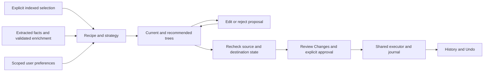

# Organize

Select indexed files in Files or Search and choose **Organize selected**. The
primary **Organize** page uses that explicit selection; it does not silently
include other files in the library. Its two trees compare current paths with
the proposed paths. Rejected moves remain at their current paths in the
recommended tree.

Choose a strategy:

- **Preserve my structure** keeps each file's containing folder and applies
  the selected filename recipe.
- **Improve my structure** retains the current hierarchy and places files
  under the recipe's final classification folder when needed.
- **Reorganize from scratch** evaluates the recipe's hierarchy relative to
  the indexed source root.

Every move explains the recipe evidence, strategy, manual edit, or remembered
preference behind it. Accepted classifications take precedence over automatic
inferences. Validated AI document type/category may supply missing classification
evidence; the UI identifies that evidence as AI-derived and not user-confirmed.
An AI inference does not acquire permission to move a file.

## Edit and review

Select a recommended file to edit its relative destination and filename. Select
a folder to rename it or move its selected descendants to another relative
folder. Use **Reject selected move** to keep an individual file where it is, or
**Restore recommendation** to remove a manual override. These actions edit the
proposal and recheck it; they do not create, rename, move, or delete source files.
Files outside the explicit selection are never affected by a folder edit.

The original file extension is preserved. Absolute paths, traversal, invalid
names, duplicate destinations, occupied targets, missing sources and root escapes
block review. A changed input disables **Review Changes** until revalidation.
Before creating a Change Plan, the service resolves the stable file identities
again and compares the preview fingerprint, including live file size and
last-write time. The production executor subsequently performs its own identity,
path and conflict checks immediately before execution.

**Review Changes** opens the established approval workflow. Applying the reviewed
plan uses the existing executor, operation journal, reconciliation and History /
Undo. Neither the Organize view nor its preferences execute filesystem changes.

## Remembered preferences

**Remember folder edits** explicitly saves valid folder substitutions from the
reviewed proposal. Future recommendations for that indexed source can prefer
the chosen folder over the original recipe folder. Preferences are inspectable
relative-folder mappings derived from user decisions, with frequency and recency
ranking; no model is trained. Turn off **Use my remembered folder preferences**
to evaluate the recipe without them.

The existing application-owned decision-history store persists these records
atomically, with its 1,000-decision and 4 MiB bounds. Routine AI history retention
preserves learned folder choices. If those choices fill the supported capacity,
saving a new decision fails while preserving existing preferences. An opaque source scope keeps
preferences from one library out of another library's recommendations and out of
general AI preference prompts. No source contents or absolute source paths are
recorded. Storage cleanup must treat decision history as durable user state.

## Implementation

`ReviewedOrganizationService` and `WorkflowTemplateEngine` continue to own
recipe-based planning. `OrganizationPreviewRequest` carries strategy and explicit
file overrides; `OrganizationProposalSet` remains ephemeral. The existing
`ReviewedOrganizationViewModel` presents both the inline legacy preview and the
dedicated `OrganizeView`. `JsonDecisionHistoryStore` owns persistence;
`ChangePlanFactory` and the shared executor own the safety handoff.

