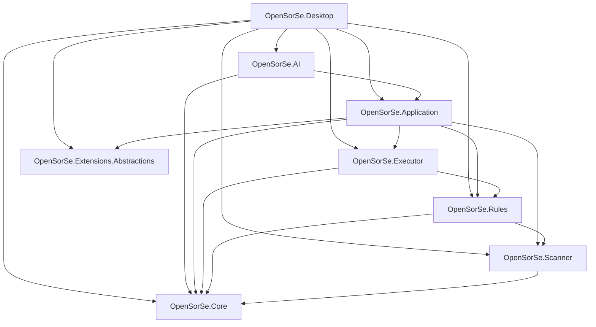

# Repository structure

This guide maps the OpenSorSe 1.5 solution as it exists in source. It describes
ownership and dependency rules; it is not a proposal for a different layering
model.

## Dependency direction

The arrows are actual `ProjectReference` entries. There are no production
reference cycles.

## Production projects

### `OpenSorSe.Extensions.Abstractions`

- **Purpose:** Stable plugin-author contract for lifecycle and eight bounded
  extension points.
- **Owns:** Immutable request/response models, capability vocabulary,
  contribution identities, `IOpenSorSePlugin`, and collection helpers.
- **Must not own:** Host discovery, persistence, dependency injection, user
  settings, credentials, Change Plans, execution, UI, or transport clients.
- **Principal entry points:** `IOpenSorSePlugin`, `IExtensionContribution`,
  `IMetadataProvider`, `IContentExtractor`, `IFileClassifier`,
  `IRecipeFieldProvider`, `IDuplicateSignalProvider`,
  `IWorkflowCapabilityProvider`, `IImportFormatProvider`, and
  `IExportFormatProvider`.
- **Dependencies:** No OpenSorSe project references.
- **Reference rule:** Application and Desktop may reference the SDK. Internal
  projects must not be introduced as SDK dependencies.

### `OpenSorSe.Core`

- **Purpose:** Reusable infrastructure with no product-feature dependency.
- **Owns:** Validated configuration, logging, diagnostics, lifecycle hosting,
  event delivery, task/state abstractions, errors, platform contracts/adapters,
  application locations, filesystem identity/capabilities, external-tool
  discovery, and Core DI registration.
- **Must not own:** Scanning algorithms, workflows, plugins, Change Plans,
  filesystem mutation, AI transport, or presentation.
- **Principal entry points:** `AddOpenSorSeCore`, `IApplicationHost`,
  `IConfigurationService`, `ILoggingService`, `IDiagnosticsCollector`,
  `IEventBus`, `ITaskManager`, `IPathSemantics`,
  `IApplicationPathProvider`, and `IPlatformCapabilityProvider`.
- **Dependencies:** No other production project.
- **Reference rule:** All internal projects except the standalone SDK may use
  Core; Core must not reference them.

### `OpenSorSe.Scanner`

- **Purpose:** Read-only filesystem discovery and deterministic file analysis.
- **Owns:** Recursive enumeration, basic metadata, hashing, classification,
  exact duplicate grouping, progress, cancellation, and per-item issues.
- **Must not own:** Content/OCR caches, AI, workflows, Change Plans, persistence,
  UI, or filesystem mutation.
- **Principal entry points:** `IFileScanner`, `IFileMetadataReader`,
  `IFileHasher`, `IFileClassifier`, and `IDuplicateDetector`.
- **Representative implementations:** `FileScanner`, `FileMetadataReader`,
  `FileHasher`, `FileClassifier`, and `DuplicateDetector`.
- **Dependencies:** Core.
- **Reference rule:** Rules, Application, and Desktop may use Scanner. Scanner
  must not reference those higher layers.

### `OpenSorSe.Rules`

- **Purpose:** Pure, deterministic evaluation and proposal planning.
- **Owns:** Rule conditions/actions, `RuleEngine`, `ActionPlanner`, lexical
  conflict resolution, and planned-operation models.
- **Must not own:** Approval, journal persistence, user-file mutation, UI, AI,
  or application-data stores.
- **Principal entry points:** `IRuleEngine`, `IActionPlanner`, and
  `IConflictResolver`.
- **Dependencies:** Core and Scanner.
- **Reference rule:** Executor, Application, and Desktop may use Rules. Rules
  must not reference execution or presentation.

### `OpenSorSe.Executor`

- **Purpose:** Safety domain and the only supported production user-file
  mutation implementation.
- **Owns:** Change Plan schema/factory/validation/store, Operation Journal,
  `IFileSystemGateway`, preflight, execution ordering, verification,
  reverse-order rollback, restart recovery, conflict-aware Undo, and reports.
- **Must not own:** UI decisions, AI, watcher coordination, workflow policy, or
  plugin loading.
- **Principal entry points:** `IChangePlanFactory`, `IChangePlanValidator`,
  `IChangePlanExecutionService`, `IChangePlanStore`,
  `IOperationJournalStore`, and `IFileSystemGateway`.
- **Representative implementations:** `ChangePlanFactory`,
  `ChangePlanValidator`, `ChangePlanExecutionService`,
  `JsonChangePlanStore`, `JsonOperationJournalStore`, and
  `PhysicalFileSystemGateway`.
- **Dependencies:** Core and Rules.
- **Reference rule:** Application and Desktop may use Executor. Executor must
  not reference Application, AI, plugins, watchers, or Desktop.
- **Compatibility note:** `ActionExecutor` and `UndoEngine` are older,
  unregistered compatibility components. New product flows must use the Change
  Plan boundary.

### `OpenSorSe.Application`

- **Purpose:** Product use cases and orchestration between domain projects.
- **Owns:** Manual processing sessions, Results projection, local content/OCR,
  catalog/search/comparison, semantic indexing, tags, structure planning and
  history, provider-neutral AI policy, watched-folder coordination, workflows,
  plugin host/lifecycle/packages, and suggestion-to-Change-Plan adapters.
- **Must not own:** Avalonia views, shell navigation, Ollama HTTP details, or
  direct approved user-file mutation.
- **Principal entry points:** `IApplicationController`,
  `IProcessingSessionManager`, `IProcessingOrchestrator`,
  `IWorkflowConfigurationResolver`, `IWatchedFolderCoordinator`,
  `IPluginManager`, `IAiSuggestionService`, and
  `ISuggestionChangePlanFactory`.
- **Important folders:**
  - `AI`: gates, prompts, parsing, validation, and diagnostics contracts.
  - `Catalog`, `CatalogSearch`, `CatalogComparison`: saved scan data and query
    services.
  - `ChangePlans`: adapters from reviewed suggestions to executor models.
  - `Content`: bounded metadata/text extraction, PDF rendering, OCR, and cache.
  - `Plugins`: manifest, discovery, integrity, dependencies, packages,
    lifecycle, registry, invocation, provenance, and built-ins.
  - `Semantic`: deterministic local index and explained search.
  - `Structure`: snapshots, preview plans, history, and comparisons.
  - `Tags`: provenance-aware generated tag candidates.
  - `Watching`: opt-in configurations, hint normalization, debounce,
    stability, reconciliation, incremental catalogues, and activity.
  - `Workflows`: profiles, recipes, validation, resolution, import/export,
    templates, snapshots, and recipe plans.
- **Dependencies:** SDK, Core, Scanner, Rules, and Executor.
- **Reference rule:** AI transport and Desktop may use Application.
  Application must not reference either.

### `OpenSorSe.AI`

- **Purpose:** Optional concrete AI-provider integration.
- **Owns:** Ollama-compatible HTTP transport and its provider-specific wire
  models. It also contains the local bounded decision-history store.
- **Must not own:** feature gating, prompts, application validation, navigation,
  or file operations.
- **Principal entry point:** `OllamaSuggestionProvider`.
- **Dependencies:** Application and Core.
- **Reference rule:** Desktop composes this transport behind
  `IAiSuggestionProvider`; lower projects do not reference it.

### `OpenSorSe.Desktop`

- **Purpose:** Avalonia composition root and presentation layer.
- **Owns:** Startup/DI, application lifetime, navigation, Views, ViewModels,
  dialogs, commands, progress/cancellation presentation, clipboard, and safe
  shell launching.
- **Must not own:** scanning algorithms, persistence schemas, provider
  validation, or raw user-file mutation.
- **Principal entry points:** `Program`, `App`, `MainWindow`, and
  `MainViewModel`.
- **Important folders:** `Views` contains XAML and minimal code-behind;
  `ViewModels` owns presentation state and commands; `Services` contains
  presentation-only adapters.
- **Dependencies:** All production projects because Desktop is the composition
  root.
- **Reference rule:** No production project may reference Desktop.

## Test projects

| Project | Primary scope |
| --- | --- |
| `OpenSorSe.Core.Tests` | Core infrastructure plus repository documentation and dependency invariants |
| `OpenSorSe.Scanner.Tests` | Traversal, metadata, hashes, classification, duplicates, bounds, and cancellation |
| `OpenSorSe.Rules.Tests` | Rule evaluation, planning, conflicts, and pure models |
| `OpenSorSe.Executor.Tests` | Change Plans, validation, journalling, execution, rollback, recovery, Undo, and compatibility regressions |
| `OpenSorSe.Application.Tests` | Orchestration, stores, OCR/content, AI policy, catalog/search, watchers, workflows, plugins, and provenance |
| `OpenSorSe.Desktop.Tests` | Composition, navigation, ViewModels, command state, persistence presentation, and plugin UI |

Tests may reference the production project under test and explicit
collaborators needed for integration. Production projects never reference test
projects.

## Repository-level directories

- `docs/`: Current guides, historical release records, architecture, and
  implementation specifications. Start at [docs/README.md](README.md).
- `docs/Architecture/`: Current architectural summaries plus clearly indexed
  historical/long-term design material.
- `docs/Implementation_Spec/`: Numbered, release-specific implementation
  history. Start at its [index](Implementation_Spec/README.md).
- `scripts/`: Maintainer scripts only. It must not contain product source or
  generated output.
- `release/`: Historical packaged release material already tracked by the
  repository. New release output must not be added during ordinary development.
- `.artifacts/`, `bin/`, and `obj/`: Ignored build output, never source.

## Where to make a change

| Change | Preferred location |
| --- | --- |
| Scanner stage or file-level deterministic analysis | `OpenSorSe.Scanner` plus Scanner tests |
| Pure rule/plan behavior | `OpenSorSe.Rules` plus Rules tests |
| Change Plan, validation, journal, execution, recovery, or Undo | `OpenSorSe.Executor` plus Executor tests |
| Product orchestration, persistence, watcher, workflow, content, or plugin host | `OpenSorSe.Application` plus Application tests |
| Ollama HTTP behavior | `OpenSorSe.AI` plus Application integration tests |
| Navigation, ViewModel, or XAML | `OpenSorSe.Desktop` plus Desktop tests |
| Plugin-author contract | `OpenSorSe.Extensions.Abstractions`, compatibility docs, and adversarial host tests |
