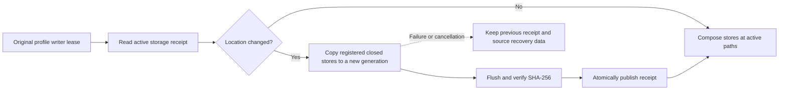

# Storage location, limits and recovery

Settings → Storage shows the active library and cache folders, physical usage,
and logical categories inside the library database. Logical detail rows are
already included in the physical total. Operation history, configuration,
plugins and logs retain their existing platform locations. Source files are
never included in storage cleanup.

To choose another drive, enter an absolute folder in the storage location
setting, save Settings, then restart. Leave the field blank to use the default
application-data drive. The chosen folder contains an application-owned,
profile-specific generation; OmniSorSe does not mix its files into an existing
folder or overwrite unrelated files. A removable drive must remain available
while the application uses it.

## Migration and compatibility

`IApplicationPathProvider` remains the path authority. After acquiring the
existing default-profile writer lease and before opening any database, the
desktop calls `ApplicationStorageLocation.ResolveAsync`. The migrator inventories
the exact entries registered in `ApplicationStorageFiles`, rejects user-controlled linked paths
and nested managed destinations, copies closed stores and SQLite sidecars,
flushes and compares SHA-256 hashes, then publishes `storage-location.json`
atomically in the original configuration folder. A matching generation marker
is required on subsequent starts. A permanent `storage-location-required.json`
guard prevents a lost receipt from being mistaken for a first launch with the
stale original profile. Partial copies without a completed generation marker
are ignored on retry. Startup fails if the selected generation is unavailable,
its receipt is missing/corrupt, or publication was interrupted after a verified
generation was marked complete, instead of opening stale or empty data.

The native macOS `/var` and `/tmp` aliases are accepted only when their immediate
targets are exactly `/private/var` and `/private/tmp`; those target ancestors are
checked too. Arbitrary redirects, linked descendants and dangling links still
fail closed. This allows standard macOS temporary storage without treating
user-created links as trusted storage.

The durable `deep-index.db`, graph-native `knowledge-decisions.db`, all graph
recovery state under `index`, saved libraries, workflow recipes and learned
organization decisions are copied. Configuration, operation journals and the
profile writer lock remain at their original locations. This migration does
not alter database schemas. Old settings without a Storage group retain the
platform default and a 512 MiB cache budget.

Prior generations are retained as recovery copies. They consume additional
space outside the active-storage total and are **not** updated after the
application switches locations. Returning to the default drive copies the
latest active generation into a new generation there; it does not restore the
stale original files.

If migration fails, restore drive availability/free space/permissions and
restart. Before a completed generation/guard exists, restoring the previous
`Storage.DirectoryPath` value in the original `settings.json` selects the
still-preserved source. Interrupted final publication requires restoring the
verified generation's matching receipt; do not remove the guard to bypass it.
After publication, preserve both the receipt and its matching generation; do
not delete the receipt to bypass a startup error. A receipt that cannot be
read requires recovery from a known matching copy. A logical `.oms-state`
export is useful for supported user-state transfer but is not a complete
replacement for graph-native decisions or operation history.

Older versions do not understand the location receipt and may open stale
original data. Downgrade after relocation is unsupported without an explicit,
verified full-profile recovery procedure. Copy preservation is not a promise
of lossless downgrade.

## Bounded storage and cleanup

The cache budget is configurable from 16 to 65,536 MiB. Content compatibility
records, search compatibility records and generated image previews each receive
one third of that budget, while their existing hard safety ceilings continue to
apply. Writes evict the oldest eligible derived records; thumbnail reads and
writes reclaim old owned previews as needed. Lowering a limit affects the next
cache operation or explicit cleanup. Active temporary extraction storage has
its separate existing per-job bounds. Temporary retention is configurable from
1 to 365 days.

The existing library-index quota remains configurable through its indexing
setting. Its provider prunes derived search chunks and compacts storage; if
durable state alone still exceeds the quota, indexing stops accepting more work
until capacity is available. Graph storage keeps its existing independent
quota and recovery policies. Durable decisions are never sacrificed to force a
quota result.

Reclaim rebuildable data proceeds in this order:

1. Remove abandoned media temporary files older than the configured retention.
2. Remove owned image previews and eligible compatibility-cache records.
3. Run the existing library provider's quota maintenance and compaction.

Legacy `content-index.json` records can contain user-accepted or rejected tags.
These records are preserved by both eviction and cleanup. Search compatibility
records containing such tags are conservatively retained too. Unreadable
compatibility stores are preserved because their authority cannot be
classified safely. If retained decisions exceed a reduced cache budget, the
write fails without replacing the prior file; increase the limit.

Expired deleted-file identities in `deep-index.db` are retained whenever Smart
Tag decisions, user/accepted assignments, relationship overrides/manual edges,
or authored Smart Collection membership depend on them. This prevents foreign
key cascades from silently erasing durable choices during routine maintenance.
Explicit privacy/Forget operations remain separate existing workflows.

## Verification boundary

Focused automated tests cover settings compatibility, migration publication,
restart reuse, return-to-default behavior, cancelled/failed/partial copies,
missing/corrupt receipts, ownership requirements, durable retention, and cache
eviction preserving accepted/rejected legacy tags. Existing schema migration
tests remain the database-upgrade coverage; byte-copy migration tests do not
claim interactive upgrade acceptance. Real-drive removal, native link/reparse
behavior, Windows installer upgrades, UI accessibility and recovery by a human
remain manual release checks.
