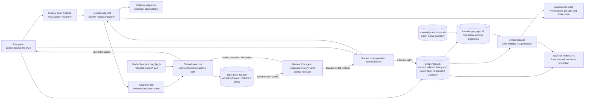
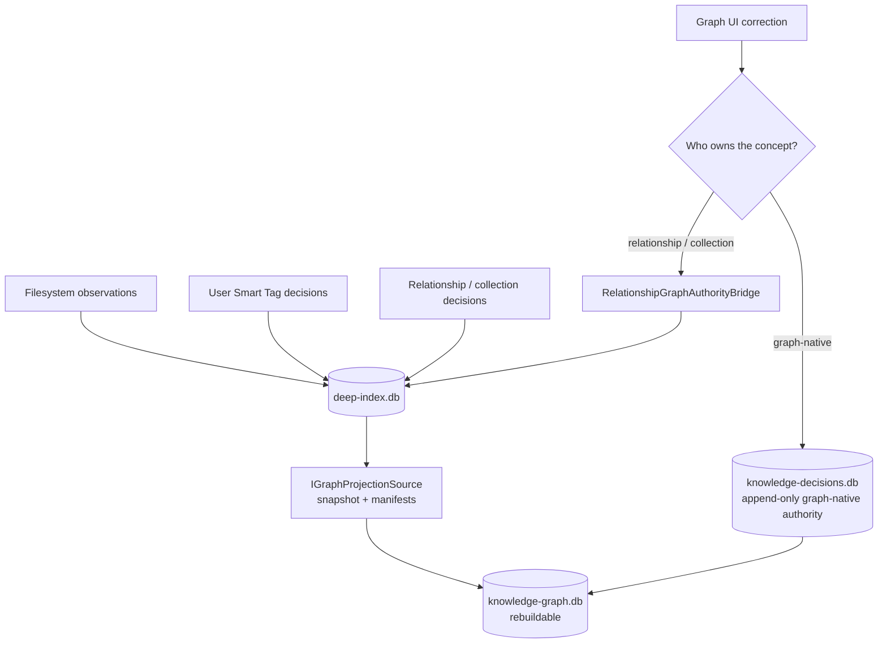

# OmniSorSe architecture and authority map

Status: living, implementation-verified architecture guide. Last verified
against branch `v2.12-trusted-relationships-context` at commit `d48bb08` on
2026-08-18.

Use this document to identify the owner of a concept before changing it. Source
and tests define implemented behavior when this guide is stale. ADRs preserve
durable decisions; versioned implementation and release reports are historical
evidence, not current authority.

## Authority vocabulary

| Term | Meaning in this document |
| --- | --- |
| Owns | Defines the canonical application meaning and allowed transitions. |
| Reads | Consumes an authority without becoming its owner. |
| Derives | Produces replaceable or point-in-time state from authority. |
| Mutates | Is allowed to change the named state. This is narrower than writing an application cache. |
| Persists | Stores state across process runs. Persistence alone does not make a value authoritative. |
| Publishes | Exposes a bounded projection to another subsystem or the UI. |
| Does not own | A boundary that must not be inferred from convenience, composition, or a cached copy. |

## System authority flow

The arrows show information or controlled action, not shared ownership. In
particular, the catalog never becomes live filesystem truth, the graph never
becomes relationship authority, and the Explorer client never becomes a
persistence or mutation authority.

## Sources of truth at a glance

| Concept | Authoritative owner | Persistent artifact | Important readers/derived consumers | Does not own |
| --- | --- | --- | --- | --- |
| Current user files and paths | Local filesystem | User-selected storage | Scanner, executor validation, indexing discovery, reconciliation | Results, catalog, Search, graph |
| Current settings | `IConfigurationService` | Versioned settings JSON | All feature services and Desktop | Feature ViewModels |
| Current manual review set | `ResultsSnapshot` held by `ResultsViewModel` | None unless explicitly saved | Files, Duplicates, AI/organization proposal flows | Durable Search library or current filesystem state after external changes |
| Saved scan history | `IResultsCatalogStore` | `DataDirectory/catalog.json` | Catalog, historical Search/comparison, Results when explicitly opened | Current filesystem or current indexed library |
| Filesystem mutation intent | `IChangePlanStore` and reviewed `ChangePlan` | `StateDirectory/change-plans.json` | Review Changes, executor | What actually happened |
| Mutation outcome and safe Undo | `IOperationJournalStore` plus current filesystem verification | `StateDirectory/operation-journal.json` | Undo history, startup recovery, reconciliation | User intent or unverified current identity |
| Current indexed library | `IDeepIndexStore` / `SqliteDeepIndexStore` | `DataDirectory/index/deep-index.db` | Search, Explorer, Smart Tags, relationships, graph source, health/privacy | Source-file truth |
| Smart Tag authority | Schema-6 `ISmartTagStore` | `deep-index.db` | Search/facets, Files, backup/restore | Legacy path-keyed content tags |
| Related Files and Smart Collection authority | `IRelationshipStore` | `deep-index.db` | Relationship UI, Search context, Explorer, graph projection | Knowledge Graph projection |
| Rebuildable Knowledge Graph | `IGraphStore` as a projection of indexed and decision authority | `DataDirectory/index/knowledge-graph.db` | Graph UI and optional Search context | Source observations or user decisions |
| Graph-native decisions and consent | `IGraphDecisionStore` | `DataDirectory/index/knowledge-decisions.db` | Graph coordinator, reads, privacy/recovery | Legacy relationship/collection decisions |
| AI review preferences | `IDecisionHistoryStore` | `DataDirectory/decision-history.json` | Explicit AI suggestion requests | Filesystem, Search ranking authority, or Change Plan approval |
| Explorer session scope | `IExplorerProtocolHost` session manager | Process memory only | Named-pipe request dispatcher | Indexed source registration or durable authorization |
| Plugin installation and grants | Plugin manager/state store | Plugin directory and `StateDirectory/plugins-state.json` | Contribution registry, workflow resolver | Host DI, persistence, credentials, Change Plan approval |
| Advanced diagnostics | `IDiagnosticsManager` | Process memory; explicit export only | Diagnostic UI/export | Product/domain state |

## Subsystem contracts

### Manual scan, rules, duplicates, and Results

| Aspect | Verified current behavior |
| --- | --- |
| Purpose and owner | `ProcessingOrchestrator` coordinates a read-only point-in-time scan. Scanner, metadata, hashing, classification, duplicate, rule, planner, and conflict services own their individual algorithms. |
| Reads / inputs | User-selected roots, workflow policy, live filesystem enumeration and metadata, deterministic rules, optional content-extraction service. |
| Derives / outputs / consumers | Produces immutable `ProcessingResult`, then `ResultsSnapshot`; Files and Duplicates present it, proposal services create reviewed intent from it, and the catalog may save it as history. Completed roots are separately queued for background indexing. |
| Mutates / persists | Does not mutate source files. The working snapshot is in memory; explicit catalog saving persists a historical copy. |
| Does not own | Durable indexed/Search state, current truth after the filesystem changes, Change Plan approval, or execution. |
| Invariants | Stage order is intentional. Exact duplicates require normalized SHA-256 equality. The orchestrator may plan actions but cannot approve or execute them. |
| Failure / cancellation / rollback | Per-path scanner, metadata, and hash issues are retained while other entries continue. Optional content extraction failure is isolated. Cancellation returns partial scan discovery or propagates at later safe boundaries. Rollback/Undo do not apply because scanning is read-only. |
| Bounds | Hashing streams sequentially through a pooled 64 KiB buffer; duplicate aggregation is linear-memory. Detailed diagnostics are bounded, but the manual pipeline has no explicit total file-count ceiling. |
| Source / tests | [`ProcessingOrchestrator`](../../src/OpenSorSe.Application/ProcessingOrchestrator.cs), [`FileScanner`](../../src/OpenSorSe.Scanner/FileScanner.cs), [`DuplicateDetector`](../../src/OpenSorSe.Scanner/DuplicateDetector.cs); `ProcessingOrchestratorTests`, Scanner tests, Rules tests, `DuplicateReviewViewModelTests`. |
| Known limitations | A manual scan holds the complete result set in memory. It can complete even when durable background indexing cannot be queued; Results and Search can therefore have different freshness. |

### Durable indexing and Search

| Aspect | Verified current behavior |
| --- | --- |
| Purpose and owner | `BackgroundIndexingService` coordinates durable progressive work. `SqliteDeepIndexStore` owns schema-6 indexed state. `SemanticSearchService` interprets and ranks bounded local queries. |
| Reads / inputs | Registered source roots, filesystem observations, settings/policy fingerprints, content/media providers, Smart Tag classifier, relationship service, Search query/filter/facet input, optional graph and explicit AI assistance. |
| Derives / outputs / consumers | Publishes progressive Search documents, coverage, facets, failures, retained bounded evidence, Smart Tags, relationship features, and graph observations. Desktop Search, Home readiness, Explorer Protocol, relationships, and graph consume those projections. |
| Mutates / persists | Mutates only application-owned index state. Durable sources, work, privacy policy, generated evidence, user Smart Tag/relationship authority, and Search records live in `deep-index.db`. Source files are never changed. |
| Does not own | Current source-file truth, manual Results, historical catalog state, or graph-native decisions. |
| Invariants | Durable stages are explicit and restartable: discovery, metadata, fingerprint, text/media, OCR, enrichment, semantic representation, Smart Tags, Search, relationships, completion. Deterministic lexical Search remains available without AI. Privacy forget markers suppress compatible rediscovery. |
| Failure / cancellation / rollback | Stages distinguish skipped, waiting-for-dependency, retry-scheduled, failed, cancelled, and complete. IO can retry; invalid inputs fail permanently. Pause/cancel/restart state is durable. Derived corruption is preserved and reset only through reviewed recovery. No source rollback is required. |
| Bounds | Schema 6 / processor `2.6.0`; default 1 GiB quota, 128 KiB extracted text, 64 KiB OCR, eight semantic chunks, concurrency one. Validated ceilings include concurrency 32, 512 relationship candidates, 128 relationships/file, and 2,000 collection members. Search: 512 query chars, 32 tokens, 16 filters, 4,096 fuzzy candidates, 1,000 ranked results, four concurrent queries. |
| Source / tests | [`BackgroundIndexingService`](../../src/OpenSorSe.Application/Indexing/BackgroundIndexingService.cs), [`DefaultIndexingStageProcessor`](../../src/OpenSorSe.Application/Indexing/DefaultIndexingStageProcessor.cs), [`SqliteDeepIndexStore`](../../src/OpenSorSe.Indexing.Sqlite/SqliteDeepIndexStore.cs), [`SemanticSearchService`](../../src/OpenSorSe.Application/Semantic/SemanticSearchService.cs); SQLite indexing, Search resilience/intelligence/integration, and performance regression tests. |
| Known limitations | Search still consumes a legacy JSON semantic index alongside SQLite. Progressive same-path data normally wins, but legacy tags are unioned and legacy vectors can be fallback data. See [Derived risks](#derived-risks-and-comprehensibility-debt). |

### Change Plan execution, reconciliation, and Undo

| Aspect | Verified current behavior |
| --- | --- |
| Purpose and owner | The shared production `IChangePlanExecutionService` is the only source-file mutation boundary. Validator, plan store, journal, filesystem gateway, recovery-safety state, and reconciliation service have separate responsibilities. |
| Reads / inputs | Reviewed plan with explicit per-action approval, immediate filesystem identity/path state, current journal dependencies, cancellation, and initiating feature identity. |
| Derives / outputs / consumers | Publishes durable operation/action outcomes, rollback/Undo availability, reports, and user-visible status. Review Changes and Operation History publish exact terminal records to `MainViewModel`; startup passes exact recovered records after index initialization. The shell derives reconciled Results and submits affected paths for targeted index refresh. |
| Mutates / persists | The executor may create directories, move/rename files, and move duplicate copies into managed recovery. Plans persist in `change-plans.json`; action-level outcomes persist in `operation-journal.json`. Reconciliation updates projections, not source intent. |
| Does not own | Suggestions, rules, AI output, duplicate classification, or a guarantee that an externally changed path remains unchanged. |
| Invariants | Only approved, revalidated actions execute. A journal record must reach Pending and Running durably before filesystem mutation. Pre/post identities are verified. Undo never overwrites an occupied original path or reverses a materially changed result. Authoritative-store corruption blocks mutation. |
| Failure / cancellation / rollback | Cancellation is observed at action boundaries. Blocking failure triggers reverse-order rollback. Journal failure triggers emergency rollback. Partial rollback and ambiguous interrupted states are durable, user-visible outcomes. Startup inspects interrupted operations. Undo is reverse-order, identity- and dependency-aware, and can complete partially. |
| Bounds | 1,000 actions/plan, 100 retained plans, 64 MiB plan file; 500 journal operations, 128 MiB journal, bounded messages/paths. Startup index submission is coalesced to at most one affected root per retained journal operation (500), independent of action count. |
| Source / tests | [`ChangePlanExecutionService`](../../src/OpenSorSe.Executor/ChangePlanExecutionService.cs), [`ChangePlanReconciliationService`](../../src/OpenSorSe.Application/ChangePlans/ChangePlanReconciliationService.cs), [`MainViewModel` reconciliation handler](../../src/OpenSorSe.Desktop/ViewModels/MainViewModel.cs); `ChangePlanSafetyTests`, `ChangePlanReconciliationServiceTests`, Change Plan and Undo ViewModel tests. See [ADR-004](../Architecture/99_Appendix/ADR-004_Change_Plan_Mutation_Authority.md). |
| Known limitations | The older standalone `IUndoEngine` and an in-memory compatibility constructor for folder restructuring remain public/tested but are not the production authority. Immediate projection refresh can fail after a valid filesystem outcome. Duplicate-recovery Undo cannot recreate a Results row removed during Apply because journal schema 1 does not own that logical row ID. Startup recover/reconcile is adjacent but not crash-atomic. The active `FolderRestructuringService.ApplyAsync` direct executor consumer remains a recorded shell-handoff gap. If journal persistence fails after Undo has already reversed a filesystem action, the disk change can precede the terminal record and projection handoff. |

### Related Files and Smart Collections

| Aspect | Verified current behavior |
| --- | --- |
| Purpose and owner | `RelationshipService` coordinates provider-neutral deterministic relationship analysis and explicit controls; schema-6 `IRelationshipStore` owns retained relationship/collection state. |
| Reads / inputs | Stable indexed file documents, bounded candidate features, exact content/path/topic/entity/time/OCR/media evidence, settings exclusions, explicit pair and collection decisions. |
| Derives / outputs / consumers | Produces evidence-backed Related Files, aggregate context, Search expansions, virtual Smart Collections, diagnostics, and graph projection input. Desktop, Search, Explorer, backup, and graph consume them. |
| Mutates / persists | Atomically replaces generated analysis for one file and persists manual links, confirm/reject/always/never corrections, collection metadata, memberships, exclusions, and tombstones in `deep-index.db`. Source files are untouched. |
| Does not own | Source-file relationships as objective truth, graph-native decisions, or physical file organization. |
| Invariants | Generated features/output are replaceable; user pair and collection authority is retained separately. Negative authority remains inspectable even when it hides a visible edge. Graph reconciliation is a derived notification, not part of the relationship transaction. |
| Failure / cancellation / rollback | One file publishes no partial analysis batch when cancelled. Store transactions protect replacement and user mutations. Optional graph signalling is best effort and periodic reconciliation covers missed signals. Reversal uses explicit clear/reset/unlink/split operations, not Change Plan Undo. |
| Bounds | 512 candidates, 128 relationships/file, eight evidence records/relationship, 2,000 collection members, 100 Search expansions, bounded explanation/title text. |
| Source / tests | [`RelationshipContracts`](../../src/OpenSorSe.Application/Relationships/RelationshipContracts.cs), [`RelationshipService`](../../src/OpenSorSe.Application/Relationships/RelationshipService.cs), SQLite relationship stores; relationship engine/quality corpus/store/Search integration and Collections ViewModel tests. |
| Known limitations | Relationship quality is heuristic and evidence-backed, not semantic certainty. The optional graph may temporarily lag authoritative relationship changes. |

### Knowledge Graph

| Aspect | Verified current behavior |
| --- | --- |
| Purpose and owner | Optional broader structural/relationship projection. `IGraphProjectionSource` reads deep-index authority; `IGraphStore` owns rebuildable projection state; `IGraphDecisionStore` owns graph-native decisions, consent, privacy sequence, and recovery metadata. |
| Reads / inputs | Deep-index snapshot manifest/revision, legacy relationship decision manifest, graph-native decision ledger/checkpoint, privacy sequence, resource settings, explicit user graph commands. |
| Derives / outputs / consumers | Deterministic nodes, edges, evidence, facts, aliases, timeline, bounded traversal and Search context. Knowledge Graph UI and optional Search context consume it. |
| Mutates / persists | Coordinator publishes generations to `knowledge-graph.db`; graph-native commands append to `knowledge-decisions.db`. `RelationshipGraphAuthorityBridge` routes relationship-owned corrections back to `RelationshipService`. |
| Does not own | Source observations, source files, Smart Tags, current schema-6 relationship/Smart Collection authority, or base Search availability. |
| Invariants | Graph reads and mutations fence on current source/decision/privacy authority and applied coverage. Stale or invalid authority fails closed. The derived store may be quarantined/replaced without resetting decisions. Provisioning occurs only after explicit consent. |
| Failure / cancellation / rollback | Jobs persist pending/running/retryable/permanent/waiting/cancelled states with lease fencing. Cancellation is durably acknowledged; unchanged jobs retry at most five times. Prior valid components can remain readable while replacement is pending. Graph failure is isolated from base indexing/Search. Graph-native decision recovery uses managed checkpoints, not Change Plan Undo. |
| Bounds | Query page 100, projection page 256, eight evidence/edge, 128 edges/node, component 1,024 nodes/4,096 edges, stable depth one/100 nodes, 16 Search seeds, 50 graph and 100 combined context expansions, four workers, 30-second lease, five-second heartbeat/shutdown, five-minute reconciliation. |
| Source / tests | [`GraphContracts`](../../src/OpenSorSe.Application/KnowledgeGraph/GraphContracts.cs), [`GraphApplicationServices`](../../src/OpenSorSe.Application/KnowledgeGraph/GraphApplicationServices.cs), [`RelationshipGraphAuthorityBridge`](../../src/OpenSorSe.Application/KnowledgeGraph/RelationshipGraphAuthorityBridge.cs), SQLite graph providers; graph release-gate, determinism/security, authority, recovery, concurrency, integration, accessibility, and performance suites. See [ADR-005](../Architecture/99_Appendix/ADR-005_Indexed_and_Graph_Authority_Separation.md). |
| Known limitations | Stable traversal is intentionally shallow and bounded. The graph is optional and may be stale/unavailable while base Search remains correct. |

The graph authority split is deliberate:

### Content, media, Content Intelligence, Smart Tags, and AI

| Aspect | Verified current behavior |
| --- | --- |
| Purpose and owner | Content/media services extract bounded local evidence; deterministic Content Intelligence derives concepts/summaries; Smart Tag service owns user/generated tag separation; AI service owns optional review-only provider requests. |
| Reads / inputs | Known files, bounded native/OCR/media evidence, configuration, optional user-managed Tesseract/ffmpeg/ffprobe/whisper.cpp, explicit Ollama settings/request, exact user selection. |
| Derives / outputs / consumers | Extracted/OCR text, metadata, transcripts, frames/thumbnails, provenance-bearing topics/entities/summary, Smart Tag candidates, AI rename/folder/document/Search suggestions. Indexing, Search, relationships, Explorer, Files, and review flows consume them. |
| Mutates / persists | Generated evidence and Smart Tag authority persist in `deep-index.db`; path-keyed content JSON and thumbnails are rebuildable compatibility caches. AI decision history persists reviewed preferences. AI suggestions must become a separate reviewed Change Plan before source mutation. |
| Does not own | Source-file truth, Change Plan approval, deterministic Search ordering, or user authority. The unavailable visual-description provider is not a core dependency. |
| Invariants | Provenance distinguishes deterministic, AI-derived, and user-authored values. Optional absence is explicit. Smart Tag user decisions survive generated-data clearing. Model output is bounded, parsed, normalized, and validated before presentation. |
| Failure / cancellation / rollback | Media/provider failure is isolated per file; enabled missing dependencies can leave deeper indexing work waiting while base coverage remains. Cancellation propagates or becomes an explicit cancelled result. AI/provider failure preserves deterministic fallback and cannot mutate. No source rollback applies until a suggestion enters Change Plan execution. |
| Bounds | Content/media settings bound file size, pages, durations, frames, transcripts, OCR, descriptions, provider timeouts, and temporary storage. AI folder proposals accept at most 12 files; document text 16,384 chars; Ollama prompt 128 KiB and response 1 MiB. |
| Source / tests | Content, Media, ContentIntelligence, SmartTags, and AI directories under [`OpenSorSe.Application`](../../src/OpenSorSe.Application); [`OllamaSuggestionProvider`](../../src/OpenSorSe.AI/OllamaSuggestionProvider.cs); content pipeline/intelligence, media, Smart Tag, AI suggestion/provider/Search, accessibility, and privacy tests. |
| Known limitations | Visual description is unavailable in production composition. Legacy path-keyed tags/content still feed the compatibility semantic index; they are not Smart Tag authority. Native optional-tool behavior still requires host-specific validation. |

### Explorer Protocol and OmniBrille

| Aspect | Verified current behavior |
| --- | --- |
| Purpose and owner | `OmniSorSe.ExplorerProtocol` owns the independently versioned DTO contract. `IExplorerProtocolHost` owns short-lived authorization and local transport. `ExplorerDataSource` adapts existing indexed/Search/relationship services. |
| Reads / inputs | Explicit launch request, enabled indexed source IDs, protocol/version/token/request envelope, existing bounded indexed and relationship projections. |
| Derives / outputs / consumers | Authorized roots, children, neighborhoods, deterministic-first Search, Related Files, and node details for the separately installed OmniBrille client. |
| Mutates / persists | No source or application-state mutation. Sessions and token hashes exist only in process memory. The named-pipe host starts on demand and grants are revoked on failure/expiry. |
| Does not own | Indexed source registration, persistence, raw SQLite, Search semantics, filesystem mutation, or companion installation. |
| Invariants | Protocol v1 is read-only, local, source-scoped, bounded, and privacy-safe. Production launch omits authorized paths. Tokens compare in fixed time; node IDs are opaque session-secret HMAC identities. Stable errors expose no exception, stack, database, or unauthorized path detail. |
| Failure / cancellation / rollback | Incompatible, unauthorized, expired, oversized, busy, cancelled, and isolated internal failures are explicit. Bootstrap/session failure revokes authorization. No rollback applies because the surface is read-only. OmniSorSe remains functional without OmniBrille. |
| Bounds | 64 KiB request, 1 MiB response, 20,000 documents examined, 256 nodes, 512 edges, 100 Search/Related results, depth two, four concurrent plus 16 queued requests, 15-second request/acknowledgement timeout, 15-minute session maximum. |
| Source / tests | [`ExplorerProtocolContracts`](../../src/OmniSorSe.ExplorerProtocol/ExplorerProtocolContracts.cs), [`ExplorerReadService`](../../src/OpenSorSe.Application/Explorer/ExplorerReadService.cs), [`ExplorerSessionSecurity`](../../src/OpenSorSe.Application/Explorer/ExplorerSessionSecurity.cs), [`ExplorerCompanionLaunch`](../../src/OpenSorSe.Application/Explorer/ExplorerCompanionLaunch.cs); Explorer protocol and companion launch tests. See [ADR-006](../Architecture/99_Appendix/ADR-006_Explorer_Protocol_Read_Only_Boundary.md). |
| Known limitations | The companion is a separate optional install. Native two-process IPC remains a platform/manual validation category. `IExplorerCompanionPresence` is obsolete compatibility surface; locator/launcher determine current availability. |

### Plugins and extensions

| Aspect | Verified current behavior |
| --- | --- |
| Purpose and owner | Plugin manager/state/package/runtime services own installation, exact version selection, enablement, grants, quarantine, load lifetime, and contribution registration. The standalone abstractions project owns the public SDK contract. |
| Reads / inputs | Strict manifest/package, stored enablement/grants, exact dependency/version graph, host-selected bounded file or read-only model, workflow references. |
| Derives / outputs / consumers | Bounded metadata, content, classification, recipe fields, duplicate evidence, workflow capability, import proposals, and export payloads. Host services validate outputs before use. |
| Mutates / persists | Mutates only application-owned plugin packages and state. It does not expose persistence or mutation services to extensions. |
| Does not own | Change Plan approval/execution, duplicate truth, credentials, host DI, filesystem policy, or a security sandbox. |
| Invariants | Manifest declaration and effective granted capability are both required. Exact versions fail closed; conflicts do not replace active registrations. Imports are proposals, duplicate signals are evidence, and workflow capability absence is not silently substituted. |
| Failure / cancellation / rollback | Plugin exceptions/timeouts are contained and diagnosed; repeated failure can quarantine. Package installation is staged/validated. Unload may require restart because external code runs in process. Package rollback is distinct from source-file Undo. |
| Bounds | 256 plugins, 64 contributions/plugin, 32 dependencies, 1,024 package entries, 128 MiB package, 256 MiB installed payload, quarantine after three failures. |
| Source / tests | [`ExtensionContracts`](../../src/OpenSorSe.Extensions.Abstractions/ExtensionContracts.cs), Application `Plugins` directory; manifest/discovery, package, runtime/extension, workflow integration, and Plugins ViewModel tests. |
| Known limitations | Capability filtering and load contexts are not OS sandboxing or publisher authentication; plugin code runs with the current user's permissions. |

### Desktop UI and state

| Aspect | Verified current behavior |
| --- | --- |
| Purpose and owner | Avalonia Views present state. Feature ViewModels own interaction state and commands. `MainViewModel` owns process-lifetime shell/navigation and cross-feature routing. `App` owns composition/startup/shutdown. |
| Reads / inputs | Application services, provider-neutral stores, configuration, user commands, cancellation, progress, notifications, and immutable projections. |
| Derives / outputs / consumers | Observable presentation rows, selection, focus/live-region state, confirmations, navigation events, Change Plan requests, and owner-visible status. |
| Mutates / persists | UI mutates ViewModel state and invokes explicit service operations. It does not read SQLite directly. Some ViewModels call provider-neutral stores for feature-owned application data. |
| Does not own | Scanning algorithms, schemas, source-file mutation, Search ranking, durable relationship/graph authority, or provider transport. |
| Invariants | Suggestions route to review; approved mutation stays behind the executor. Historical catalog views identify themselves as stale. Accessibility names, live regions, keyboard/focus restoration, and cancellation state are part of the workflow. |
| Failure / cancellation / rollback | ViewModels disclose cancelled, partial, unavailable, and stale states and retain safe existing projections where practical. Rollback/Undo are delegated to domain services. |
| Bounds | Large collections use bounded service queries and selected views, but several ViewModels remain very large: Knowledge Graph ~3,154 lines, Search ~2,232, Main ~2,160, Results ~1,789. |
| Source / tests | [`App`](../../src/OpenSorSe.Desktop/App.axaml.cs), [`MainViewModel`](../../src/OpenSorSe.Desktop/ViewModels/MainViewModel.cs), feature ViewModels and Views; broad Desktop ViewModel tests plus Knowledge Graph and Smart Tag accessibility tests. |
| Known limitations | Responsibility is service-oriented but not always visible from class size. `MainViewModel` constructs its reconciliation service directly. Some compatibility constructor parameters remain after their UI state was removed. |

### Persistence, backup, diagnostics, and recovery

| Aspect | Verified current behavior |
| --- | --- |
| Purpose and owner | Core atomic JSON coordination, provider stores, state backup, operational health, profile ownership, run markers, and diagnostics preserve state and make failure reviewable. Each domain store validates its own schema/bounds. |
| Reads / inputs | Owned settings/data/state/cache paths, store envelopes, SQLite schema/integrity, exact stable identities, explicit backup/restore selection, diagnostic classification/settings. |
| Derives / outputs / consumers | Health issues/guidance, logical backup preview/result, recovery copies, redacted process-local diagnostic sessions, explicit exports. Settings, maintenance UI, runbooks, and recovery workflows consume them. |
| Mutates / persists | Atomic JSON and SQLite providers write only their owned application data. Logical backup restores selected user authority and creates a pre-restore recovery archive. Diagnostics retain process memory unless explicitly exported. |
| Does not own | Source files, derived-index inclusion in logical backup, or permission to silently replace corrupt authoritative state. |
| Invariants | Data/state/cache roles remain distinct. Backup excludes derived indexes and restores authority only by exact stable identity. Authoritative mutation-state corruption blocks changes. Paths/content/metadata are redacted by default; secrets are removed even during explicit unredacted-content retention. |
| Failure / cancellation / rollback | Store validation fails without silently rewriting malformed authority. Restore previews an unchanged archive, makes a recovery point, and compensates applied categories on failure where supported. Health distinguishes attention, unavailable, and recovery-required. Diagnostics are best effort and cannot alter feature behavior. |
| Bounds | Logical backup: 32 MiB archive, 24 MiB state, 100,000 authority records. Individual JSON/SQLite stores have schema-specific record/file/quota ceilings. Diagnostics bound sessions, events, fields, text, and retained bytes. |
| Source / tests | Core `Persistence` and `Diagnostics`, [`StateBackupService`](../../src/OpenSorSe.Application/Resilience/StateBackupService.cs), [`OperationalHealthService`](../../src/OpenSorSe.Application/Resilience/OperationalHealthService.cs); state-backup, operational-health, store-corruption, privacy, index/graph recovery tests. |
| Known limitations | Not every application JSON file is equally authoritative; recovery policy must be selected by the owning domain. Cross-platform/native recovery and package behavior require host-specific evidence. |

## Boundary questions with direct answers

| Question | Current answer |
| --- | --- |
| Who owns indexed file state? | Schema-6 `SqliteDeepIndexStore`; the filesystem remains source-file truth. |
| Who owns filesystem mutation intent? | Reviewed `ChangePlan` in `IChangePlanStore`. |
| Who owns actual mutation outcome and Undo eligibility? | The Operation Journal plus current filesystem identity verification. |
| Who reconciles after mutation? | `MainViewModel` invokes `ChangePlanReconciliationService` for Review Changes, Operation History Undo, and startup-recovered records. Interactive operations submit affected paths; startup coalesces to at most 500 retained operation roots before calling `BackgroundIndexingService.ReconcilePathsAsync`. Folder Restructuring remains a recorded missing publisher. |
| Who owns user-authored relationship decisions? | Schema-6 relationship/collection tables behind `IRelationshipStore`. |
| Who may modify persistence? | The provider/service that owns that store; UI and plugins do not acquire general persistence authority. |
| Which behavior remains deterministic without AI? | Scanning, exact duplicates, rules/plans, indexing, Smart Tags, Content Intelligence, relationship analysis, Search interpretation/ranking, graph projection, and all mutation safety. |
| Which interfaces are read-only? | Explorer Protocol, graph query services, plugin read-only contribution inputs, catalog comparisons, and scan/results projections unless an explicit mutation service is invoked. |
| Which subsystem exposes data to OmniBrille? | Explorer Protocol through `ExplorerDataSource`, scoped to authorized indexed sources. |
| May UI directly access persistence? | ViewModels may use narrow domain store contracts; Views and companion/plugin code may not access provider persistence directly. |

## Derived risks and comprehensibility debt

These findings are evidence-based review conclusions, not accepted invariants or
reproduced product defects. They should be investigated before related changes.

1. **A mutation consumer and an Undo failure path still bypass complete
   projection handoff.** `FolderRestructuringService.ApplyAsync` directly calls
   the shared executor but its result contract omits the terminal journal
   record, so the shell cannot reconcile it immediately. Separately, an Undo
   journal-persistence failure after the inverse filesystem action can escape
   before Operation History receives a terminal record. Both are recorded
   follow-ups; neither creates another mutation authority.
2. **Two active Search stores.** `SemanticSearchService` loads legacy
   `semantic-index.json` and progressive SQLite concurrently. `SemanticIndexer`
   remains user-invokable and rebuilds legacy data from `content-index.json`.
   Progressive documents replace most same-path values, but tags are unioned
   and vectors can fall back to legacy values.
3. **Possible stale tag reintroduction.** Schema-6 Smart Tags are authoritative,
   while legacy `ContentRecord.Tags` can feed the semantic cache and be merged
   into Search. A focused regression should prove that current user rejection
   cannot be contradicted by legacy compatibility data.
4. **Dormant alternative safety surfaces.** Standalone `IUndoEngine` lacks the
   journal-aware executor's current identity/dependency checks, and a public
   `FolderRestructuringService` compatibility constructor creates in-memory
   plan/journal services with unmanaged recovery safety. Neither is used by
   production composition, but both obscure the exclusive boundary.
5. **Manual large-library work is not globally bounded.** The manual scan holds
   all results and hashes sequentially. Durable indexing has stronger quota,
   batching, retry, and concurrency controls.
6. **Oversized ViewModels hide otherwise valid service boundaries.** The graph,
   Search, Main, and Results ViewModels combine many interaction state machines.
   Improve incrementally along existing service/feature boundaries rather than
   reorganizing directories speculatively.
7. **Obsolete compatibility dependencies remain.** `IExplorerCompanionPresence`
   is permanently unavailable while locator/launcher own current discovery;
   Search retains an unused Smart Tag service constructor parameter for source
   compatibility.

## Change discipline

Before introducing a store, cache, ledger, coordinator, index, mutation path, or
companion/plugin API:

1. identify the concept's owner in this document and verify it in source/tests;
2. extend that owner unless new evidence requires an ADR-level boundary change;
3. trace all readers and derived consumers, including legacy compatibility paths;
4. validate success, failure, cancellation, retry, partial, rollback, Undo,
   restart, privacy, and bounds that apply to the change;
5. update this map, affected Mermaid diagrams, and ADR status only when the
   implemented boundary actually changes.

Related durable decisions: [ADR-004 mutation authority](../Architecture/99_Appendix/ADR-004_Change_Plan_Mutation_Authority.md),
[ADR-005 indexed and graph authority](../Architecture/99_Appendix/ADR-005_Indexed_and_Graph_Authority_Separation.md), and
[ADR-006 Explorer boundary](../Architecture/99_Appendix/ADR-006_Explorer_Protocol_Read_Only_Boundary.md).
