# OmniSorSe development system

Status: living workflow. Owner: Lead/Orchestrator with Documentation review.

## Purpose

The system minimizes total effort per accepted, correct, understandable change.
It moves durable context into the repository, selects review by risk, and keeps
historical evidence available without loading it into every run.

```mermaid
flowchart LR
    Owner[Project-owner task] --> Lead[Lead / Orchestrator]
    Lead --> Context[Load current state and affected subsystem]
    Context --> Route{Risk-based routing}
    Route --> Product[Product / Strategy]
    Route --> Architecture[Architecture]
    Route --> UX[UX or AX]
    Route --> DX[DX or Performance]
    Product --> Decision[Bounded decision / plan]
    Architecture --> Decision
    UX --> Decision
    DX --> Decision
    Decision --> Implementation[Implementation]
    Implementation --> Review[Independent adversarial review]
    Review --> Validation[Risk-matched validation]
    Validation --> Documentation[Documentation synchronization]
    Documentation --> Retro[Retrospective]
    Retro --> Candidate[Candidate knowledge]
    Candidate --> Gate{Independent evidence review}
    Gate -->|promote| Durable[Test / ADR / current docs / skill / rule]
    Gate -->|retain only| Archive[Historical evidence]
    Durable --> Report[Project-owner report]
    Archive --> Report
```

Specialists may run in parallel when their questions are independent. The lead
passes a verified baseline, affected paths, relevant authorities, and prior
findings to them. A handoff links durable sources, carries only the live task
delta, and labels inference or unverified assumptions. Raw search output is not
a handoff. Specialists do not recursively delegate overlapping discovery
without the lead rerouting it.

## Task lifecycle

1. **Orient.** Capture Git/worktree/toolchain facts and protect pre-existing
   work. Read Current State and only the relevant subsystem knowledge.
2. **Classify.** Name the task category, authorities/contracts touched, likely
   consumers, failure paths, and documentation impact.
3. **Discover when needed.** Product, Architecture, UX/AX, Performance, and
   Documentation return bounded conclusions before large or uncertain work.
4. **Resolve the plan.** Record decisions, material non-goals, validation
   evidence required, manual gaps, and files likely to change. For a behavior
   change, name the existing public or observable boundary at which its promise
   can be tested. Use a separate specification only when resolved decisions or
   work must survive multiple sessions; do not duplicate current authorities.
   Implementation does not silently reopen resolved decisions; contradictory
   source evidence goes back to the lead.
5. **Implement.** Preserve authorities and compatibility. When behavior is
   reproducible at a stable observable seam, capture one failing focused
   regression before the minimal fix, then proceed one behavior at a time. Do
   not force documentation, configuration, or wiring through a tautological
   test when no independent behavioral oracle exists.
6. **Review independently.** The reviewer receives the objective, baseline,
   risk classification, diff, and authority map—not only the author's report.
   Review both fidelity to the owner objective and resolved plan, and conformity
   with repository authorities, contracts, and engineering standards.
7. **Validate.** Use the risk matrix and distinguish code, automated,
   interactive, platform/package, and release confidence.
8. **Synchronize knowledge.** Compare the final diff with the planned document,
   diagram, glossary, ADR, public-contract, and validation impact.
9. **Learn under control.** Record candidate lessons; promote only after
   independent evidence review. Archive rather than globally load run detail.
10. **Report.** Produce the concise project-owner report and exact repository
    state. Retain it only when it improves future auditability.

## Documentation participation

Documentation review begins during planning. It names documents/diagrams likely
to change, checks the final implementation directly, and updates only current
truth. The Documentation specialist may raise an engineering finding when no
single owner can be explained, diagrams require unexplained cycles, terminology
collides, or rollback/consumer paths cannot be traced.

Architecture changes are incomplete when their rationale exists only in a
conversation. Preserve it in code structure, names, a focused test, current
documentation, a Mermaid diagram, an ADR, or a why-comment.

## Context and effort policy

- Level 1: `AGENTS.md`, Current State, and the documentation router.
- Level 2: only the affected subsystem and validation guidance.
- Level 3: relevant ADRs, archaeology, release reports, or retrospectives only
  when a decision, audit, regression, or process review needs them.
- Reuse one distilled investigation across specialists when independence does
  not require separate discovery.
- A cheap isolated change does not need a committee. A little extra focused
  review is worthwhile when it prevents a corrective run.

Retrospectives record task category, agents used, major knowledge sources,
duplicated exploration, rework, reviewer findings, corrective follow-ups, and
durable knowledge produced. Periodic review compares these signals; it does not
optimize token count in isolation.

## Concise owner prompts

These prompts rely on repository knowledge and intentionally omit project
history.

**Release direction / discovery**

> Using the standard OmniSorSe discovery workflow, recommend the next release
> direction. Investigate Product, Architecture, UX/AX, Performance, and
> Documentation implications. Do not implement.

**Approved feature implementation**

> Implement the approved plan for `<feature>` using the standard OmniSorSe
> workflow. Preserve stated boundaries, validate by risk, and update durable
> knowledge and the owner report.

**Bug investigation and fix**

> Diagnose and fix `<defect>` using the standard OmniSorSe workflow. Reproduce
> it where practical, check sibling consumers/failure paths, add focused
> regression coverage, and report remaining manual validation.

**Architecture audit**

> Audit `<subsystem>` against the current OmniSorSe authority map. Verify claims
> from source/tests/history, identify duplicated authority or stale consumers,
> and recommend bounded changes. Do not implement product changes.

**Release validation / integration**

> Validate and prepare the current OmniSorSe candidate using the standard
> release workflow. Separate automated, native, manual, package, signing, and
> publication confidence. Do not publish without explicit authorization.
