# Controlled engineering learning

**Knowledge level:** Active process knowledge

**Purpose:** Turn evidence from substantial OmniSorSe work into the smallest
durable improvement that makes a future accepted change more likely to be
correct, understandable, and efficient.

This is a controlled review process, not self-modifying agent behavior. An
agent may propose a lesson; it may not promote its own observation directly
into a permanent invariant.

Historical incident detail lives in
`docs/engineering/ARCHAEOLOGY_2026-08-18.md` and retained run records. It is not
default context for ordinary tasks.

## Learning flow

```mermaid
flowchart LR
    Task[Project-owner task] --> Plan[Plan and route by risk]
    Plan --> Investigate[Focused specialist investigation]
    Investigate --> Work[Implementation or bounded analysis]
    Work --> Review[Independent adversarial review]
    Review --> Validate[Risk-based validation]
    Validate --> Sync[Documentation synchronization]
    Sync --> Retro[Run retrospective]
    Retro --> Candidate[Candidate lessons]
    Candidate --> Evaluate[Independent evaluation]
    Evaluate -->|Reject, merge, or archive| History[Historical evidence]
    Evaluate -->|Accept| Promote[Strongest durable form]
    Promote --> Test[Test or automated rule]
    Promote --> Decision[ADR or architecture contract]
    Promote --> Workflow[Scoped skill or instruction]
    Test --> Active[Concise active knowledge]
    Decision --> Active
    Workflow --> Active
```

## When the loop applies

Use the fast loop after a substantial run: a run that changes a durable
contract, crosses subsystem boundaries, changes user workflow, touches
filesystem mutation/persistence/protocol/platform behavior, adds meaningful
validation evidence, or produces reviewer findings worth retaining.

A small documentation typo or isolated mechanical edit does not require a full
retrospective. It still receives proportionate verification and a concise
handoff.

## Fast loop — every substantial run

1. **Record the intended outcome and risk category.** Preserve the initial
   baseline and distinguish pre-existing work.
2. **Plan documentation and validation impact before implementation.** Identify
   likely current-state, architecture, decision, diagram, contract, and manual
   validation effects.
3. **Transfer focused context.** Specialists receive the task, known evidence,
   affected authority, and relevant files—not raw repository-search output.
4. **Implement from resolved decisions.** Contradictory source evidence returns
   to the orchestrator rather than being silently improvised around.
5. **Review independently.** The reviewer attempts to break invariants and
   examines stale consumers, failure/cancellation/Undo symmetry, bounds,
   optional-dependency fallback, compatibility, and documentation truth.
6. **Validate by risk.** Record what ran and what remains manual; do not infer
   native, interactive, package, or release confidence from code-level tests.
7. **Synchronize documentation.** Update only affected current truth and
   diagrams. Historical reports remain snapshots and must not become a second
   current authority.
8. **Complete the retrospective.** Use
   `docs/engineering/templates/RETROSPECTIVE.md`.
9. **Capture candidate lessons.** A finding is a candidate, not a rule.
10. **Correct obvious local memory.** A regression test or documentation fix
    directly required for task completion may be implemented in the same run;
    the generalized lesson still requires independent evaluation before it is
    added to global guidance.

## Retrospective questions

Answer only those that produced useful evidence:

- Which assumptions were wrong?
- Which architecture or authority had to be rediscovered?
- Which knowledge was missing or stale?
- What caused unnecessary exploration or duplicated searches?
- What caused rework?
- What did implementation miss?
- What did independent review discover?
- What did tests fail to catch?
- Which specialists were useful, unnecessary, or involved too late?
- Was context transferred as a distilled brief or rediscovered independently?
- Did a reusable lesson emerge?
- Can that lesson become executable rather than prose?

## Candidate lesson record

Record a candidate in the retrospective with these fields. Keep it short
enough to evaluate without reloading the whole run.

| Field | Required content |
| --- | --- |
| Candidate ID | Run-local stable identifier, such as `C1` |
| Observation | What happened, without generalizing beyond evidence |
| Evidence | Source, test, diff, validation result, reviewer finding, or history |
| Failure class | Requirement, missing context, architecture/reasoning, implementation, test, review, documentation, or routing/process |
| Root cause | Causal explanation and confidence; say when inferred |
| Affected scope | Subsystems, contracts, workflows, or change categories |
| Proposed general rule | The smallest rule that generalizes beyond the incident |
| Proposed durable form | Test, architecture check, validation rule, ADR, documentation, Skill, or scoped instruction |
| Future validation | How a future violation could be detected |
| Cost and risk | Expected maintenance/noise and false-positive risk |
| Status | Candidate, accepted, promoted, rejected, merged, superseded, or retired |

Do not preserve raw tool logs, lengthy thought traces, or every minor defect as
a candidate.

## Independent promotion gate

A candidate may be promoted only when an evaluator who did not originate the
observation checks all of the following:

1. **Evidence exists.** The claim is grounded in inspected implementation,
   tests, history, or a reproducible validation result.
2. **The cause is credible.** Correlation is not presented as a root cause.
3. **It generalizes.** The rule helps a meaningful class of future work and is
   not a disguised replay of one old answer.
4. **An authority does not already exist.** Update the existing test, document,
   ADR, or workflow instead of creating a parallel source of truth.
5. **The scope is proportionate.** The lesson does not impose high-risk release
   process on an isolated low-risk edit.
6. **The strongest minimal form is selected.** Prefer executable memory when it
   is stable and behavior-focused.
7. **The proposed check is low-noise.** Brittle implementation-detail tests or
   broad prompt rules are rejected or narrowed.
8. **Contradictions are resolved.** Current architecture and active ADRs are
   updated together when required.
9. **Promotion is validated.** The new test/check/document/Skill is verified in
   proportion to its effect.
10. **The candidate is compacted.** Mark it promoted and link to the durable
    artifact; do not retain duplicate active prose.

Architecture-affecting candidates require Architecture review. UX/AX,
performance, platform, persistence, protocol, packaging, and documentation
candidates require a reviewer competent in that domain. The implementation
author may supply evidence but cannot be the sole evaluator.

## Strongest-form hierarchy

Choose the earliest form that expresses the invariant truthfully and remains
maintainable:

1. **Behavioral regression test** — a reproducible escaped behavior.
2. **Architecture or contract test** — dependency, ownership, protocol,
   persistence, or source-of-truth boundary.
3. **Automated validation rule** — documentation links, generated artifacts,
   package contents, platform matrix, performance ceiling, or schema check.
4. **Clear code structure/type/name** — make invalid ownership or state harder
   to express.
5. **ADR** — a durable choice with meaningful alternatives and consequences.
6. **Current architecture/validation documentation** — an invariant that cannot
   be executed safely.
7. **Scoped Skill** — a recurring multi-step procedure whose sequencing matters.
8. **Scoped agent or `AGENTS.md` instruction** — only when future behavior
   cannot be derived from the stronger artifacts.
9. **Historical lesson only** — useful evidence without enough general value to
   burden active knowledge.

Do not create a test merely to obtain the preferred ranking. A misleading or
brittle test is weaker memory than a precise ADR or contract document.

## Slow loop — release boundary or periodic engineering review

Review the period's accepted changes rather than loading every retrospective
into normal work.

1. Gather candidate lessons, regression fixes, reviewer findings, failed native
   or package validation, documentation drift, corrective follow-up runs, and
   ADR changes.
2. Group duplicate observations by root cause. Keep the strongest evidence and
   archive the rest.
3. Re-evaluate risk routing: specialists invoked too often, too late, or not at
   all; duplicated exploration; unchanged areas repeatedly revalidated.
4. Audit active architecture and terminology against source/tests.
5. Review test memory for missing intent, obsolete fixtures, false precision,
   and historical regressions that no longer protect a supported contract.
6. Review Skills and instructions for actual reuse. Merge, narrow, or retire
   stale procedures.
7. Reassess performance and operational bounds using current supported scale
   and platforms.
8. Promote independently accepted candidates into their strongest form.
9. Compact active knowledge and archive historical detail.
10. Record the review outcome and unresolved uncertainty in a bounded owner
    report.

## Compaction, supersession, and retirement

- **Active knowledge** contains current authority, invariants, terminology,
  routing, and validation requirements only.
- **Historical evidence** contains old releases, superseded designs, incidents,
  and retrospectives. It remains discoverable but is not default-loaded.
- When two candidates express the same cause, merge them before promotion.
- When a test or architecture contract fully encodes a lesson, replace repeated
  active prose with a link and a one-line rationale.
- Mark ADRs and instructions superseded rather than silently contradicting
  them.
- Retire a Skill or rule when its workflow disappears, its evidence is no
  longer applicable, or a stronger repository-native mechanism replaces it.
- Do not delete valuable incident evidence only to reduce tokens. Move it out
  of active context.

## Low-cost run metrics

Record one small table per substantial run. These are diagnostic signals, not
productivity scores or targets.

| Metric | Suggested value |
| --- | --- |
| Task category | Documentation, isolated bug, UI, Search/indexing, AI, mutation, persistence/schema, protocol, performance, architecture, packaging/release |
| Risk domains | Short comma-separated list |
| Specialists used | Roles only |
| Major knowledge sources | Entry documents and subsystem documents, not every file |
| Duplicate exploration | None, minor, material; one sentence if material |
| Rework | None or count of substantive implementation reversals |
| Independent findings | Count by severity, with links to accepted findings |
| Corrective follow-up needed | Yes/no and reason |
| Durable knowledge produced | Test/check/ADR/doc/Skill/none |
| Validation confidence | Code, automated, manual, platform/package, release—state separately |

Do not require manual token accounting. Context efficiency is evaluated by
avoidable duplicate discovery, irrelevant sources loaded, rework caused by
missing context, and corrective runs—not by minimizing one agent invocation.

## Context-efficiency rules

- Start from the small orientation set, identify the subsystem and risk, then
  load only relevant deeper documents, ADRs, and tests.
- The orchestrator transfers verified authority, scope, invariants, and source
  references to specialists. Specialists should not independently repeat safe
  baseline archaeology.
- Specialists return distilled findings, decisions, uncertainties, and
  evidence references—not search output.
- Historical retrospectives are queried only for archaeology, repeated failure,
  or slow-loop review.
- Revalidate changed/risk-connected areas. Do not rerun expensive unchanged
  matrices without a release, platform, dependency, or boundary reason.
- A somewhat more expensive independent review is efficient when it prevents a
  corrective implementation run.

## Historical evaluation of this workflow

The representative cases below test whether the learning system would have had
the needed signal without embedding the old solution as a future instruction.

| Case | General trigger in the workflow | Evidence available at the time | Automatable? | Assessment |
| --- | --- | --- | --- | --- |
| `.audit-validation` duplicate | Baseline plus DX/adversarial tracked-artifact review | Git status, top-level tree, duplicate solution | Yes: forbidden tracked roots | Likely prevented before commit. |
| Optional Ollama correction | AI category routes AX/UX and validates degraded/setup states | Provider, settings, ViewModels, manual flow | Mostly; interactive clarity remains manual | Likely caught earlier without requiring Ollama to become mandatory. |
| v1.6 host assumptions | Platform change requires native evidence, not only target compile | Host-sensitive APIs/fixtures and CI matrix | Yes | Likely caught before claiming cross-platform validation. |
| Corrupt v2.0 Git store | Baseline integrity and recovery procedure precede mutation | `git fsck`, remote, file inventory | Integrity yes; transplant judgment no | Strongly improves preservation and evidence quality. |
| SQLite lock/pool defects | Persistence routes Architecture/Performance/adversarial contention review | Connection ownership and timeout sites | Yes with fault/native tests | Likely catches the defect class; native CI remains necessary. |
| Late progress/reconciliation | Mutation category requires terminal-state and rollback/Undo matrix | ViewModel, journal, filesystem truth, every invoking consumer | Yes | The service matrix covered the algorithm but not all consumers. This run promoted the late-callback test and independent review found Operation History/startup bypasses still requiring a product fix. |
| Search prefix cap | Search plus scale risk requires correctness before bounded hydration | Cap placement, ranking pipeline, large fixture | Yes | Likely prevented or caught by an exact-hit-beyond-cap scenario. |
| Backup authority gap | New durable authority triggers persistence/docs/compatibility review | Schema ownership and state payload | Yes | Likely forces an explicit include/exclude/legacy decision before release. |

The evaluation supports the workflow because each case is detected by a broad
risk or authority question. It does not justify routing every specialist to
every task. Small documentation or isolated code changes continue to use a
proportionate path.

## Bootstrap state

This active process document is not a candidate registry. The bootstrap run's
independent evaluations, promoted artifacts, and deferred candidates are
retained in its [retrospective](retrospectives/2026-08-18-engineering-system.md).
Promoted lessons now live in their tests or current documentation. Load that
retrospective only for archaeology, the related product fix, or a slow-loop
review.
