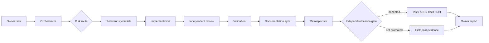

# Project-owner report — OmniSorSe engineering system

## 1. What this run was meant to do

Understand OmniSorSe from its repository and history, then make the repository
itself teach humans and future Codex runs how to change the product safely,
efficiently, and honestly—without changing product behavior.

## 2. What actually changed

The authoritative checkout was identified as `OpenSorSe-recovered-clean`; the
outer workspace is an older damaged recovery tree and was left untouched. The
current checkout had no active `AGENTS.md`, repository Codex agents, or project
Skills at baseline. It now has a short orientation path, explicit current-state and
authority maps, five navigational system diagrams, three reconstructed ADRs,
nine scoped Codex specialists, one substantial-run Skill, risk-based routing,
conditional completion/confidence rules, controlled retrospective learning,
and reusable short owner prompts.

Documentation drift across schema 3–6, v2.4/v2.12 status, repository structure,
terminology, persistence, Change Plan reconciliation, and OmniBrille boundaries
was corrected in active entry points. CI now uses `v*` rather than a manually
extended release-branch list. Repository checks now guard current version facts,
ADRs, agent/Skill structure, ignored validation roots, and the retained five-
diagram map. A deterministic regression protects terminal Change Plan state
from a delayed progress callback.

Important artifact map:

```text
AGENTS.md
.agents/skills/omnisorse-engineering-run/SKILL.md
.codex/agents/
  product-strategy.toml
  architecture.toml
  ux.toml
  ax.toml
  dx-maintainability.toml
  performance.toml
  implementation.toml
  documentation.toml
  adversarial-reviewer.toml
docs/CURRENT-STATE.md
docs/engineering/
  README.md
  ARCHITECTURE_AUTHORITY.md
  DEVELOPMENT_SYSTEM.md
  RISK_VALIDATION_MATRIX.md
  LEARNING_SYSTEM.md
  ARCHAEOLOGY_2026-08-18.md
  templates/{OWNER_REPORT,RETROSPECTIVE}.md
  reports/ and retrospectives/
docs/Architecture/99_Appendix/ADR-004..006
```

## 3. Important technical decisions

**Decision:** Preserve the existing documentation library and add one compact
current-truth/engineering layer instead of creating a parallel hierarchy.

**Why:** Source/tests and the existing router were strong; promotion into active
knowledge had fallen behind v2.5–v2.12.

**Impact:** Normal work starts small and loads subsystem/history detail only
when risk requires it.

**Decision:** Keep specialist selection risk-based and encode only one recurring
Skill.

**Why:** History supports independent Architecture, Documentation, AX/UX,
Performance, Implementation, and adversarial perspectives, but not using all of
them for every task.

**Impact:** The orchestrator transfers distilled evidence and optimizes total
effort per accepted change rather than individual-call token counts.

**Decision:** No agent may promote its own lesson; accepted knowledge uses the
strongest minimal form.

**Why:** Tests and reviewed contracts are more reliable than accumulating prompt
rules, while independent review limits opaque self-modification.

**Impact:** This run promoted two executable regressions and historical-status
labels; one mutation-consumer finding remains only a candidate/product defect.

## 4. Validation and confidence

**Verified**

- Git baseline/integrity, remotes, branches/tags, no active Git operation, and
  preservation of the outer recovery tree.
- Static resolution across 360 active Markdown files and all 173 Mermaid blocks;
  exactly five system-map diagrams; `git diff --check`.
- Nine TOML agent definitions parse; write access is limited to Implementation
  and Documentation; the single project Skill passes the official validator.
- Six ADR identifiers are unique/indexed; no `.audit-validation` or `.artifacts`
  file is tracked; no `src/` product file changed.
- Independent adversarial review completed and its material documentation,
  hierarchy, context-cost, learning, and validation findings were corrected.

**Not verified / manual validation required**

- Build and tests did not start: `global.json` requires .NET SDK `10.0.400`, but
  this host has only `8.0.423` and `9.0.316`.
- Mermaid structure passed, but diagrams were not rendered by Mermaid CLI.
- No interactive, accessibility, native-platform, package, signing,
  publication, or release validation was performed. Release confidence is
  unchanged.

## 5. Problems found

- **Deferred product defect:** Operation History Undo and startup interruption
  recovery use the safe executor/journal but do not forward returned records to
  Results/targeted-index reconciliation. Current docs now disclose this; fixing
  product wiring and adding end-to-end regressions requires a separate task.
- **Fixed:** active documentation contradicted source/current status and old
  reports were presented as current.
- **Fixed:** v2.12 pushes were absent from the version-by-version CI branch list.
- **Recorded:** legacy JSON and SQLite both remain active Search inputs; legacy
  tag reintroduction is a focused audit risk, not a reproduced defect.
- **Recorded:** oversized ViewModels/provider classes, dormant alternative Undo/
  compatibility surfaces, and unbounded total manual-scan retention remain
  incremental maintainability risks.

## 6. What the agents learned

The initial workspace root was not the authoritative repository. Passing service
tests did not prove every caller used the reconciliation service. The
Documentation specialist exposed real schema/status/terminology drift; the
independent reviewer found a stale mutation consumer that the first architecture
pass missed. History also showed that an early generic Codex setup was created
and quickly removed; the durable replacement therefore routes through actual
OmniSorSe authorities and risks. Architecture, Documentation, History, focused Implementation, and
Adversarial Review were valuable; Product, UX, AX, and Performance specialists
were correctly not invoked for a behavior-neutral infrastructure run.

Promoted knowledge: validation-clone tracking and delayed progress now have
tests; historical reports have explicit status routing. Candidate only: unify
Operation History/startup completion with reconciliation. The full evidence and
metrics are retained in the [retrospective](../retrospectives/2026-08-18-engineering-system.md).

## 7. Documentation and diagrams

Created Current State, architecture authority, development/routing/learning,
archaeology, templates, ADRs, and retained run records. Updated the repository
README, main documentation router, architecture overview, five-diagram system
map, glossary, developer/maintainer/repository guides, and Product Vision.
Diagrams explain platform/profile
boundaries, system ownership, indexing/Search, safe mutation including the known
consumer gap, relationships/graph, and the future agent workflow.



## 8. Repository state

**Repository:** `D:\Own Projects\OpenSorSe\OpenSorSe-recovered-clean`

**Branch:** `v2.12-trusted-relationships-context`

**HEAD:** `d48bb080f5125e536978e5527c77afbb4b57da7d`

**Working tree:** 16 unstaged modified files and 25 untracked files, all in the
uncommitted engineering-system documentation/configuration, CI policy,
repository tests, and one behavior-preserving regression test. No staged or
product-source change.

**Upstream/remotes:** No upstream configured for the branch; `origin` is
`https://github.com/nishdel/OpenSorSe.git`.

**Active Git operation:** None

**Commits created:** 0

**Push performed:** No

**Schema changed:** No

**Protocol/public interface changed:** No

The next Codex run should open `OpenSorSe-recovered-clean` as the workspace root,
not the damaged outer checkout.

## 9. Bottom line

**Status: Complete with follow-up**

The engineering objective was achieved at code-review/static-validation
confidence and is safe to build on without hidden product changes. The most
important caveat is that .NET tests have not executed locally and two existing
mutation entry paths can leave projections stale. Next, validate the patch on a
.NET 10.0.400 host/CI; then authorize a separate focused task to route Operation
History Undo and startup recovery through reconciliation with regressions.
